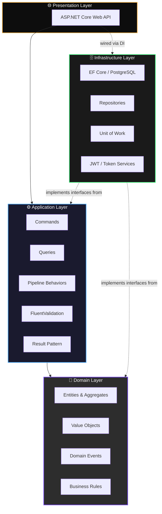
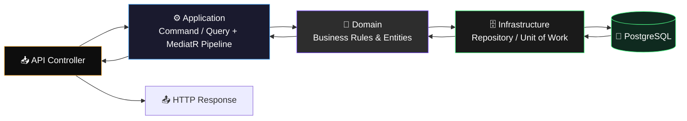

<div align="center">

# 🛠️ FixNow

### The Backend Behind a Production-Grade Service Marketplace

**Connecting customers with verified technicians — engineered like a system meant to run at scale, not a tutorial demo.**

[](https://dotnet.microsoft.com/)
[](https://learn.microsoft.com/aspnet/core)
[](https://www.postgresql.org/)
[](#-architecture)
[](#-license)

[](#-future-roadmap)
[](#-architecture)
[](#-error-handling)
[](#-contributing)

</div>

<br/>

<div align="center">

### 📖 Navigation

[Why FixNow](#-why-fixnow) • [Features](#-features) • [Tech Stack](#-tech-stack) • [Architecture](#-architecture) • [Diagrams](#-architecture-diagram) • [Auth Flow](#-authentication-flow) • [Folder Structure](#-folder-structure) • [API Endpoints](#-api-endpoints) • [Error Handling](#-error-handling) • [Security](#-security) • [Design Principles](#-design-principles) • [Scalability](#-scalability) • [Roadmap](#-future-roadmap) • [Running the Project](#-running-the-project) • [Contributing](#-contributing) • [Contact](#-contact)

</div>

---

## 💡 Why FixNow

Home and vehicle services — electrical work, plumbing, carpentry, painting, appliance repair, HVAC — are still largely booked through phone calls, word of mouth, and unreliable local listings. **FixNow is the backend for a platform that fixes that**: a marketplace where customers can find *verified* technicians, and technicians can build a reputation and a pipeline of work.

The business problem is simple. The engineering problem is not:

- Technicians and customers need to be **matched reliably**, even as the catalog of categories and providers grows.
- Every write — a booking, a review, a payment — must be **consistent**, not "probably fine."
- The system has to be **maintainable by a team**, not just readable by the person who wrote it.
- It has to be built so that **scaling to another city, another country, or another order of magnitude of users** is a capacity problem, not a rewrite.

FixNow exists to prove that this kind of system can be designed correctly from day one — with the architecture, patterns, and discipline of a production platform, not a weekend project.

---

## ✨ Features

<table>
<tr><td width="50%" valign="top">

**🔐 Authentication**
- ✅ Register
- ✅ Login
- ✅ Refresh Token
- ✅ Send OTP
- ✅ Verify OTP

</td><td width="50%" valign="top">

**🧑‍🔧 Marketplace**
- ✅ Technician Module
- ✅ Service Categories
- ✅ Technician Discovery
- ✅ Role-based architecture

</td></tr>
<tr><td width="50%" valign="top">

**⚙️ Application Infrastructure**
- ✅ Validation pipeline
- ✅ Logging pipeline
- ✅ Performance pipeline
- ✅ Transaction pipeline

</td><td width="50%" valign="top">

**🚨 Reliability**
- ✅ Global exception handling
- ✅ Production-ready error handling
- ✅ RFC 9457 Problem Details responses

</td></tr>
</table>

---

## 🧰 Tech Stack

<div align="center">

| Category | Technology | Purpose |
|---|---|---|
| **Language & Runtime** | C# / .NET 10 | Core application runtime |
| **Web Framework** | ASP.NET Core Web API | HTTP layer & REST API |
| **Database** | PostgreSQL | Primary relational data store |
| **ORM** | Entity Framework Core | Data access & migrations |
| **Mediation** | MediatR | CQRS command/query dispatch |
| **Validation** | FluentValidation | Declarative input validation |
| **Auth** | JWT + Refresh Tokens | Stateless authentication |
| **Error Contract** | RFC 9457 Problem Details | Standardized error responses |
| **Architecture** | Clean Architecture, DDD, CQRS | Structural & domain modeling |
| **Patterns** | Repository, Unit of Work, Result Pattern, Domain Events | Data access & flow control |

</div>

---

## 🏗️ Architecture

FixNow is built on four architectural pillars. Each one solves a specific engineering problem — none of them are here for decoration.

| Pattern | What It Means | Why It's Here |
|---|---|---|
| **Clean Architecture** | Code is organized into concentric layers (Domain → Application → Infrastructure → Presentation), with dependencies always pointing inward. | Keeps business logic independent of frameworks, databases, and delivery mechanisms — so the domain can be tested, reasoned about, and evolved in isolation. |
| **Domain-Driven Design (DDD)** | The domain model — entities, value objects, aggregates, domain events — reflects the actual business (customers, technicians, bookings), not the database schema. | Prevents the codebase from becoming an anemic CRUD wrapper around tables. The code speaks the language of the business. |
| **CQRS (via MediatR)** | Commands (writes) and Queries (reads) are modeled as distinct objects with distinct handlers, instead of one bloated "service" class. | Reads and writes have different performance profiles and different concerns. Separating them keeps each handler small, focused, and independently optimizable. |
| **Result Pattern** | Handlers return an explicit `Result<T>` instead of throwing exceptions for expected failures (e.g. "invalid OTP", "email taken"). | Exceptions are for the exceptional. Business failures are a normal part of a request's lifecycle and should be handled as data, not as control-flow-breaking events. |
| **Domain Events** | Side effects of a business action (e.g. sending an OTP after registration) are raised as events from the domain and handled separately from the action that triggered them. | Keeps the core action (e.g. "create user") decoupled from its consequences (e.g. "notify user"), so one failing side effect can't corrupt the primary operation. |

---

## 🗺️ Architecture Diagram



**The rule:** `Domain` depends on nothing. `Application` depends only on `Domain`. `Infrastructure` and `Presentation` depend on `Application` and implement its interfaces — never the reverse. This is enforced by project references, not convention.

---

## 🔀 Request Flow Diagram

Every request follows the same path through the layers, regardless of feature:



The controller never talks to the database, and the domain never knows PostgreSQL exists. Every request is dispatched through MediatR, passes through the validation/logging/performance/transaction pipeline, executes domain logic, and persists via the repository abstraction.

---

## 🔐 Authentication Flow

```mermaid
sequenceDiagram
    participant User
    participant API
    participant AuthHandler as Auth Handlers
    participant DB as PostgreSQL

    rect rgb(20,20,30)
    Note over User,DB: Registration
    User->>API: POST /register
    API->>AuthHandler: RegisterCommand
    AuthHandler->>DB: Create user (unverified)
    AuthHandler-->>User: Trigger OTP dispatch
    end

    rect rgb(30,25,15)
    Note over User,DB: OTP Verification
    User->>API: POST /send-otp
    API->>AuthHandler: SendOtpCommand
    AuthHandler-->>User: OTP delivered
    User->>API: POST /verify-otp
    API->>AuthHandler: VerifyOtpCommand
    AuthHandler->>DB: Mark account as verified
    end

    rect rgb(20,30,20)
    Note over User,DB: Login
    User->>API: POST /login
    API->>AuthHandler: LoginCommand
    AuthHandler->>DB: Validate credentials
    DB-->>AuthHandler: User record
    AuthHandler-->>User: Access Token (short-lived) + Refresh Token (long-lived)
    end

    rect rgb(15,20,30)
    Note over User,DB: Token Refresh
    User->>API: POST /refresh-token
    API->>AuthHandler: RefreshTokenCommand
    AuthHandler->>DB: Validate & rotate refresh token
    DB-->>AuthHandler: New token pair
    AuthHandler-->>User: New Access Token + New Refresh Token
    end
```



**Design notes:**
- Access tokens are short-lived and stateless, so authorizing a request never requires a database round trip.
- Refresh tokens rotate on every use — a leaked refresh token has a limited, single-use window.
- OTP dispatch and verification are handled as distinct steps, keeping registration fast and the verification requirement enforceable independently.

---

## 📁 Folder Structure

```
FixNow/
│
├── src/
│   ├── FixNow.Domain/               # 🎯 Enterprise business rules
│   │   ├── Entities/                # Aggregate roots & entities (User, Technician, ...)
│   │   ├── ValueObjects/            # Immutable domain concepts
│   │   ├── Events/                  # Domain events
│   │   └── Exceptions/              # Domain-specific exceptions
│   │
│   ├── FixNow.Application/          # ⚙️ Use cases & orchestration
│   │   ├── Features/
│   │   │   ├── Authentication/      # Register, Login, Refresh, OTP
│   │   │   └── Technicians/         # Discovery, Categories
│   │   ├── Common/
│   │   │   ├── Behaviors/           # Logging, Validation, Performance, Transaction
│   │   │   ├── Interfaces/          # Repository & service contracts
│   │   │   └── Results/             # Result<T> pattern
│   │   └── DependencyInjection.cs
│   │
│   ├── FixNow.Infrastructure/       # 🗄️ External concerns
│   │   ├── Persistence/
│   │   │   ├── Configurations/      # EF Core entity configurations
│   │   │   ├── Repositories/        # Repository implementations
│   │   │   └── UnitOfWork/
│   │   ├── Authentication/          # JWT, refresh token, OTP services
│   │   └── DependencyInjection.cs
│   │
│   └── FixNow.API/                  # 🌐 Entry point
│       ├── Controllers/
│       ├── Middleware/              # Global exception handling → Problem Details
│       └── Program.cs
│
├── tests/
│   ├── FixNow.Domain.Tests/
│   ├── FixNow.Application.Tests/
│   └── FixNow.Infrastructure.Tests/
│
└── FixNow.sln
```

<details>
<summary><strong>📌 What each layer is responsible for</strong></summary>

<br/>

| Layer | Responsibility | Depends On |
|---|---|---|
| **Domain** | Entities, value objects, domain events, invariants | Nothing |
| **Application** | Use cases (commands/queries), validation, orchestration | Domain |
| **Infrastructure** | EF Core, PostgreSQL, JWT, repositories | Application, Domain |
| **API** | HTTP endpoints, middleware, request/response mapping | Application (via DI) |

Separating these into distinct projects means the dependency rules are enforced by the compiler — `Domain` physically cannot reference `Infrastructure`.

</details>

---

## 🔑 Authentication Module

| Capability | Description |
|---|---|
| **Register** | Creates a new user account in an unverified state and triggers OTP delivery. |
| **Login** | Validates credentials and issues an access token / refresh token pair. |
| **Refresh Token** | Exchanges a valid, unexpired refresh token for a new token pair, rotating the refresh token in the process. |
| **Send OTP** | Generates and dispatches a one-time password for account verification. |
| **Verify OTP** | Validates the submitted OTP and marks the account as verified. |

---

## 📡 API Endpoints

<div align="center">

| Method | Endpoint | Description | Auth Required |
|---|---|---|---|
| `POST` | `/api/auth/register` | Register a new user | ❌ |
| `POST` | `/api/auth/login` | Authenticate and receive tokens | ❌ |
| `POST` | `/api/auth/refresh-token` | Rotate access/refresh tokens | ❌ |
| `POST` | `/api/auth/send-otp` | Send a one-time password | ❌ |
| `POST` | `/api/auth/verify-otp` | Verify a one-time password | ❌ |
| `GET` | `/api/technicians` | Discover technicians | ✅ |
| `GET` | `/api/technicians/{id}` | Get technician details | ✅ |
| `GET` | `/api/service-categories` | List service categories | ✅ |

</div>

<details>
<summary><strong>💻 Example — Login Request</strong></summary>

<br/>

```http
POST /api/auth/login
Content-Type: application/json

{
  "email": "customer@example.com",
  "password": "SecurePassword123!"
}
```

**Response**

```json
{
  "accessToken": "eyJhbGciOiJIUzI1NiIsInR5cCI6IkpXVCJ9...",
  "refreshToken": "8f14e45fceea167a5a36dedd4bea2543...",
  "expiresIn": 900
}
```

</details>

---

## 🚨 Error Handling

FixNow standardizes on **[RFC 9457 Problem Details](https://www.rfc-editor.org/rfc/rfc9457)** for every non-success HTTP response, so API consumers get a consistent, machine-readable error contract regardless of what failed.

```json
{
  "type": "https://fixnow.dev/errors/validation-failed",
  "title": "Validation Failed",
  "status": 400,
  "detail": "One or more validation errors occurred.",
  "errors": {
    "Email": ["Email is not a valid address."],
    "Password": ["Password must be at least 8 characters."]
  }
}
```

| Layer | Mechanism | Behavior |
|---|---|---|
| **Domain / Application** | Result Pattern | Expected business failures (invalid OTP, duplicate email) return `Result.Failure(...)` — no exception thrown. |
| **Validation Pipeline** | FluentValidation + MediatR Behavior | Rejects invalid requests before they reach the handler, returning field-level errors. |
| **Unhandled Exceptions** | Global Exception Middleware | Caught centrally and converted into a safe, standardized Problem Details response — no stack traces leaked to clients. |

---

## 🛡️ Security

| Measure | Implementation |
|---|---|
| **Authentication** | JWT access tokens, signed and short-lived |
| **Session Renewal** | Refresh token rotation on every use |
| **Password Storage** | Hashed, never stored or logged in plain text |
| **Account Verification** | OTP-based verification before full account access |
| **Input Validation** | FluentValidation on every command/query, enforced by pipeline |
| **Data Access Isolation** | Repository pattern prevents raw query leakage into business logic |
| **Error Responses** | Problem Details responses never expose internal exception details |

---

## 📐 Design Principles

FixNow is built on a small set of principles applied consistently across every feature:

- **SOLID** — every class has a single responsibility, and dependencies are injected against abstractions, not concretions.
- **Clean Architecture** — dependencies point inward; the domain never depends on infrastructure.
- **Domain-Driven Design** — the code models the business domain, not the database.
- **CQRS** — reads and writes are modeled and optimized independently.
- **Separation of Concerns** — HTTP, business logic, and persistence never mix in the same class.
- **High Cohesion, Low Coupling** — features are self-contained; layers interact only through interfaces.

---

## 📈 Scalability

The architecture is designed so that scaling is a matter of adding capacity, not rewriting the system:

- **Stateless authentication** (JWT) means any number of API instances can be load-balanced without a shared session store.
- **CQRS separation** allows read workloads (technician discovery, service browsing) to be scaled, cached, or eventually served from read replicas independently of write workloads.
- **Repository abstraction** means the persistence layer — PostgreSQL today — can be optimized, sharded, or partially replaced without touching business logic.
- **Domain events** decouple side effects (notifications, downstream processing) from core transactions, making it straightforward to move them onto a message queue or background worker as load grows.
- **Layered architecture** means new bounded contexts (Payments, Notifications) can be added as new features without destabilizing existing ones.

---

## 🗺️ Future Roadmap

<details open>
<summary><strong>🧑‍🔧 Marketplace Features</strong></summary>

- [ ] Appointments / Booking
- [ ] Service Requests
- [ ] Ratings
- [ ] Reviews
- [ ] Notifications
- [ ] Payments
- [ ] Admin Dashboard
- [ ] Analytics

</details>

<details>
<summary><strong>🔐 Identity & Access</strong></summary>

- [ ] Two-Factor Authentication (2FA)
- [ ] OAuth
- [ ] Google Login
- [ ] Facebook Login

</details>

<details>
<summary><strong>⚡ Real-Time & Performance</strong></summary>

- [ ] SignalR (real-time booking/status updates)
- [ ] Caching
- [ ] Redis
- [ ] Background Jobs
- [ ] Hangfire

</details>

<details>
<summary><strong>🔎 Search & Location</strong></summary>

- [ ] Search
- [ ] Geo-location based discovery

</details>

<details>
<summary><strong>☁️ Infrastructure & Deployment</strong></summary>

- [ ] Docker
- [ ] CI/CD Pipeline
- [ ] Monitoring
- [ ] OpenTelemetry
- [ ] Azure Deployment
- [ ] AWS Deployment
- [ ] Microservices Decomposition

</details>

---

## 🚀 Running the Project

### Requirements

- [.NET 10 SDK](https://dotnet.microsoft.com/download)
- [PostgreSQL](https://www.postgresql.org/download/) (local instance or container)

### Installation

```bash
# 1. Clone the repository
git clone https://github.com/<your-username>/FixNow.git
cd FixNow

# 2. Restore dependencies
dotnet restore
```

### Database

```bash
# Configure your connection string in:
# src/FixNow.API/appsettings.Development.json

# Apply migrations
dotnet ef database update \
  --project src/FixNow.Infrastructure \
  --startup-project src/FixNow.API
```

### Run

```bash
dotnet run --project src/FixNow.API
```

---

## 📸 Screenshots

> Screenshots and API demo captures will be added here as the platform's endpoints stabilize.

<div align="center">

| Auth Flow | Technician Discovery | API Response |
|---|---|---|
| *placeholder* | *placeholder* | *placeholder* |

</div>

---

## 🤝 Contributing

FixNow is built in the open, and contributions are welcome — especially from engineers who care about architecture as much as features.

1. Fork the repository
2. Create a feature branch — `git checkout -b feature/service-categories`
3. Follow the existing layering (Domain → Application → Infrastructure → API)
4. Commit with clear, descriptive messages
5. Open a pull request describing the change and the reasoning behind it

Please open an issue first for larger architectural changes so the approach can be discussed before implementation.

---

## 📜 License

This project is licensed under the **MIT License**.

---

## 📬 Contact

<div align="center">

[](https://github.com/<your-username>)
[](https://linkedin.com/in/<your-linkedin>)
[](mailto:your-email@example.com)

</div>

---

<div align="center">

**Built with an obsession for backend engineering done right.**

⭐ If this architecture resonates with you, consider starring the repository.

</div>