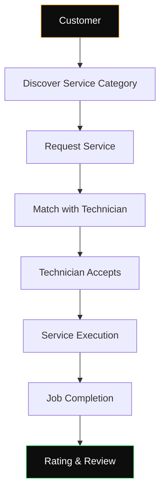
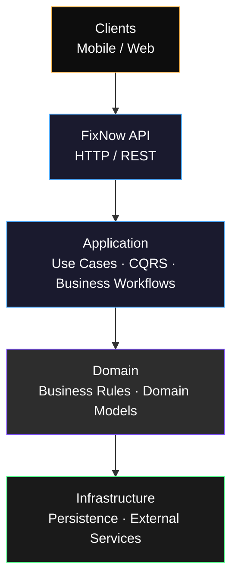

<div align="center">

# FixNow

**Fixing your home problems instantly.**

An on-demand home services platform connecting customers with trusted, verified technicians for maintenance, repairs, and emergency services.

[](https://dotnet.microsoft.com/)
[](https://learn.microsoft.com/aspnet/core)
[](https://www.postgresql.org/)
[](#system-architecture)
[](#project-roadmap)
[](#license)

</div>

<br/>

<div align="center">

[Why FixNow](#why-fixnow) · [How It Works](#how-fixnow-works) · [Capabilities](#core-product-capabilities) · [Architecture](#system-architecture) · [Tech Stack](#technology-stack) · [Domain](#domain-overview) · [Auth](#authentication--trust-model) · [Roadmap](#project-roadmap) · [Getting Started](#getting-started)

</div>

---

## What Is FixNow?

A customer has a problem at home — a leaking pipe, a broken outlet, an AC unit that stopped working. **FixNow connects that customer with a verified technician** who can fix it: plumbers, electricians, AC technicians, carpenters, cleaners, and other home-maintenance professionals.

The platform is built to support the full lifecycle of a home-service request — from discovery and request, through technician matching and job execution, to completion and feedback — with the trust, verification, and reliability that on-demand marketplaces require.

---

## Why FixNow?

Booking a home technician today is still largely informal: phone numbers passed between neighbors, unverified listings, no visibility into who is actually showing up. That creates real friction, especially for anything urgent.

| Problem | How FixNow Addresses It |
|---|---|
| Finding a reliable technician is hard | A marketplace of **verified** technicians, discoverable by service category |
| No visibility into technician quality | Ratings, reviews, and verification status as first-class product data |
| Emergency issues need a fast response | Structured service requests instead of ad-hoc phone calls |
| Service discovery is fragmented across channels | A single platform for browsing categories and requesting service |
| Technicians lack a structured pipeline of work | A dedicated technician experience for managing profile, availability, and incoming requests |

The long-term goal isn't to be a directory of technicians — it's to be the **infrastructure** that on-demand home services run on.

---

## How FixNow Works



This is the product's core loop. Today, the **identity, verification, and technician-discovery** stages of this flow are implemented; the **request-through-review** stages are on the roadmap (see [Project Roadmap](#project-roadmap)).

---

## Core Product Capabilities

### Customer Experience

| Capability | Status |
|---|---|
| Account registration & authentication | ✅ Implemented |
| Account verification (OTP) | ✅ Implemented |
| Technician discovery | ✅ Implemented |
| Service category browsing | ✅ Implemented |
| Profile management | 🔜 Planned |
| Service requests | 🔜 Planned |
| Address / location management | 🔜 Planned |
| Service status tracking | 🔜 Planned |
| Ratings and reviews | 🔜 Planned |

### Technician Experience

| Capability | Status |
|---|---|
| Technician module (foundation) | ✅ Implemented |
| Role-based access | ✅ Implemented |
| Technician onboarding & profile creation | 🔜 Planned |
| Availability management | 🔜 Planned |
| Receiving & managing service opportunities | 🔜 Planned |
| Customer feedback visibility | 🔜 Planned |

### Trust & Safety

| Capability | Status |
|---|---|
| OTP-based account verification | ✅ Implemented |
| Secure token-based authentication | ✅ Implemented |
| Technician verification workflow | 🔜 Planned |
| Identity / document verification | 🔜 Planned |
| Ratings and reviews as a trust signal | 🔜 Planned |

---

## System Architecture

FixNow is a backend-first system built on **Clean Architecture**, keeping the business logic independent of the web framework, the database, and any external service.



The dependency direction is deliberate: **Domain** has no knowledge of **Infrastructure**. Business rules don't change if the database, the identity provider, or the delivery mechanism changes — only the outer layers do. This is what makes it possible to add new capabilities (payments, notifications, matching) as new bounded contexts, rather than as changes threaded through the entire codebase.

---

## Engineering Principles

The architecture isn't chosen for its own sake — each decision maps to a concrete concern in a marketplace system:

- **Clean Architecture** keeps the domain (users, technicians, verification rules) independent of ASP.NET Core and PostgreSQL, so either can change without rewriting business logic.
- **CQRS**, implemented via MediatR, separates read workflows (discovery, browsing) from write workflows (registration, verification), since a marketplace's read and write paths tend to scale and evolve differently.
- **Domain-Driven Design** keeps the codebase modeling *customers*, *technicians*, and *verification* — not just database tables — so the code stays legible as the product grows.
- **Result Pattern** treats expected business outcomes (an invalid OTP, a duplicate account) as data returned from a handler, not exceptions — keeping control flow predictable in a system where "the operation didn't succeed" is a normal outcome, not a failure of the system itself.
- **Repository abstractions** isolate persistence behind interfaces the Application layer owns, so infrastructure — including things like OTP delivery — can be swapped without touching business logic.
- **Explicit layer boundaries** between API, Application, Domain, and Infrastructure mean business logic never lives in a controller, and infrastructure concerns never leak into domain code.

---

## Technology Stack

| Layer | Technology |
|---|---|
| Backend Framework | ASP.NET Core |
| Language / Runtime | C# / .NET 10 |
| Application Layer | MediatR, CQRS |
| ORM | Entity Framework Core |
| Database | PostgreSQL |
| Authentication | JWT + Refresh Tokens |
| Account Verification | OTP |
| Validation | FluentValidation |
| API Style | REST |
| Error Contract | RFC 9457 Problem Details |

---

## Domain Overview

At a business level, FixNow's domain centers on two kinds of users and the services that connect them:

```text
User
 ├── Customer Profile        (planned)
 └── Technician Profile      (foundation implemented)

Technician
 ├── Service Categories      (implemented)
 ├── Discovery                (implemented)
 ├── Verification             (planned)
 ├── Availability             (planned)
 └── Reviews                  (planned)

Customer
 ├── Addresses                (planned)
 ├── Service Requests         (planned)
 └── Reviews                  (planned)
```

The identity model (a `User` that can act as a customer or a technician) and the service-category structure are in place today. Everything downstream of "finding a technician" — requesting, assigning, and completing a job — is the next phase of the domain model.

---

## Authentication & Trust Model

```text
Registration
     ↓
Account Verification (OTP)
     ↓
Authentication
     ↓
Access Token + Refresh Token
     ↓
Authenticated API Requests
     ↓
Token Refresh / Logout
```

New accounts start unverified. **OTP verification** exists specifically because a marketplace connecting strangers in someone's home needs a baseline guarantee that an account belongs to a reachable, real person before it can act on the platform. Authenticated sessions use short-lived JWT access tokens paired with rotating refresh tokens, so a compromised token has a limited window of use without requiring server-side session storage.

No secrets, keys, or credentials are included in this repository or documentation.

---

## Example API Workflow

A representative slice of the API surface — not an exhaustive reference:

```http
POST /api/auth/register
POST /api/auth/login
POST /api/auth/refresh-token
POST /api/auth/send-otp
POST /api/auth/verify-otp

GET  /api/technicians
GET  /api/technicians/{id}
GET  /api/service-categories
```

> Full interactive API documentation is available via Swagger/OpenAPI once the project is running locally (see [Getting Started](#getting-started)).

---

## Project Roadmap

FixNow is being built in phases, moving from identity and trust toward the full marketplace lifecycle.

<details open>
<summary><strong>Phase 1 — Identity & Trust</strong> (In Progress)</summary>

- [x] Registration
- [x] Authentication (JWT + Refresh Tokens)
- [x] OTP-based account verification
- [ ] Technician onboarding
- [ ] Technician verification workflows

</details>

<details open>
<summary><strong>Phase 2 — Service Marketplace</strong> (In Progress)</summary>

- [x] Service categories
- [x] Technician discovery
- [ ] Technician services
- [ ] Customer service requests

</details>

<details>
<summary><strong>Phase 3 — Job Lifecycle</strong> (Planned)</summary>

- [ ] Technician assignment
- [ ] Request acceptance
- [ ] Job status lifecycle
- [ ] Completion workflow

</details>

<details>
<summary><strong>Phase 4 — Customer Experience</strong> (Planned)</summary>

- [ ] Service tracking
- [ ] Notifications
- [ ] Reviews and ratings
- [ ] Service history

</details>

<details>
<summary><strong>Phase 5 — Platform Growth</strong> (Planned)</summary>

- [ ] Payments
- [ ] Advanced technician matching
- [ ] Analytics and operational dashboards
- [ ] Scalability improvements (caching, background jobs, deployment infrastructure)

</details>

---

## What Makes This Project Interesting

FixNow is, at its core, an exercise in the hard parts of building a two-sided marketplace:

- Modeling identity for two distinct user types sharing one account system
- Building a trust system (verification, ratings) that a marketplace depends on to function at all
- Structuring service-request workflows that will eventually involve state transitions and concurrency (a job being accepted, assigned, and completed)
- Designing technician discovery in a way that can later support location-aware and demand-aware matching
- Keeping the domain model clean enough that job lifecycle, notifications, and payments can be added as new capabilities rather than retrofits

---

## Repository Structure

```text
src/
├── FixNow.Api/              # HTTP entry point, controllers, middleware
├── FixNow.Application/      # Use cases, CQRS commands/queries, validation
├── FixNow.Domain/           # Entities, value objects, domain events, business rules
├── FixNow.Infrastructure/   # EF Core, PostgreSQL, JWT, OTP delivery
└── FixNow.Contracts/        # Shared request/response contracts
```

> ℹ️ This structure reflects the project's Clean Architecture direction as described in this document. If your local copy of the repository differs, treat the actual solution structure as the source of truth.

---

## Getting Started

### Prerequisites

- [.NET 10 SDK](https://dotnet.microsoft.com/download)
- [PostgreSQL](https://www.postgresql.org/download/)

### Setup

```bash
# Clone
git clone https://github.com/<your-username>/FixNow.git
cd FixNow

# Restore dependencies
dotnet restore

# Configure the database connection
# in src/FixNow.Api/appsettings.Development.json

# Apply migrations
dotnet ef database update \
  --project src/FixNow.Infrastructure \
  --startup-project src/FixNow.Api

# Run
dotnet run --project src/FixNow.Api
```

Once running, API documentation is available via Swagger/OpenAPI at the application's `/swagger` endpoint.

---

## Configuration

The application is configured through the standard ASP.NET Core configuration providers (`appsettings.json`, environment variables, or a `.env` file, depending on environment). Required configuration categories:

| Category | Purpose |
|---|---|
| Database connection | PostgreSQL connection string |
| JWT settings | Signing key, issuer, audience, token lifetimes |
| OTP settings | OTP delivery/provider configuration |

```json
{
  "ConnectionStrings": {
    "DefaultConnection": "<your-postgres-connection-string>"
  },
  "Jwt": {
    "SigningKey": "<your-signing-key>",
    "Issuer": "<your-issuer>",
    "Audience": "<your-audience>"
  }
}
```

No real secrets are stored in this repository.

---

## Testing

Automated test coverage is part of the project's engineering roadmap and is being expanded alongside new features, prioritizing the identity, verification, and marketplace workflows described above.

---

## Security

| Mechanism | Status |
|---|---|
| Password hashing | ✅ In place |
| JWT authentication | ✅ In place |
| Refresh-token rotation | ✅ In place |
| OTP-based account verification | ✅ In place |
| Authorization / role-based access | ✅ In place |
| Configuration via environment/secrets (not hardcoded) | ✅ In place |
| Technician identity/document verification | 🔜 Planned |

---

## Development Philosophy

FixNow is currently a personal engineering project, built with the discipline of a production codebase:

- Business logic stays out of controllers.
- Layer boundaries (API → Application → Domain → Infrastructure) are not bypassed for convenience.
- Domain rules are made explicit rather than inferred from validation scattered across the codebase.
- Infrastructure — the database, token issuance, OTP delivery — sits behind abstractions the Application layer owns.
- New workflows are expected to bring tests, not just endpoints.
- API changes aim to stay backward-compatible as the platform evolves.

---

## License

This project is licensed under the **MIT License**.

---

<div align="center">

**FixNow — fixing your home problems instantly.**

</div>