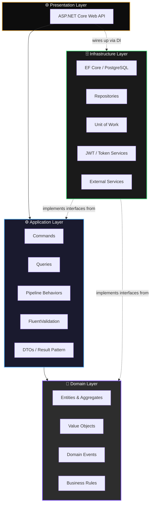
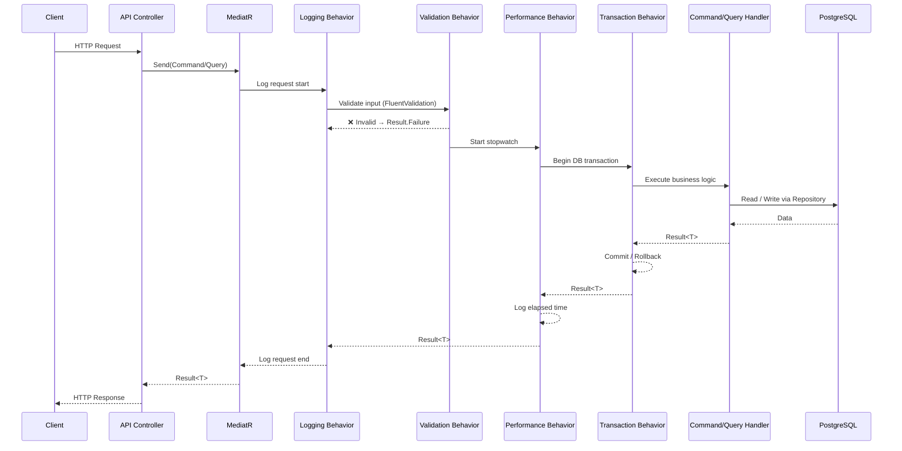

<div align="center">

# 🛠️ FixNow

### A Production-Grade Service Marketplace Backend

**Connecting customers with verified technicians — built like a system meant to survive real traffic, not a tutorial demo.**

[](https://dotnet.microsoft.com/)
[](https://learn.microsoft.com/aspnet/core)
[](https://www.postgresql.org/)
[](#-architecture)
[](#-license)

[](#-roadmap)
[](#-engineering-decisions)
[](#-application-pipeline)
[](#-contributing)

</div>

<br/>

<div align="center">

### 📖 Table of Contents

[Overview](#-overview) • [Why This Project Exists](#-why-this-project-exists) • [Architecture](#-architecture) • [Engineering Decisions](#-engineering-decisions) • [Application Pipeline](#-application-pipeline) • [Authentication Flow](#-authentication-flow) • [Project Structure](#-project-structure) • [Tech Stack](#-tech-stack) • [Features](#-features) • [Getting Started](#-getting-started) • [Roadmap](#-roadmap) • [Contributing](#-contributing)

</div>

---

## 🎯 Overview

**FixNow** is the backend for a service marketplace platform — the kind of system that sits behind apps like TaskRabbit, Thumbtack, or UrbanClap. It connects **customers** who need a job done (electrical repair, plumbing, car maintenance, carpentry, painting) with **verified technicians** who can do it.

This repository is not a CRUD showcase. It is an exercise in building backend software the way it would need to be built if the product had to survive **real users, real load, and real failure modes** — multiple countries, concurrent bookings, inconsistent networks, and teams of engineers working on the same codebase without stepping on each other.

> **Every architectural decision in this repository is made with one question in mind:**
> *"Will this still make sense when the team is 10 engineers and the traffic is 100x?"*

---

## 💡 Why This Project Exists

Most backend portfolio projects optimize for **breadth** — as many endpoints as possible, wired together as quickly as possible. FixNow optimizes for **depth**: fewer features, implemented the way a production system actually requires.

That means:

- 🧱 A **layered, dependency-inverted architecture** instead of a single project with everything in it
- 🔐 **Security treated as a first-class concern**, not an afterthought bolted on at the end
- 🧪 **Testable, isolated business logic** that doesn't depend on ASP.NET Core, EF Core, or any framework
- 🔄 **Consistent cross-cutting behavior** (validation, logging, transactions, error handling) enforced by the framework, not by developer discipline
- 📐 **Explicit domain modeling** so the code reads like the business it represents, not like a database schema with extra steps

---

## 🏗️ Architecture

FixNow follows **Clean Architecture** principles combined with **Domain-Driven Design**, organized around **CQRS** using **MediatR**. Dependencies always point inward — the domain has no knowledge of the database, the web framework, or any external system.



**The dependency rule in one sentence:** the `Domain` project references nothing. `Application` references only `Domain`. `Infrastructure` and `Presentation` reference `Application`, and implement the interfaces `Application` defines — never the other way around.

<details>
<summary><strong>📌 Why Clean Architecture instead of a "simple" layered API?</strong></summary>

<br/>

A typical "Controllers → Services → Repositories" setup works fine until the business logic starts leaking into controllers, or the database schema starts dictating how the domain is modeled. Clean Architecture solves this by inverting the dependency direction:

- The **domain and business rules** are the most stable, most protected part of the system — they don't change when you switch databases or web frameworks.
- Infrastructure concerns (PostgreSQL, JWT libraries, email providers) are **plugins** to the application, not its foundation.
- Business logic can be **unit tested with zero infrastructure** — no test database, no HTTP server, no mocking framework gymnastics.

This is the same architectural philosophy used in large-scale, long-lived enterprise systems, applied here at a scale where it can actually be appreciated in the code.

</details>

---

## 🧠 Engineering Decisions

Every pattern in this project was chosen to solve a specific problem, not to pad a resume.

| Decision | Problem It Solves | Trade-off Accepted |
|---|---|---|
| **CQRS + MediatR** | Read and write workloads have different scaling and modeling needs; mixing them into one service class creates bloated, hard-to-test code. | More files per feature (Command + Handler + Validator) in exchange for isolation and single-responsibility handlers. |
| **Result Pattern** | Exceptions are expensive and unsuitable for expected business failures ("email already exists" is not exceptional). Explicit `Result<T>` return types force error handling at compile time. | Slightly more verbose method signatures, in exchange for predictable, exception-free control flow. |
| **Repository + Unit of Work** | Decouples the domain and application layers from EF Core specifics, and guarantees atomic writes across multiple repositories within a single transaction. | An extra abstraction layer, in exchange for testable business logic and consistent transaction boundaries. |
| **Domain Events** | Side effects of a business action (e.g. "send welcome email after registration") shouldn't be hard-coded into the same handler that creates the user. | Slightly more indirection, in exchange for a domain model that stays focused on *what happened*, not *what should happen next*. |
| **FluentValidation + Pipeline Behavior** | Manual `if` checks scattered across handlers are inconsistent and easy to forget. Centralizing validation as a pipeline step makes it impossible to skip. | Validators as separate classes, in exchange for guaranteed, uniform input validation on every request. |
| **JWT + Refresh Tokens** | Stateless authentication that scales horizontally without a shared session store, while still allowing short-lived access tokens for better security. | Refresh token storage and rotation logic, in exchange for reduced blast radius if an access token is compromised. |

---

## ⚙️ Application Pipeline

Every request that flows through the application layer passes through a chain of **MediatR pipeline behaviors**. This guarantees that cross-cutting concerns are applied consistently, on every single request, without relying on individual handlers to remember to do it.



| Behavior | Responsibility |
|---|---|
| 🪵 **Logging Pipeline** | Structured logging of every request and response, with correlation for traceability. |
| ✅ **Validation Pipeline** | Runs all `FluentValidation` validators before the handler executes; short-circuits on failure. |
| ⏱️ **Performance Pipeline** | Measures handler execution time and flags slow requests. |
| 🔁 **Transaction Pipeline** | Wraps command handlers in a database transaction via Unit of Work — commit on success, rollback on failure. |
| 🚨 **Global Error Handling** | Centralized exception middleware that converts unhandled exceptions into consistent, safe API responses. |

---

## 🔐 Authentication Flow

Authentication is built on **JWT access tokens** paired with **rotating refresh tokens**, backed by an **OTP verification step** for added account security.

```mermaid
sequenceDiagram
    participant User
    participant API
    participant AuthHandler as Auth Handlers
    participant DB as PostgreSQL

    rect rgb(20,20,30)
    Note over User,DB: Registration
    User->>API: POST /register
    API->>AuthHandler: RegisterCommand
    AuthHandler->>DB: Create user (unverified)
    AuthHandler->>User: Send OTP
    end

    rect rgb(20,30,20)
    Note over User,DB: Login
    User->>API: POST /login
    API->>AuthHandler: LoginCommand
    AuthHandler->>DB: Validate credentials
    DB-->>AuthHandler: User record
    AuthHandler-->>User: Access Token (short-lived) + Refresh Token (long-lived)
    end

    rect rgb(30,25,15)
    Note over User,DB: Token Refresh
    User->>API: POST /refresh-token
    API->>AuthHandler: RefreshTokenCommand
    AuthHandler->>DB: Validate & rotate refresh token
    DB-->>AuthHandler: New token pair
    AuthHandler-->>User: New Access Token + New Refresh Token
    end

    rect rgb(30,15,15)
    Note over User,DB: Logout
    User->>API: POST /logout
    API->>AuthHandler: LogoutCommand
    AuthHandler->>DB: Revoke refresh token
    end
```



**Design notes:**
- Access tokens are short-lived and stateless — no database lookup required to authorize a request.
- Refresh tokens are stored and rotated on every use, so a leaked refresh token has a limited window of usefulness.
- OTP delivery is decoupled from the registration handler via **domain events**, so notification failures never block account creation.

---

## 📁 Project Structure

FixNow follows a **project-per-layer** structure that mirrors the Clean Architecture diagram above — each layer is a separate compilation unit, and the compiler enforces the dependency rules.

```
FixNow/
│
├── src/
│   ├── FixNow.Domain/               # 🎯 Enterprise business rules
│   │   ├── Entities/                # Aggregate roots & entities
│   │   ├── ValueObjects/            # Immutable domain concepts
│   │   ├── Events/                  # Domain events
│   │   └── Exceptions/              # Domain-specific exceptions
│   │
│   ├── FixNow.Application/          # ⚙️ Use cases & orchestration
│   │   ├── Features/
│   │   │   └── Authentication/
│   │   │       ├── Commands/        # Register, Login, RefreshToken, Logout
│   │   │       ├── Queries/
│   │   │       └── Validators/      # FluentValidation rules
│   │   ├── Common/
│   │   │   ├── Behaviors/           # Logging, Validation, Performance, Transaction
│   │   │   ├── Interfaces/          # Repository & service contracts
│   │   │   └── Results/             # Result<T> pattern
│   │   └── DependencyInjection.cs
│   │
│   ├── FixNow.Infrastructure/       # 🗄️ External concerns
│   │   ├── Persistence/
│   │   │   ├── Configurations/      # EF Core entity configurations
│   │   │   ├── Repositories/        # Repository implementations
│   │   │   └── UnitOfWork/
│   │   ├── Authentication/          # JWT & refresh token services
│   │   └── DependencyInjection.cs
│   │
│   └── FixNow.API/                  # 🌐 Entry point
│       ├── Controllers/
│       ├── Middleware/              # Global exception handling
│       └── Program.cs
│
├── tests/
│   ├── FixNow.Domain.Tests/
│   ├── FixNow.Application.Tests/
│   └── FixNow.Infrastructure.Tests/
│
└── FixNow.sln
```

<details>
<summary><strong>📌 Why split into separate projects instead of folders in one project?</strong></summary>

<br/>

Folders can be bypassed with a single `using` statement. Separate projects **cannot** — the .NET compiler physically prevents `FixNow.Domain` from referencing `FixNow.Infrastructure`. This turns the architecture from a convention the team has to remember into a rule the build enforces.

</details>

---

## 🧰 Tech Stack

<div align="center">

| Layer | Technology |
|---|---|
| **Language & Runtime** | C# on .NET 10 |
| **Web Framework** | ASP.NET Core |
| **Database** | PostgreSQL |
| **ORM** | Entity Framework Core |
| **Mediation / CQRS** | MediatR |
| **Validation** | FluentValidation |
| **Authentication** | JWT Access Tokens + Refresh Tokens |
| **Architecture** | Clean Architecture · Domain-Driven Design |
| **Patterns** | Repository · Unit of Work · Result Pattern · Domain Events |

</div>

---

## ✨ Features

### ✅ Implemented

<table>
<tr><td width="50%" valign="top">

**🔐 Authentication Module**
- User registration
- Login with JWT issuance
- Logout with token revocation
- Refresh token rotation
- OTP dispatch on registration

</td><td width="50%" valign="top">

**⚙️ Application Infrastructure**
- Validation pipeline (FluentValidation)
- Structured logging pipeline
- Performance monitoring pipeline
- Transactional pipeline (Unit of Work)
- Centralized global error handling

</td></tr>
</table>

---

## 🚀 Getting Started

### Prerequisites

- [.NET 10 SDK](https://dotnet.microsoft.com/download)
- [PostgreSQL](https://www.postgresql.org/download/) (local instance or container)

### Setup

```bash
# 1. Clone the repository
git clone https://github.com/<your-username>/FixNow.git
cd FixNow

# 2. Restore dependencies
dotnet restore

# 3. Configure your connection string
# Update appsettings.Development.json under src/FixNow.API/

# 4. Apply database migrations
dotnet ef database update \
  --project src/FixNow.Infrastructure \
  --startup-project src/FixNow.API

# 5. Run the API
dotnet run --project src/FixNow.API
```

---

## 🗺️ Roadmap

FixNow is under active development. The roadmap below reflects the actual build order — foundational modules first, marketplace features next, and infrastructure/deployment concerns last.

<details open>
<summary><strong>🔓 Authentication & Identity</strong></summary>

- [x] Register
- [x] Login
- [x] Logout
- [x] Refresh Token
- [x] Send OTP
- [ ] Verify OTP
- [ ] Forgot Password
- [ ] Reset Password

</details>

<details>
<summary><strong>🧑‍🔧 Marketplace Core</strong></summary>

- [ ] Customer Module
- [ ] Technician Module
- [ ] Technician Discovery
- [ ] Service Categories
- [ ] Booking
- [ ] Service Requests
- [ ] Reviews

</details>

<details>
<summary><strong>📣 Platform Capabilities</strong></summary>

- [ ] Notifications
- [ ] Payments

</details>

<details>
<summary><strong>☁️ Infrastructure & Deployment</strong></summary>

- [ ] Redis (caching / distributed state)
- [ ] Docker
- [ ] CI/CD Pipeline
- [ ] AWS Deployment

</details>

---

## 🤝 Contributing

FixNow is built in the open. Issues, architectural discussions, and pull requests are welcome — especially from engineers who enjoy debating trade-offs as much as writing code.

1. Fork the repository
2. Create a feature branch (`git checkout -b feature/service-categories`)
3. Commit your changes with clear, descriptive messages
4. Open a pull request describing the change and the reasoning behind it

---

## 📜 License

This project is licensed under the **MIT License**.

---

<div align="center">

**Built with an obsession for backend engineering done right.**

⭐ If this architecture resonates with you, consider starring the repository.

</div>