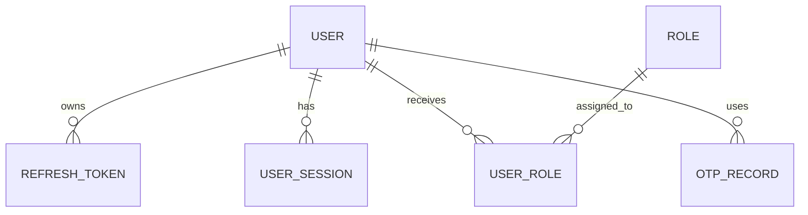

# Cover Page

Project Name

FixNow

Identity Bounded Context

Architecture Documentation & Technical Review

Version

1.0

Date

2026-07-07

---

# Table of Contents

1. Executive Summary
2. Identity Domain Overview
3. Folder Structure
4. Entities
5. Value Objects
6. Domain Events
7. Validation Strategy
8. Result Pattern
9. Aggregate Design
10. DDD Review
11. CQRS Review
12. Enterprise Architecture Review
13. Scalability Review
14. Security Review
15. Code Smells
16. Strengths
17. Weaknesses
18. Improvement Plan
19. Refactoring Roadmap
20. Final Scores
21. Final Verdict

---

# Executive Summary

The Identity bounded context in FixNow is a compact but meaningful domain module responsible for user lifecycle management, authentication state, roles, refresh tokens, and user sessions. Its purpose is to preserve the core business invariants around identity and access, while remaining independent enough to evolve into a future standalone service.

From an architectural perspective, the module demonstrates a strong foundation: the domain model is rich, entities encapsulate behavior, value objects are used for important concepts, and the result pattern is applied consistently across commands. The code is clearly organized around domain concepts rather than technical concerns.

At the same time, the module is still in an early stage. The current implementation appears to be a domain-only skeleton with no application or infrastructure implementations in the workspace. There are no visible repositories, handlers, or persistence abstractions, and the bounded context lacks a concrete integration strategy for future microservices and distributed deployment. The domain is strong, but the architectural maturity is only partially realized.

---

# Identity Domain Overview

The Identity bounded context exists to ensure that the platform can safely recognize, authenticate, authorize, and manage users over time. Its responsibilities include:

- Creating and maintaining user identity data
- Managing account lifecycle states such as pending verification, active, suspended, deactivated, and deleted
- Supporting authentication through password hashes, phone/email identity, and provider-based registration
- Managing refresh tokens and user sessions for long-lived authentication
- Assigning and revoking roles for authorization
- Emitting domain events that can be consumed by other modules in the future

This context is foundational because nearly every other domain in a marketplace platform depends on it. In a future architecture, it will likely interact with:

- Customer: to manage customer profiles and account activation
- Technician: to manage technician onboarding and identity verification
- Booking: to authorize access to booking operations
- Payment: to secure payment actions and ownership checks
- Notification: to dispatch security, verification, and account-change notifications

The bounded context should act as the system of record for identity and access, while other modules consume identity facts as events or APIs rather than duplicating identity concepts.



---

# Folder Structure

The folder structure is simple and conceptually aligned with DDD boundaries.

## Domain root

The domain root contains the identity model and shared domain primitives. This is appropriate for a clean architecture design because the core business logic lives close to the domain language.

## Identity folder

This folder is the heart of the bounded context. It contains the aggregate-like entities and their state transitions. This is the correct location for the Identity domain concepts.

## Enums

The enums define lifecycle and platform values such as account status, authentication provider, and language. They are domain concepts and belong in the domain layer rather than infrastructure.

## Errors

The errors folder centralizes validation and business-rule messages. This is a good practice because it keeps business behavior explicit and consistent.

## Events

The events folder holds domain events emitted by entities. This is reasonable for a DDD-based model and provides a good foundation for future integration.

## ValueObjects

Value objects encapsulate identity-related concepts that should be immutable and comparable by structure rather than by reference. This is a solid DDD practice.

## Strengths

- The structure reflects domain concerns clearly.
- The bounded context is isolated from infrastructure concerns.
- The organization is easy to understand and extend.

## Weaknesses

- There is no application layer evidence yet in the workspace, which limits the ability to see use cases and orchestration.
- There is no infrastructure implementation, so the domain boundary is not yet fully connected to persistence or messaging.
- The folder naming is mostly good, but the file name "Role .cs" is a quality smell and should be cleaned up.

---

# Entities

## User

### Purpose
The User entity is the central aggregate-like root for identity data and lifecycle behavior.

### Responsibilities
- Represents a person or account in the platform
- Stores profile and identity attributes
- Enforces account lifecycle transitions
- Emits domain events for registration, verification, password changes, profile updates, and status changes

### Business Rules
- A user must have a non-empty first and last name
- A user must have a valid phone number and a password hash value
- Account status transitions are guarded against invalid states
- Email and phone verification are each one-way transitions
- Profile image and language changes are idempotence-checked

### Lifecycle
A user begins in PendingVerification and can later become Active, Suspended, Deactivated, or Deleted.

### Relationships
- Has many refresh tokens
- Has many sessions
- Has many role assignments

### Aggregate Root?
Yes, from a modeling standpoint, User is the primary aggregate root for account identity.

### Strengths
- Encapsulates meaningful behavior rather than exposing setters
- Uses domain events to signal meaningful state changes

### Weaknesses
- It is a large entity with several responsibilities and a growing number of lifecycle behaviors
- It currently has no explicit coordination with related aggregates such as refresh tokens and sessions beyond IDs and navigation properties
- It may become a bottleneck if it owns too much behavior in the future

### Suggestions
- Consider extracting account lifecycle management into a dedicated domain service or richer account aggregate if the model grows beyond authentication and profile concerns
- Keep the entity focused on invariants, and move cross-aggregate orchestration to application services

## RefreshToken

### Purpose
Represents a single refresh token capable of being issued, revoked, and checked for expiration.

### Responsibilities
- Tracks token issuance and revocation state
- Holds expiration semantics
- Emits events when created or revoked

### Business Rules
- Token must exist and have a valid user ID
- Expiration must be in the future
- Revocation is guarded against already-revoked and already-expired states

### Lifecycle
Created -> Active -> Revoked/Expired

### Relationships
- Belongs to one User

### Aggregate Root?
It behaves like an entity, but it is better viewed as a subordinate entity in the identity aggregate rather than a root.

### Strengths
- Simple and focused
- Encapsulates revocation logic

### Weaknesses
- The model lacks a clear strategy for token rotation, reuse detection, family-based revocation, or blacklisting
- The token value itself is treated as a plain string, which is a security smell for a high-scale system

### Suggestions
- Introduce a dedicated token value object or secret wrapper
- Add rotation and replay protection rules

## UserSession

### Purpose
Tracks a user login session on a specific device or client.

### Responsibilities
- Records session scope and lifecycle
- Captures device, IP, and user-agent information
- Emits session lifecycle events

### Business Rules
- Must have a valid user, refresh token, device name, IP, and user agent
- Must expire in the future
- Can only end once

### Lifecycle
Started -> Active -> Ended

### Relationships
- Belongs to one User
- References one RefreshToken

### Aggregate Root?
Subordinate entity.

### Strengths
- Clear ownership boundaries
- Easy to reason about

### Weaknesses
- It does not currently enforce richer security constraints such as suspicious session activity, IP change detection, or concurrent session limits

### Suggestions
- Consider session fingerprinting and anomaly tracking for enterprise-grade security

## UserRole

### Purpose
Represents the assignment of a role to a user.

### Responsibilities
- Tracks whether a role assignment is active
- Captures who assigned it and who revoked it
- Emits assignment/revocation events

### Business Rules
- Requires valid user and role identifiers
- Can be revoked only once and requires a revoker identity

### Lifecycle
Assigned -> Active -> Revoked

### Relationships
- Belongs to one User
- Belongs to one Role

### Aggregate Root?
Subordinate entity.

### Strengths
- Clean ownership and lifecycle semantics

### Weaknesses
- The model is too simple for authorization systems that need fine-grained permission evaluation and role hierarchy support

### Suggestions
- Consider adding permission concepts or policy-based authorization in later iterations

## Role

### Purpose
Defines a named role that can be assigned to users.

### Responsibilities
- Holds a role name and activation state
- Supports rename and activation transitions

### Business Rules
- Name must be present and not exceed 50 characters

### Lifecycle
Created -> Active/Inactive

### Relationships
- Has many user role assignments

### Aggregate Root?
This could act as a small aggregate root for role administration.

### Strengths
- Minimal and clear

### Weaknesses
- No hierarchy, scope, or permission model yet

### Suggestions
- Extend to support role hierarchy and permissions if enterprise authorization grows

---

# Value Objects

## Email

### Why it is a Value Object
Email is a concept with immutable semantics and identity-specific equality rules. It should be compared by its normalized value rather than by object identity.

### Assessment
This is a good fit for a value object and is implemented appropriately.

### Weaknesses
- It relies on a simple regex/SMTP parser check and does not enforce domain-specific constraints such as disposable addresses or provider policy.

## PhoneNumber

### Why it is a Value Object
Phone numbers are immutable, formatted values and are ideal value objects.

### Assessment
This is a strong fit and the implementation is acceptable for an initial version.

### Weaknesses
- The normalization is simplistic and could lead to inconsistent semantics across regions.
- It does not model country-specific formatting or validation rules.

## PasswordHash

### Why it is a Value Object
A password hash is an immutable credential representation and should not be mutable once created.

### Assessment
This is conceptually correct but the implementation is currently too shallow. It only checks length and not the actual hash algorithm, strength, or storage semantics.

### Weaknesses
- It should probably not be a domain value object in the same way as Email or PhoneNumber because it is a security artifact rather than a business concept.
- It should be treated more carefully with hashing strategy and storage concerns.

## CountryCode

### Why it is a Value Object
Country code is a normalized immutable identifier and fits well as a value object.

### Assessment
This is appropriate and simple.

### Weaknesses
- It is not yet connected to the phone number rules or localization logic.

## Missing Value Objects

The following concepts would benefit from explicit value objects in a mature system:

- Authentication credential or login secret
- Session fingerprint
- Device identity
- Token family identifier
- Account status transition reason
- Address or locale profile

---

# Domain Events

The domain emits a set of events for important state changes. This is a good direction because it enables eventual integration and loose coupling.

## UserRegisteredDomainEvent
Used to signal that a new user account has been created.

## UserActivatedDomainEvent
Used to signal that the user has become active.

## UserEmailVerifiedDomainEvent
Used to signal successful email verification.

## UserPhoneVerifiedDomainEvent
Used to signal successful phone verification.

## UserPasswordChangedDomainEvent
Used to signal that a password hash changed.

## UserLanguageChangedDomainEvent
Used to signal that a language preference changed.

## UserProfileImageChangedDomainEvent
Used to signal that a profile image changed.

## UserSuspendedDomainEvent
Used to signal account suspension.

## UserDeactivatedDomainEvent
Used to signal account deactivation.

## UserDeletedDomainEvent
Used to signal a soft-delete operation.

## RefreshTokenCreatedDomainEvent
Used to signal issuance of a refresh token.

## RefreshTokenRevokedDomainEvent
Used to signal revocation.

## UserSessionStartedDomainEvent
Used to signal the start of a session.

## UserSessionEndedDomainEvent
Used to signal the end of a session.

## UserRoleAssignedDomainEvent
Used to signal a role assignment.

## UserRoleRevokedDomainEvent
Used to signal a role revocation.

### Assessment
The events are meaningful and belong to the domain. However, the current set is somewhat noisy and may be too event-heavy for early-stage development. In enterprise systems, event volume should be justified by downstream consumers.

### Missing Events
- Login attempted / failed
- Password reset requested
- Password reset completed
- OTP requested / consumed / expired
- Account reactivated after suspension
- Session fingerprint changed
- Suspicious activity detected

### Unnecessary Events
The current event set is not obviously over-designed, but some events such as profile image changed may be of limited downstream value unless they are explicitly consumed.

---

# Validation Strategy

Validation is implemented directly in entity factories and mutators. This is a strong domain-centric approach because important business rules remain close to the objects that own them.

## Strengths
- Validation happens in the model rather than in the UI or infrastructure
- Errors are represented consistently via the result pattern
- Invariants such as non-empty names and valid future expiration dates are enforced at the domain boundary

## Weaknesses
- Validation is still fairly primitive and mostly shape-based rather than policy-based
- There is no evidence of a domain-specific fluent validation DSL or validator composition
- Some invariants are not represented, such as user uniqueness or password strength policy

## Observations
The current approach is good for early development but will need more sophistication as the system scales. For example, uniqueness checks for email/phone should usually be enforced within the application layer or a dedicated domain service, not just in a simple constructor.

---

# Result Pattern

The Result pattern is used consistently to return either a success or a domain-specific error. This is a good fit for a domain model that wants to avoid exceptions for ordinary business failures.

## Advantages
- Clear, explicit error handling
- No exception-driven control flow for expected failures
- Domain errors are structured and typed

## Problems
- The implementation is still fairly minimal and does not appear to be fully integrated with application or infrastructure layers yet
- Error handling is not yet standardized across the entire architecture because there are no command handlers or use cases in the workspace
- The pattern should be composed with richer error categories and correlation identifiers in future iterations

## Consistency
The domain layer is mostly consistent, but the wider application layer is not yet visible in the repository snapshot.

---

# Aggregate Design

The current model is close to an aggregate-oriented design, but it is still somewhat conceptual rather than fully enforced.

## Aggregate Roots
- User appears to be the primary aggregate root
- Role can be treated as a small aggregate root for role management

## Aggregate Boundaries
The user aggregate appears to own profile, account status, roles, sessions, and tokens at the conceptual level, even though they are modeled as separate entities. This is reasonable for a first design, but it risks becoming too wide over time.

## Transaction Boundaries
There is no evidence of transaction boundaries or persistence orchestration, so this remains an open design concern.

## Consistency Rules
The model currently enforces local invariants well, but cross-aggregate consistency rules are not visible.

## Risks
If the User aggregate becomes too large and owns too much behavior, it may create concurrency and scalability problems.

---

# DDD Review

## Entities
The entities are meaningful and mostly align with the domain language.

## Value Objects
The use of value objects is appropriate and relatively mature for the current scope.

## Repositories
No repositories are visible in the workspace, so the persistence model is not yet implemented. This is a notable gap for a full DDD architecture.

## Aggregates
The aggregate boundaries are plausible but not fully enforced. The user aggregate is likely to become the main hotspot over time.

## Ubiquitous Language
The naming is mostly consistent with domain terminology and it is easy to follow.

## Bounded Context
The Identity module is well-scoped and conceptually separate from other modules.

## Domain Purity
The domain layer is mostly clean and free from infrastructure concerns.

## Infrastructure Leakage
The repository and persistence concerns are not implemented here, which is positive. However, the absence of these layers means the bounded context is currently more of a domain sketch than a complete bounded context.

## Rich Domain Model
This is a strength. The model uses behavior and invariants instead of simple data holders.

## Overall DDD Maturity
The module shows a good early DDD foundation but is not yet complete enough for enterprise-scale production without application and infrastructure layers.

---

# CQRS Review

The module is CQRS-friendly because the domain entities are naturally command-oriented and emit domain events. The use of rich entities and result-based methods maps well to command handling.

## Why it fits CQRS
- Commands can be represented as operations such as register user, verify email, revoke token, create session, assign role, and deactivate account
- Domain events can be published to downstream subscribers
- The domain model already contains behavioral methods instead of passive data bags

## Potential Issues
- The current workspace does not show commands, queries, handlers, or query models, so the CQRS structure is only partial
- The user aggregate may become too large if it receives too many application use cases
- The system will need explicit read models for authentication and profile lookups if it scales beyond simple CRUD patterns

---

# Enterprise Architecture Review

## SOLID
The domain model follows the Single Responsibility principle reasonably well for individual entities, and behavior is mostly encapsulated in the right places.

## DRY
The error pattern and result pattern are consistent and reduce duplication.

## Encapsulation
The entities use private setters and explicit factory methods, which is good.

## Dependency Direction
The domain layer is clean and does not depend on infrastructure concerns.

## Maintainability
Good for the current size, though the module will need stronger application and infrastructure boundaries as it grows.

## Testability
The domain model is testable, especially because validation and state transitions are concentrated in the model.

## Extensibility
The use of value objects and events supports extension well.

## Folder organization
Good but still small and incomplete.

## Naming conventions
Mostly good, although the file name "Role .cs" is a defect and should be corrected.

---

# Scalability Review

Assuming millions of users and high authentication traffic, the current design will need significant scaling work.

## Performance
The current domain model is lightweight and should scale in principle, but the absence of repositories and persistence strategies makes it hard to assess performance realistically.

## Concurrency
The aggregate design may become a hotspot for concurrent account updates. User-level contention could become a problem during high-volume login, verification, or role updates.

## Aggregate contention
A large User aggregate will likely experience write contention at scale.

## Future bottlenecks
The most likely bottlenecks will be:
- authentication token issuance and validation
- user lookup performance
- session store access
- role and permission evaluation

## Database concerns
The system will probably need:
- indexed lookups on email, phone, and session identifiers
- token storage optimized for fast revocation checks
- partitioning or sharding strategy for large identity datasets

## Caching concerns
The system should consider caching for:
- user profile metadata
- role assignments
- recent session state
- refresh token revocation checks

---

# Security Review

## Authentication model
The module has the core ingredients for authentication management, especially user records, password hashes, sessions, and refresh tokens. That said, the workspace does not show the authentication flow implementation, so the actual security posture cannot be fully assessed.

## Refresh Tokens
Refresh tokens are modeled as first-class entities and include fields for expiration and revocation. This is a good start, but it needs robust rotation, replay detection, and storage protections. The current token model is too simple for production-scale security.

## OTP
The OTPRecord file exists but is empty. This is a significant gap because one-time passwords are a common identity control. The current state suggests the security design is incomplete.

## Password storage
The PasswordHash value object is a step in the right direction, but it currently validates length only. This is not sufficient for production-grade password security.

## Sessions
Sessions are explicitly modeled and can be ended. That is appropriate. However, there is no evidence of session fingerprinting or anomaly detection.

## Revocation strategy
The domain model can revoke tokens and sessions, but there is no evidence of a scalable revocation strategy for billions of token checks.

## Replay attacks
The model does not yet appear to address refresh token replay protection.

## Best practices
The module should eventually adopt:
- secure hashing (for example, Argon2id or PBKDF2)
- token rotation
- short-lived access tokens
- opaque refresh tokens
- device binding and session fingerprinting
- rate limiting and abuse detection

## Potential vulnerabilities
The biggest risks are currently around:
- incomplete OTP implementation
- simplistic password hashing validation
- missing replay protection for refresh tokens
- insufficient evidence of secure storage and transport layers

---

# Code Smells

## Primitive Obsession
The use of strings for names, device names, IPs, and token values is somewhat primitive. Some should be value objects or wrappers.

## Large Aggregate
The User aggregate is likely to become too large if it absorbs more behaviors over time.

## Hidden Coupling
The entities reference each other via IDs and navigation properties, but the actual orchestration rules are not yet explicit.

## Feature Envy
The entity methods could eventually become too aware of cross-aggregate concerns such as authentication flow orchestration.

## Under-engineering
The current module is still a domain skeleton and does not yet implement critical production concerns such as repositories, commands, query handlers, and persistence.

## Naming inconsistency
The file name "Role .cs" is a clear maintainability smell.

## Empty placeholder files
OTPRecord.cs exists but is empty, which signals unfinished design work.

---

# Strengths

- The bounded context is clearly scoped and cohesive.
- The domain uses rich behavior rather than an anemic model.
- The result pattern is a strong choice for explicit domain failures.
- The use of value objects is a good DDD decision.
- Domain events offer a future integration path.
- The model is easy to read and reason about.

---

# Weaknesses

- The module is incomplete from a full architecture perspective because repositories and application layers are absent from the workspace.
- OTP handling is incomplete.
- Security controls are still too rudimentary for enterprise-scale identity needs.
- The user aggregate may become a bottleneck.
- The module does not yet demonstrate persistence strategy, concurrency handling, or distributed concerns.
- The domain model lacks explicit anti-replay and device-binding logic.

---

# Improvement Plan

## 1. Implement repositories and persistence abstractions

### Why it matters
Without persistence abstraction, the domain cannot be used in a production architecture.

### Severity
Critical

### Impact
Blocks real-world deployment and testing.

### Recommended solution
Introduce repository interfaces in the application or domain boundary and implement them in infrastructure.

### Example implementation
```csharp
public interface IUserRepository
{
    Task<User?> GetByIdAsync(Guid id, CancellationToken cancellationToken);
    Task<User?> GetByPhoneAsync(string phone, CancellationToken cancellationToken);
    Task<User?> GetByEmailAsync(string email, CancellationToken cancellationToken);
    Task AddAsync(User user, CancellationToken cancellationToken);
}
```

### Priority
Critical

## 2. Complete OTP support

### Why it matters
OTP is a core identity control and the current file is empty.

### Severity
High

### Impact
Weakens account verification and recovery workflows.

### Recommended solution
Implement an OTP aggregate or value object with expiration, attempts, and consumption rules.

### Priority
High

## 3. Strengthen password security model

### Why it matters
The current password hash value object is not sufficient for modern authentication systems.

### Severity
High

### Impact
Creates a security risk if used as-is in production.

### Recommended solution
Use a dedicated password-hashing strategy and enforce secure password strength rules at the application layer.

### Priority
High

## 4. Introduce token rotation and replay protection

### Why it matters
Refresh tokens need secure lifecycle management at scale.

### Severity
High

### Impact
Protects against replay and token theft.

### Recommended solution
Add rotation tokens, family identifiers, and replay detection.

### Priority
High

## 5. Separate authentication workflows from the user aggregate

### Why it matters
The User aggregate may become too large and coupled to every authentication operation.

### Severity
Medium

### Impact
Improves scalability and maintainability.

### Recommended solution
Move orchestration flows such as login and password reset to application services and domain services.

### Priority
Medium

## 6. Improve observability and event handling

### Why it matters
Domain events are useful only if they are consumed and monitored.

### Severity
Medium

### Impact
Improves distributed system reliability.

### Recommended solution
Add event handlers, outbox patterns, and telemetry for identity events.

### Priority
Medium

---

# Refactoring Roadmap

## Phase 1
- Finalize the core domain model and fix naming issues
- Implement repositories and persistence adapters
- Add tests for entity lifecycle behavior

## Phase 2
- Add full OTP support and authentication workflow implementation
- Strengthen password policy and identity verification flows
- Introduce domain services for cross-aggregate workflows

## Phase 3
- Introduce token rotation, replay protection, and session security controls
- Add event dispatch and outbox support
- Add read models for high-scale lookup scenarios

## Phase 4
- Split identity into independently deployable services if growth justifies it
- Introduce distributed caching and session stores
- Build advanced security analytics and anomaly detection

---

# Final Scores

| Area | Score |
| --- | ---: |
| DDD Maturity | 7.5/10 |
| Architecture Quality | 7/10 |
| Enterprise Readiness | 5.5/10 |
| Scalability | 5/10 |
| Maintainability | 7/10 |
| Security | 5/10 |
| Code Quality | 7/10 |
| Overall Score | 6.5/10 |

---

# Final Verdict

Would I approve this module for production as-is? No.

Would I request changes? Yes.

## Blockers
- Incomplete OTP implementation
- Missing persistence and repository abstractions
- Insufficient security controls for refresh tokens and password handling
- Missing evidence of application-layer orchestration and integration patterns

## Optional improvements
- Further refinement of the aggregate boundaries
- Additional value objects for tokens, session fingerprints, and device identity
- Event-driven integration and observability

---

# Closing Note

The module shows a promising DDD foundation and a strong domain model, but it is not yet enterprise-ready. It should be viewed as a solid starting point for the Identity bounded context rather than a production-complete implementation.
