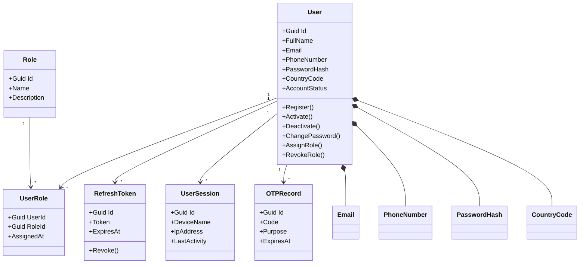

# Identity Domain Model

## Overview

This diagram illustrates the Identity bounded context domain model, including the aggregate root, entities, and value objects.

---

## Aggregate Root

**User** is the aggregate root of the Identity bounded context.

All identity-related operations must go through the `User` aggregate.

---

## Notes

- `UserRole` represents role assignments.
- `RefreshToken` manages authentication sessions.
- `UserSession` tracks active user sessions.
- `OTPRecord` stores one-time password verification records.
- `Email`, `PhoneNumber`, `PasswordHash`, and `CountryCode` are immutable Value Objects.