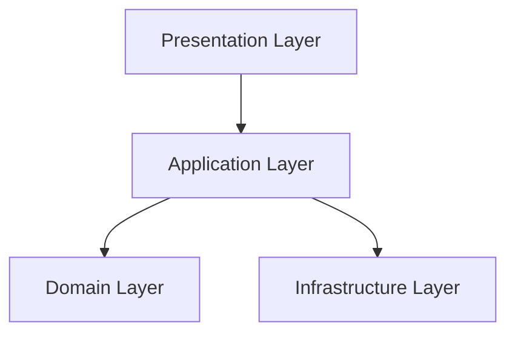
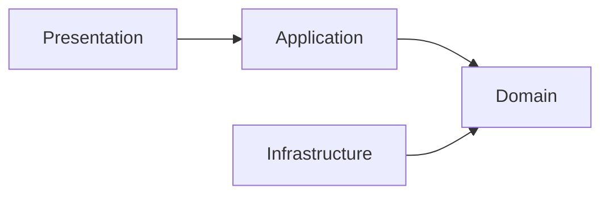

# Clean Architecture

> *"Architecture should protect the business—not the framework."*

---

# Introduction

FixNow is built using **Clean Architecture** to ensure that the business domain remains independent from frameworks, databases, user interfaces, and third-party services.

The primary objective is to make the business logic the most stable part of the application while allowing technical implementations to evolve over time.

Rather than organizing the project around technologies such as ASP.NET Core or Entity Framework Core, FixNow is organized around the business itself.

---

# The Problem

Many software projects start by designing:

* Database tables
* Controllers
* API endpoints
* Entity Framework models

As the project grows, business rules become scattered across:

* Controllers
* Services
* Repositories
* SQL queries
* Background jobs

This leads to several problems:

* High coupling
* Difficult testing
* Duplicate business rules
* Fragile architecture
* Expensive maintenance

Eventually, changing a business rule requires modifying multiple unrelated parts of the system.

---

# Our Solution

FixNow adopts **Clean Architecture**.

Instead of placing technology at the center of the application, the **Domain Model** becomes the center.

Every other layer exists only to support the Domain.

---

# Architecture Overview

---

# Layer Responsibilities

## Presentation Layer

Responsible for communication with external clients.

Examples:

* REST APIs
* Authentication
* Authorization
* HTTP requests
* HTTP responses

The Presentation Layer never contains business rules.

---

## Application Layer

Responsible for executing use cases.

It coordinates the system by:

* Executing Commands
* Executing Queries
* Loading Aggregates
* Calling Domain Behaviors
* Persisting changes
* Publishing Domain Events

It orchestrates the business.

It does not implement it.

---

## Domain Layer

The Domain Layer is the heart of FixNow.

It contains:

* Aggregates
* Entities
* Value Objects
* Domain Events
* Business Rules
* Specifications

The Domain Layer knows nothing about:

* ASP.NET Core
* Entity Framework Core
* PostgreSQL
* JWT
* Redis
* HTTP
* APIs

This independence is intentional.

---

## Infrastructure Layer

Infrastructure provides technical implementations.

Examples include:

* Entity Framework Core
* PostgreSQL
* Object Storage
* Email Providers
* SMS Providers
* Payment Gateways
* Background Processing

Infrastructure depends on the Domain—not the other way around.

---

# Dependency Rule

The most important rule in Clean Architecture is:

> **Dependencies always point toward the Domain.**

The Domain has no outgoing dependencies.

---

# Why Clean Architecture?

The architecture was selected because it provides:

## Maintainability

Business rules are located in one place.

Developers know exactly where to make changes.

---

## Testability

Business logic can be tested without:

* Web APIs
* Databases
* Entity Framework
* External services

Unit tests execute directly against the Domain.

---

## Framework Independence

Replacing ASP.NET Core should not require changing business rules.

Replacing PostgreSQL should not require changing Aggregates.

Frameworks are implementation details.

---

## Scalability

As FixNow grows, new technologies can be introduced without redesigning the Domain Model.

Examples include:

* Redis
* RabbitMQ
* Elasticsearch
* Microservices

The business remains unchanged.

---

## Long-Term Flexibility

The application is designed around business concepts rather than technical tools.

This significantly reduces the cost of future changes.

---

# Example

Consider the following business rule:

> A payment cannot be refunded unless it has already been paid.

Where should this rule live?

❌ Controller

❌ Repository

❌ Entity Framework Configuration

❌ SQL Trigger

✅ Payment Aggregate

Because this is a business rule.

---

# Common Mistakes

The following are intentionally avoided in FixNow:

* Business logic inside Controllers
* Business logic inside Repositories
* Business logic inside Entity Framework configurations
* Fat Service classes
* Database-driven business rules

Instead, all business decisions belong to the Domain Layer.

---

# How FixNow Applies Clean Architecture

The project follows these principles consistently:

* Business rules are implemented inside Aggregates.
* Use cases are implemented as Commands and Queries.
* Infrastructure provides persistence only.
* APIs expose use cases but contain no business logic.
* Domain Events communicate business changes.
* Technical concerns never leak into the Domain Layer.

---

# Benefits for FixNow

Using Clean Architecture gives the project:

* High cohesion
* Low coupling
* Clear separation of responsibilities
* Easier onboarding for new developers
* Better unit testing
* Easier feature development
* Greater confidence during refactoring

---

# Key Takeaways

* The Domain is the center of the system.
* Frameworks are replaceable.
* Business rules are permanent.
* Dependencies always point inward.
* Every layer has a single responsibility.

These principles guide every architectural decision made throughout the FixNow project.

---

# Related Documents

* `02-dependency-rules.md`
* `03-vertical-slice-architecture.md`
* `04-cqrs.md`
* `../book/05-clean-architecture.md`
