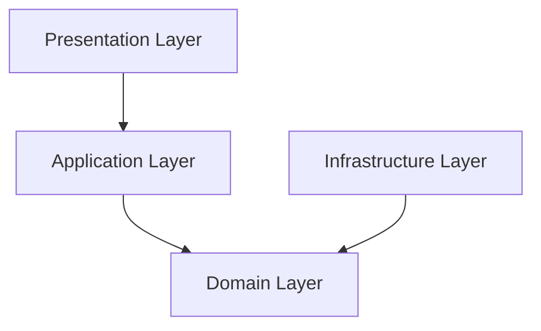
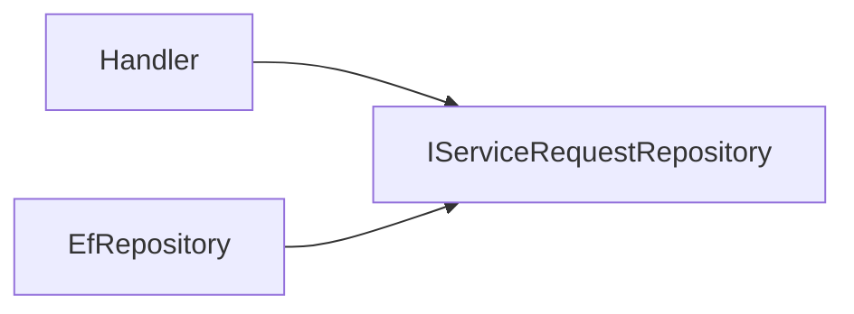
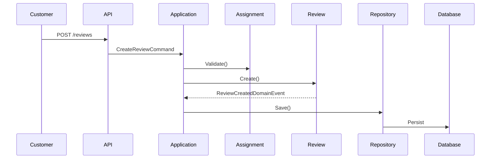

# Dependency Rules

> *"Good architecture is not defined by layers—it is defined by the direction of dependencies."*

---

# Introduction

One of the fundamental principles of **Clean Architecture** is the **Dependency Rule**.

This rule determines how different layers of the system are allowed to communicate with each other.

Following this rule ensures that the business domain remains stable, independent, and protected from changes in external technologies.

Ignoring this rule eventually leads to tightly coupled systems that are difficult to maintain and evolve.

---

# The Golden Rule

> **Source code dependencies must always point inward, toward the Domain Layer.**

Business rules should never depend on:

* Frameworks
* Databases
* UI
* External APIs
* Infrastructure libraries

Instead, those technologies depend on the business.

---

# Dependency Flow



Notice that **nothing points away from the Domain**.

The Domain is completely isolated.

---

# Allowed Dependencies

The following diagram summarizes which layer may reference another.

| From           | Can Reference |
| -------------- | ------------- |
| Presentation   | Application   |
| Application    | Domain        |
| Infrastructure | Domain        |
| Domain         | Nothing       |

---

# Dependency Matrix

| Layer          | Presentation | Application | Domain | Infrastructure |
| -------------- | :----------: | :---------: | :----: | :------------: |
| Presentation   |       ✅      |      ✅      |    ❌   |        ❌       |
| Application    |       ❌      |      ✅      |    ✅   |        ❌       |
| Domain         |       ❌      |      ❌      |    ✅   |        ❌       |
| Infrastructure |       ❌      |      ❌      |    ✅   |        ✅       |

---

# Why This Rule Exists

Imagine the following situation.

The project currently uses:

* ASP.NET Core
* Entity Framework Core
* PostgreSQL

After two years, the company decides to migrate to:

* gRPC
* Dapper
* SQL Server

If the Domain depends on these technologies, the migration becomes extremely expensive.

If the Dependency Rule is respected, only the Infrastructure changes.

The business remains untouched.

---

# Layer by Layer

## Presentation → Application

Allowed ✅

Controllers should invoke application use cases.

```text
HTTP Request

↓

Controller

↓

Command

↓

Handler
```

Controllers never execute business rules directly.

---

## Application → Domain

Allowed ✅

Handlers orchestrate business operations by calling Aggregate behaviors.

Example:

```text
CompleteAssignmentCommandHandler

↓

Assignment.Complete()

↓

Payment.Create()

↓

SaveChanges()
```

Business decisions remain inside the Domain.

---

## Infrastructure → Domain

Allowed ✅

Repositories implement Domain interfaces.

Example:

```text
EfServiceRequestRepository

implements

IServiceRequestRepository
```

Infrastructure knows about the Domain.

The Domain never knows about Infrastructure.

---

# Forbidden Dependencies

## Domain → Application

Not Allowed ❌

The Domain should never reference:

* Commands
* Queries
* Handlers
* Validators

Wrong:

```text
ServiceRequest

↓

CreatePaymentCommand
```

Correct:

```text
ServiceRequest

↓

PaymentCreatedDomainEvent
```

---

## Domain → Infrastructure

Not Allowed ❌

Wrong:

```csharp
using Microsoft.EntityFrameworkCore;
```

Wrong:

```csharp
using Npgsql;
```

Wrong:

```csharp
using Redis;
```

The Domain should not know that these technologies even exist.

---

## Domain → Presentation

Not Allowed ❌

Business entities should never return:

* IActionResult
* HttpResponse
* HttpContext
* ClaimsPrincipal

Those concepts belong to the Presentation Layer.

---

# Interfaces and Inversion

Suppose the Application needs to load a Service Request.

Instead of depending on EF Core:

```text
Handler

↓

DbContext
```

FixNow uses Dependency Inversion.



The Application depends only on the abstraction.

Infrastructure provides the implementation.

---

# Example

## ❌ Wrong Design

```text
Controller

↓

DbContext

↓

Business Logic
```

Business logic is trapped inside Controllers.

---

## ✅ Correct Design

```text
Controller

↓

Command

↓

Handler

↓

Aggregate

↓

Repository

↓

Database
```

Each layer has a single responsibility.

---

# Real Example from FixNow

When a customer submits a review:



Observe that:

* API knows nothing about the Domain implementation.
* The Domain knows nothing about HTTP.
* Infrastructure knows how to persist data.
* Business rules remain inside the Review Aggregate.

---

# Benefits

Following the Dependency Rule provides:

* Better maintainability
* Easier testing
* Framework independence
* Database independence
* Better separation of concerns
* Easier refactoring
* Long-term scalability

---

# Common Violations

The following are considered architectural violations in FixNow.

❌ Aggregate referencing DbContext

❌ Aggregate sending emails

❌ Aggregate calling HTTP APIs

❌ Aggregate publishing messages directly

❌ Handler containing business rules

❌ Controller modifying entities directly

Whenever one of these appears, the dependency direction is likely incorrect.

---

# Architectural Validation Checklist

Before introducing a new dependency, ask:

* Does this dependency point toward the Domain?
* Is the Domain aware of any framework?
* Can the business run without the database?
* Can I unit test this without ASP.NET Core?
* Does this layer know more than it should?

If the answer raises concerns, reconsider the design.

---

# Summary

The Dependency Rule is the backbone of FixNow's architecture.

By ensuring that dependencies always point inward:

* Business logic remains protected.
* Technologies become replaceable.
* The system becomes easier to evolve.
* Maintenance costs remain low.

This single rule enables the Domain Layer to remain the most stable and valuable part of the application.

---

# Related Documents

* `01-clean-architecture.md`
* `03-vertical-slice-architecture.md`
* `04-cqrs.md`
* `../domain/overview.md`
