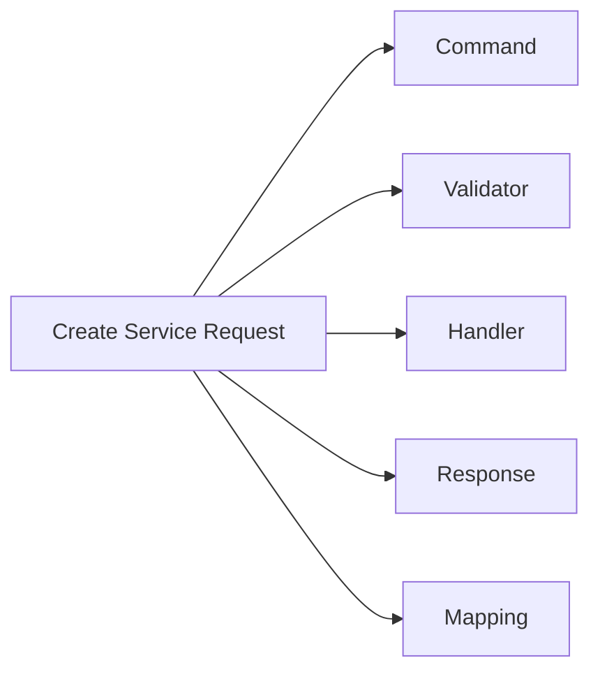
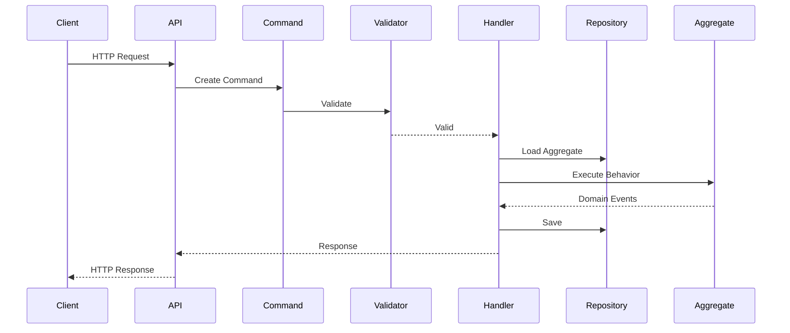

# Vertical Slice Architecture

> *"Organize software around features, not technical layers."*

---

# Introduction

As software systems grow, one of the biggest challenges becomes **maintainability**.

Traditional layered architectures often organize source code by technical responsibility:

```text
Controllers/
Services/
Repositories/
Models/
Validators/
DTOs/
```

While this structure works for small applications, it becomes increasingly difficult to navigate as the project grows.

FixNow adopts **Vertical Slice Architecture (VSA)** to organize the application around **business features** instead of technical layers.

---

# What is Vertical Slice Architecture?

Vertical Slice Architecture organizes the Application Layer by **use cases**.

Instead of grouping files by their technical role, every feature contains everything required to implement a single business operation.

Each slice is:

* Independent
* Self-contained
* Focused on one use case

A slice typically includes:

* Command or Query
* Handler
* Validator
* DTOs
* Mapping
* Authorization
* Unit Tests

Everything needed to execute one business operation lives together.

---

# Traditional Layered Organization

A common project structure looks like this:

```text
Application/

├── Commands/
├── Queries/
├── Validators/
├── DTOs/
├── Services/
├── Handlers/
├── Mappings/
```

Imagine implementing **Create Service Request**.

The code would be scattered across multiple folders.

```text
CreateServiceRequestCommand

↓

Commands/

Handler

↓

Handlers/

Validator

↓

Validators/

DTO

↓

DTOs/

Mapping

↓

Mappings/
```

A single feature is spread throughout the solution.

---

# Vertical Slice Organization

Instead, Vertical Slice groups everything by feature.

```text
Application/

ServiceRequests/

└── Create/

    ├── Command.cs

    ├── Handler.cs

    ├── Validator.cs

    ├── Response.cs

    ├── Mapping.cs

    └── Tests.cs
```

Everything related to creating a service request exists in one place.

---

# High-Level View



Each feature owns its complete implementation.

---

# How FixNow Uses Vertical Slice

FixNow organizes the Application Layer by business capabilities.

Example:

```text
Application/

Customers/

    Create/

    UpdateProfile/

Technicians/

    Verify/

    UpdateAvailability/

ServiceRequests/

    Create/

    Assign/

    Cancel/

Assignments/

    Accept/

    Reject/

    Complete/

Payments/

    MarkAsPaid/

    Refund/

Reviews/

    Create/

    Update/
```

Each folder represents a single business use case.

---

# A Typical Slice

Consider the **Accept Assignment** use case.

```text
Assignments/

└── Accept/

    ├── AcceptAssignmentCommand.cs

    ├── AcceptAssignmentHandler.cs

    ├── AcceptAssignmentValidator.cs

    ├── AcceptAssignmentResponse.cs

    └── Mapping.cs
```

A developer working on this feature rarely needs to leave the folder.

---

# Request Flow



Notice that every step belongs to the same vertical slice.

---

# Why We Chose Vertical Slice

Several reasons influenced this decision.

## Business-Oriented Organization

Developers think in terms of features.

Examples:

* Create Service Request
* Verify Technician
* Refund Payment

They rarely think:

* Repository
* Validator
* DTO

Vertical Slice matches how developers naturally work.

---

## Better Maintainability

Each feature is isolated.

Changing one feature rarely affects another.

---

## Easier Navigation

Suppose a bug exists in **Refund Payment**.

Instead of searching through:

* Commands
* Validators
* DTOs
* Handlers

Everything is already inside:

```text
Payments/

Refund/
```

---

## Reduced Coupling

Slices communicate through the Domain.

They do not depend on one another.

This keeps features isolated.

---

## Better Scalability

As the project grows from:

20 features

to

200 features

the folder structure remains clean.

Adding new functionality does not increase architectural complexity.

---

# Relationship with CQRS

Vertical Slice and CQRS complement each other.

CQRS separates:

* Commands
* Queries

Vertical Slice groups everything required to execute each Command or Query.


CQRS defines **how requests behave**.

Vertical Slice defines **where requests live**.

---

# Relationship with Clean Architecture

Vertical Slice does **not** replace Clean Architecture.

Instead:

* Clean Architecture defines the layers.
* Vertical Slice defines the organization inside the Application Layer.

```text
API

↓

Application

↓

ServiceRequests/

Create/

↓

Handler

↓

Domain

↓

Infrastructure
```

The architectural boundaries remain unchanged.

---

# Best Practices

Each slice should:

* Represent exactly one business use case.
* Contain one Handler.
* Contain one Validator.
* Contain one Request model.
* Contain one Response model when needed.
* Avoid depending on other slices.

If code is shared across multiple slices, consider extracting it into a shared component rather than introducing feature coupling.

---

# Common Mistakes

Avoid:

❌ Feature A calling Handler from Feature B.

❌ Shared "ApplicationService" containing dozens of unrelated methods.

❌ Generic CRUD folders.

❌ Large folders containing multiple unrelated use cases.

Instead, each slice should remain focused and independent.

---

# Benefits for FixNow

Using Vertical Slice Architecture gives FixNow:

* Feature-based organization.
* Better readability.
* Easier onboarding.
* Smaller pull requests.
* Independent feature development.
* Better testing.
* Reduced coupling.
* Excellent long-term maintainability.

---

# Summary

Vertical Slice Architecture aligns the project structure with the business itself.

Instead of organizing code by technical concerns, FixNow organizes it around business capabilities.

As the platform grows, developers can locate, understand, modify, and test features with minimal effort.

This architecture works particularly well when combined with:

* Clean Architecture
* CQRS
* Domain-Driven Design

Together, these approaches create an application that is modular, scalable, and easy to evolve.

---

# Related Documents

* `01-clean-architecture.md`
* `02-dependency-rules.md`
* `04-cqrs.md`
* `../application/README.md`
