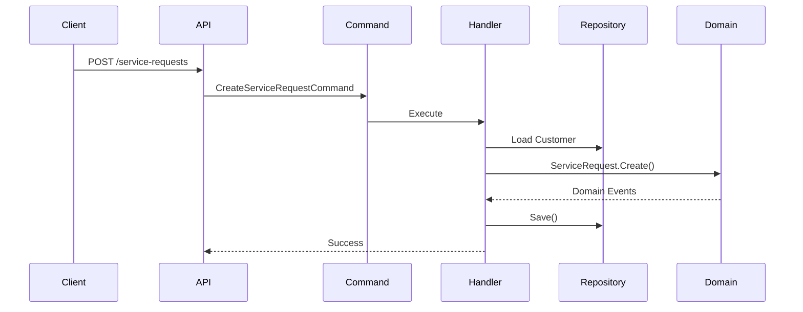
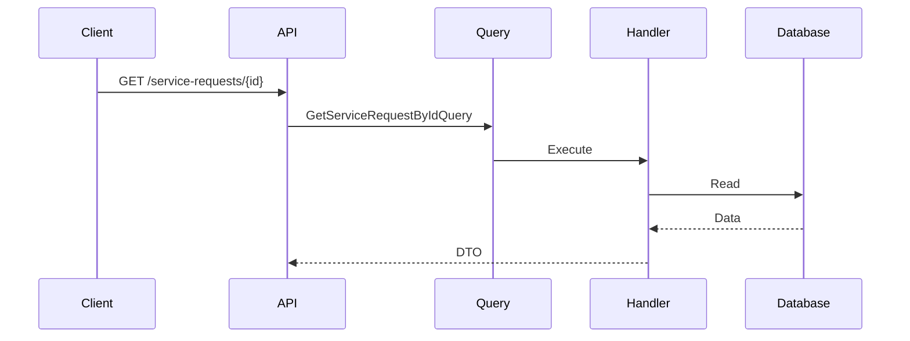

# CQRS (Command Query Responsibility Segregation)

> *"Commands change state. Queries read state. They should not do both."*

---

# Introduction

One of the architectural principles adopted by FixNow is **Command Query Responsibility Segregation (CQRS)**.

CQRS is **not** about using multiple databases or microservices.

At its core, CQRS is a simple design principle:

> **Separate operations that modify the system from operations that read data.**

This separation leads to clearer code, easier maintenance, better scalability, and simpler reasoning about business behavior.

---

# The Problem

In traditional CRUD applications, a single service is responsible for both:

* Reading data
* Modifying data

Example:

```csharp
public class ServiceRequestService
{
    public Task<ServiceRequestDto> GetById(Guid id);

    public Task Create(CreateRequestDto dto);

    public Task Update(UpdateRequestDto dto);

    public Task Delete(Guid id);

    public Task Cancel(Guid id);

    public Task Complete(Guid id);
}
```

As the application grows, these services become:

* Large
* Difficult to navigate
* Hard to test
* Full of unrelated responsibilities

---

# Our Solution

FixNow separates operations into two categories.

## Commands

Commands **change** the state of the system.

Examples:

* Create Service Request
* Accept Assignment
* Reject Assignment
* Complete Assignment
* Verify Technician
* Refund Payment

---

## Queries

Queries **only read** data.

They never modify the system.

Examples:

* Get Customer Profile
* Get Service Request Details
* Get Available Technicians
* Get Technician Reviews
* Get Dashboard Statistics

---

# High-Level Flow

```mermaid
flowchart LR

Client

--> Command

Command --> Handler

Handler --> Domain

Domain --> Database

Client

--> Query

Query --> Handler

Handler --> Read Database
```

Notice that:

Commands and Queries are completely independent.

---

# Commands

A Command represents an intention to change the system.

Example:

```text
CreateServiceRequestCommand
```

A Command contains only the data required to execute the operation.

Example:

```text
CustomerId

CategoryId

Description

Location
```

A Command should never contain business logic.

---

# Command Handler

Every Command has exactly one Handler.

Example:

```text
CreateServiceRequestCommand

↓

CreateServiceRequestHandler
```

The Handler is responsible for:

* Loading Aggregates
* Calling Domain Behaviors
* Saving Changes
* Publishing Domain Events

The Handler orchestrates.

The Domain decides.

---

# Example Command Flow



---

# Queries

Queries retrieve information.

They never modify business state.

Example:

```text
GetServiceRequestByIdQuery
```

A Query Handler can:

* Join multiple tables
* Use projections
* Optimize SQL
* Use caching

Because Queries contain **no business logic**.

---

# Query Flow



Notice that the Domain is often **not involved** in read-only operations.

---

# Why Separate Reads and Writes?

Reads and writes have different goals.

| Commands               | Queries              |
| ---------------------- | -------------------- |
| Modify state           | Read state           |
| Execute business rules | Return data          |
| Validate invariants    | Optimize performance |
| Raise Domain Events    | No Domain Events     |

Trying to solve both concerns using the same objects usually leads to unnecessary complexity.

---

# CQRS in FixNow

The Application Layer is organized around use cases.

Example:

```text
Application/

ServiceRequests/

    Create/

        Command.cs

        Handler.cs

        Validator.cs

    Cancel/

        Command.cs

        Handler.cs

    GetById/

        Query.cs

        Handler.cs

        Response.cs

    GetCustomerRequests/

        Query.cs

        Handler.cs
```

Each use case is completely isolated.

---

# Relationship with Vertical Slice

CQRS defines **what** a request is.

Vertical Slice defines **where** that request lives.

```text
Create/

    Command

    Handler

    Validator

↓

One Vertical Slice
```

The two patterns complement each other perfectly.

---

# Relationship with the Domain

Only **Commands** interact with the Domain Model.

```text
Command

↓

Aggregate

↓

Business Rules
```

Queries bypass the Domain whenever possible because they are not enforcing business invariants—they are simply retrieving information.

This keeps the read side lightweight and efficient.

---

# Validation

Command validation happens before business execution.

```text
Command

↓

FluentValidation

↓

Handler

↓

Domain
```

Validation checks:

* Required fields
* Input format
* Basic constraints

Business rules remain inside the Domain.

---

# Domain Events

Commands may produce Domain Events.

Example:

```text
AcceptAssignmentCommand

↓

Assignment.Accept()

↓

AssignmentAcceptedDomainEvent
```

Queries never produce Domain Events because they do not change the system.

---

# Benefits

Using CQRS provides several advantages.

## Clear Intent

The purpose of every request is immediately obvious.

Either:

* It changes the system.

or

* It reads data.

Never both.

---

## Better Organization

Every business use case has its own folder.

Developers spend less time searching for code.

---

## Easier Testing

Handlers are small and focused.

Each one is responsible for exactly one operation.

---

## Better Performance

Queries can be optimized independently from business logic.

Examples include:

* Read projections
* Optimized SQL
* Caching
* Specialized indexes

---

## Easier Scalability

As FixNow grows, the read side and write side can evolve independently.

Future optimizations might include:

* Read replicas
* Search indexes
* Materialized views
* Elasticsearch

Without affecting business rules.

---

# Common Mistakes

Avoid the following:

❌ Using Commands to return large datasets.

❌ Putting business logic inside Query Handlers.

❌ Sharing one Handler between multiple Commands.

❌ Creating generic CRUD Handlers.

❌ Calling one Command Handler from another.

Each Handler should represent one business use case and remain independent.

---

# CQRS in Practice

Consider the "Accept Assignment" feature.

**Write Side**

```text
AcceptAssignmentCommand

↓

AcceptAssignmentHandler

↓

Assignment.Accept()

↓

Save Changes

↓

Publish Domain Events
```

**Read Side**

```text
GetAssignmentDetailsQuery

↓

GetAssignmentDetailsHandler

↓

Read Database

↓

Return DTO
```

Two completely different flows.

One modifies the business.

The other only retrieves information.

---

# Summary

CQRS is one of the key architectural patterns used throughout FixNow.

By separating reads from writes, the project achieves:

* Clearer code
* Better organization
* Easier maintenance
* Better scalability
* Simpler testing
* Higher performance

Combined with **Clean Architecture**, **Vertical Slice Architecture**, and **Domain-Driven Design**, CQRS helps keep every business use case focused, predictable, and easy to evolve.

---

# Related Documents

* `01-clean-architecture.md`
* `02-dependency-rules.md`
* `03-vertical-slice-architecture.md`
* `../application/README.md`
