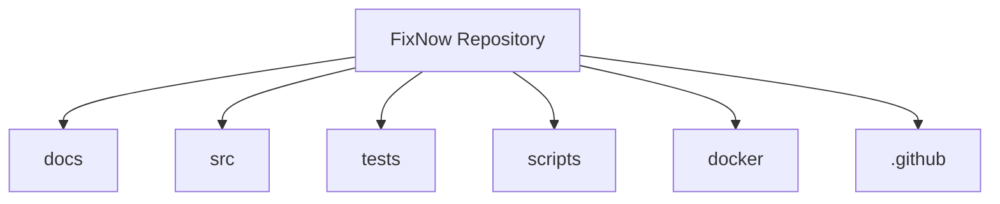
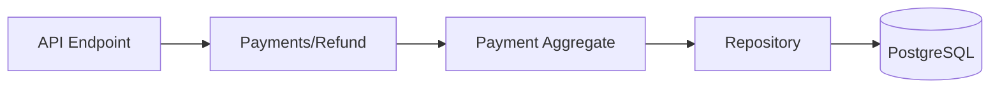

# Folder Structure

> *"A well-designed folder structure should explain the architecture before a single line of code is read."*

---

# Introduction

The FixNow solution is organized to reflect the **architecture of the system**, not the technologies used to build it.

Every folder has a clear responsibility.

A developer joining the project for the first time should be able to understand where new code belongs without asking another team member.

The structure follows the principles of:

* Clean Architecture
* Domain-Driven Design (DDD)
* Vertical Slice Architecture (VSA)
* CQRS

---

# High-Level Repository Structure

```text
FixNow/

├── docs/
├── src/
├── tests/
├── scripts/
├── .github/
├── docker/
├── .editorconfig
├── .gitignore
├── Directory.Build.props
├── FixNow.sln
└── README.md
```

---

# Repository Overview



Each directory serves a distinct purpose.

---

# docs/

Contains all project documentation.

```text
docs/

├── book/
├── architecture/
├── domain/
├── application/
├── infrastructure/
├── api/
├── development/
├── deployment/
├── diagrams/
├── decisions/
└── guides/
```

Documentation evolves together with the source code.

---

# src/

Contains the production source code.

```text
src/

├── FixNow.Domain/
├── FixNow.Application/
├── FixNow.Infrastructure/
├── FixNow.API/
└── FixNow.SharedKernel/
```

Each project maps directly to a layer of the architecture.

---

# Domain Project

```text
FixNow.Domain/

├── Identity/
├── Customer/
├── Technician/
├── ServiceCatalog/
├── ServiceRequest/
├── Assignment/
├── Payment/
├── Review/
└── Shared/
```

Each folder represents a **business module**.

No ASP.NET, Entity Framework, or database code exists here.

---

# Application Project

The Application layer is organized using **Vertical Slice Architecture**.

```text
FixNow.Application/

├── Customers/
├── Technicians/
├── ServiceRequests/
├── Assignments/
├── Payments/
├── Reviews/
├── Common/
└── Abstractions/
```

Each feature contains its own Commands, Queries, Validators, and Handlers.

Example:

```text
ServiceRequests/

├── Create/
├── Cancel/
├── Assign/
├── Complete/
├── GetById/
└── GetCustomerRequests/
```

Every folder represents a single business use case.

---

# Infrastructure Project

Contains technical implementations.

```text
FixNow.Infrastructure/

├── Persistence/
├── Repositories/
├── Configurations/
├── Identity/
├── Storage/
├── Messaging/
├── Services/
├── BackgroundJobs/
└── DependencyInjection/
```

Nothing inside Infrastructure contains business rules.

---

# API Project

Responsible for HTTP communication.

```text
FixNow.API/

├── Controllers/
├── Endpoints/
├── Middleware/
├── Filters/
├── Authentication/
├── Authorization/
├── DependencyInjection/
├── Extensions/
└── Program.cs
```

The API should remain as thin as possible.

Its responsibility is translating HTTP requests into Application requests.

---

# Shared Kernel

Contains concepts shared across the entire solution.

```text
FixNow.SharedKernel/

├── Result/
├── Errors/
├── Domain/
├── ValueObjects/
├── Abstractions/
├── Constants/
└── Extensions/
```

Only truly generic components belong here.

Business-specific logic should never be moved into the Shared Kernel.

---

# Tests

Production code and test code are separated.

```text
tests/

├── FixNow.Domain.Tests/
├── FixNow.Application.Tests/
├── FixNow.Infrastructure.Tests/
├── FixNow.API.Tests/
└── IntegrationTests/
```

Each project tests a single architectural layer.

---

# Scripts

Automation scripts live here.

```text
scripts/

├── database/
├── docker/
├── development/
└── deployment/
```

Examples:

* Seed data
* Local environment setup
* Build automation

---

# Docker

Docker-related assets are isolated.

```text
docker/

├── api/
├── postgres/
├── redis/
└── compose/
```

Keeping infrastructure files outside the source projects prevents clutter.

---

# GitHub

Repository automation.

```text
.github/

├── workflows/
├── ISSUE_TEMPLATE/
├── PULL_REQUEST_TEMPLATE.md
└── CODEOWNERS
```

Examples include:

* CI/CD
* Code quality checks
* Automated testing

---

# Why This Structure?

This organization provides several benefits.

## Separation of Concerns

Every project has one responsibility.

---

## Discoverability

Developers immediately know where new code belongs.

---

## Scalability

Adding a new feature does not require restructuring the solution.

---

## Maintainability

Business logic, infrastructure, and presentation remain isolated.

---

## Team Collaboration

Multiple developers can work on different areas with minimal conflicts.

---

# Folder Organization Principles

Throughout the project, the following rules are consistently applied.

* Organize by business capability, not by technology.
* Keep related files together.
* Prefer feature folders over generic folders.
* Avoid "Utils", "Helpers", and "Miscellaneous" folders.
* Every folder should have a clear purpose.
* If a folder's responsibility cannot be explained in one sentence, reconsider its design.

---

# Example Feature Lifecycle

Suppose a developer implements **Refund Payment**.

The implementation naturally spans multiple layers.



Even though the feature touches several projects, each layer remains responsible for only its own concern.

---

# Key Takeaways

* The repository mirrors the system architecture.
* Each project represents one architectural layer.
* The Domain is organized by business modules.
* The Application is organized by use cases (Vertical Slice).
* Infrastructure contains technical implementations only.
* API exposes business capabilities through HTTP.
* Tests mirror the production structure.

A consistent folder structure improves readability, onboarding, maintainability, and long-term scalability.

---

# Related Documents

* `01-clean-architecture.md`
* `02-dependency-rules.md`
* `03-vertical-slice-architecture.md`
* `04-cqrs.md`
* `06-technology-stack.md`
