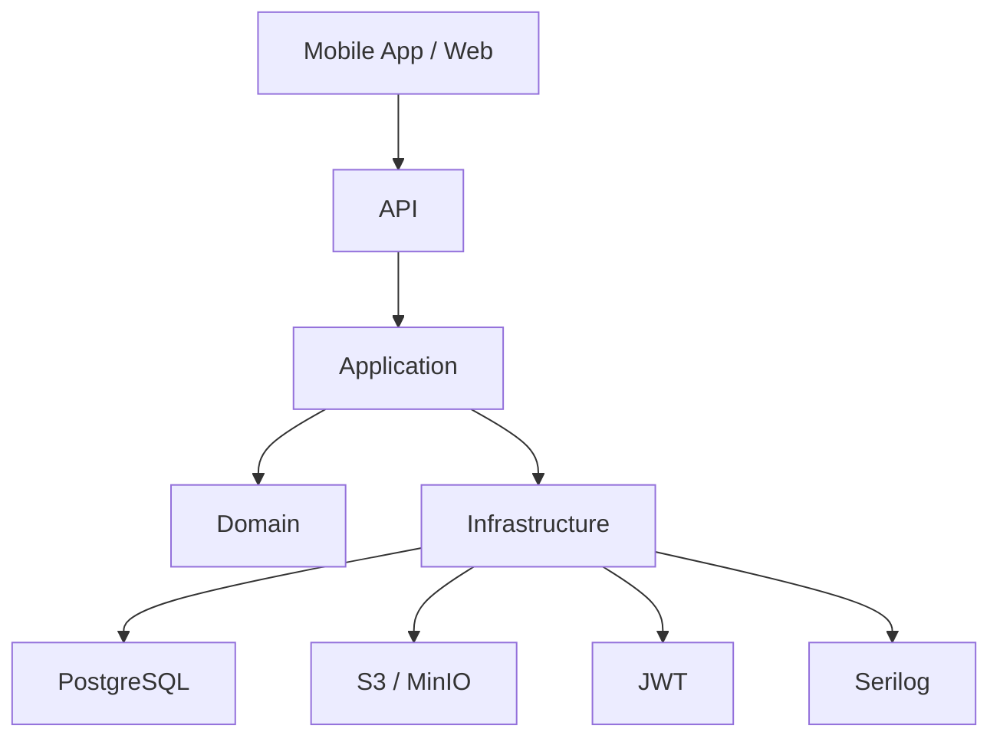

# Technology Stack

> *"Choose technologies that serve the architecture—not the other way around."*

---

# Introduction

Technology is one of the easiest parts of a software project to change.

Business rules are not.

For that reason, FixNow was designed using **technology-independent architecture**. The technologies listed in this document are implementation choices that support the architecture rather than define it.

Each technology was selected after considering:

* Maintainability
* Performance
* Community support
* Scalability
* Developer productivity
* Long-term stability

---

# Technology Stack Overview

| Category             | Technology                           | Purpose                          |
| -------------------- | ------------------------------------ | -------------------------------- |
| Programming Language | C# 13                                | Primary development language     |
| Framework            | .NET 9                               | Backend framework                |
| Architecture         | Clean Architecture                   | Layer separation                 |
| Design Methodology   | Domain-Driven Design (DDD)           | Business modeling                |
| Application Pattern  | CQRS                                 | Read/Write separation            |
| Organization Pattern | Vertical Slice Architecture          | Feature organization             |
| ORM                  | Entity Framework Core                | Data persistence                 |
| Database             | PostgreSQL                           | Relational database              |
| Validation           | FluentValidation                     | Request validation               |
| Mediator             | MediatR                              | Command & Query dispatching      |
| Object Mapping       | Mapster                              | DTO mapping                      |
| Authentication       | JWT Bearer Tokens                    | Secure authentication            |
| Password Hashing     | ASP.NET Identity PasswordHasher      | Password security                |
| File Storage         | S3 Compatible Storage (MinIO/AWS S3) | Images and documents             |
| Logging              | Serilog                              | Structured logging               |
| API Documentation    | Scalar (OpenAPI)                     | API exploration                  |
| Testing              | xUnit                                | Unit testing                     |
| Mocking              | NSubstitute                          | Test doubles                     |
| Containerization     | Docker                               | Consistent environments          |
| Version Control      | Git + GitHub                         | Source control and collaboration |

---

# Architectural View



The architecture remains stable even if individual technologies change.

---

# Programming Language — C#

## Why C#?

C# provides:

* Excellent object-oriented support
* Strong typing
* Excellent async programming
* Modern language features
* Enterprise ecosystem
* High performance

It is one of the strongest languages for building enterprise backend systems.

---

# .NET 9

The project is built on **.NET 9**.

Reasons:

* High performance
* Long-term evolution
* Excellent dependency injection
* Built-in configuration
* Excellent asynchronous programming model
* Cross-platform support

---

# Entity Framework Core

Entity Framework Core is used as the ORM.

Responsibilities:

* Object mapping
* LINQ queries
* Change tracking
* Transactions
* Migrations

Business logic is **never** implemented inside EF Core configurations.

---

# PostgreSQL

FixNow uses PostgreSQL as its primary database.

Reasons:

* Open source
* ACID compliant
* Excellent performance
* JSON support
* Advanced indexing
* Rich extension ecosystem

Future scalability features include:

* Read replicas
* Partitioning
* Full-text search
* Logical replication

---

# MediatR

Every use case passes through MediatR.

```text
Controller

↓

Command / Query

↓

MediatR

↓

Handler
```

Benefits:

* Decoupling
* Clear request pipeline
* Easy behaviors
* Better testing

---

# FluentValidation

Validation is separated from business logic.

Example responsibilities:

* Required fields
* String lengths
* Email format
* Numeric ranges

Business invariants remain inside the Domain Layer.

---

# Mapster

Mapster is used to map:

* Entities
* DTOs
* Responses

Reasons:

* High performance
* Low allocations
* Minimal boilerplate
* Simple configuration

---

# JWT Authentication

Authentication is handled using JWT Bearer Tokens.

JWT contains:

* User Id
* Roles
* Expiration
* Claims

Authorization decisions are performed in the Application/API layers, not inside the Domain.

---

# File Storage

Large files are never stored inside PostgreSQL.

Instead:

```text
Application

↓

Storage Service

↓

S3 / MinIO

↓

Database stores only:

ImageKey
```

Examples:

* National ID images
* Profile pictures
* Service request images

This approach keeps the database lightweight and scalable.

---

# Serilog

Logging uses Serilog.

Reasons:

* Structured logging
* Multiple sinks
* Correlation IDs
* Easy integration

Typical logged information:

* Requests
* Exceptions
* Performance metrics
* Business events

Sensitive information such as passwords or tokens is never logged.

---

# Scalar (OpenAPI)

The API is documented using Scalar.

Benefits:

* Interactive endpoint exploration
* Request examples
* Response schemas
* Faster API integration

It serves as the primary interface for developers consuming the API.

---

# xUnit

Unit testing framework.

Used for testing:

* Domain behaviors
* Application handlers
* Value Objects
* Business rules

Tests remain independent from infrastructure.

---

# NSubstitute

Used to mock dependencies.

Example:

* Repositories
* External services
* Storage providers

Allows isolated unit testing without requiring a database.

---

# Docker

Docker provides consistent environments across:

* Local development
* CI pipelines
* Production deployments

Typical services:

```text
Docker Compose

├── API

├── PostgreSQL

├── MinIO

└── pgAdmin (Development)
```

---

# Git & GitHub

Source control is managed with Git.

GitHub provides:

* Pull Requests
* Code Reviews
* CI/CD
* Issue Tracking
* Project Management

The project follows a feature-branch workflow to keep development organized.

---

# Why These Technologies?

Every technology was selected because it aligns with the project's architectural goals.

| Goal                   | Supporting Technologies            |
| ---------------------- | ---------------------------------- |
| Maintainability        | Clean Architecture, DDD, CQRS      |
| Scalability            | PostgreSQL, Docker, Vertical Slice |
| Testability            | xUnit, NSubstitute, MediatR        |
| Performance            | .NET 9, PostgreSQL, Mapster        |
| Developer Productivity | C#, EF Core, FluentValidation      |
| Cloud Readiness        | Docker, S3-compatible storage      |

---

# Technology Independence

One of the most important design goals is technology independence.

For example:

* PostgreSQL can be replaced with SQL Server.
* Entity Framework Core can be replaced with Dapper.
* MinIO can be replaced with AWS S3.
* Serilog can be replaced with another logging provider.

These changes should affect only the Infrastructure Layer, leaving the Domain and Application Layers untouched.

---

# Future Technologies

The current MVP intentionally avoids unnecessary complexity.

As the platform grows, additional technologies may be introduced:

* Redis (Caching)
* RabbitMQ (Messaging)
* Elasticsearch (Search)
* Hangfire or Quartz.NET (Background jobs)
* OpenTelemetry (Observability)
* Kubernetes (Container orchestration)

These can be integrated without changing the business model.

---

# Summary

The FixNow technology stack was selected to support a clean, maintainable, and scalable architecture.

Rather than chasing trends, each technology solves a specific problem while respecting the architectural boundaries of the system.

The architecture remains the foundation; technologies are replaceable implementation details.

---

# Related Documents

* `01-clean-architecture.md`
* `02-dependency-rules.md`
* `03-vertical-slice-architecture.md`
* `04-cqrs.md`
* `07-quality-attributes.md`
* `08-scalability.md`
