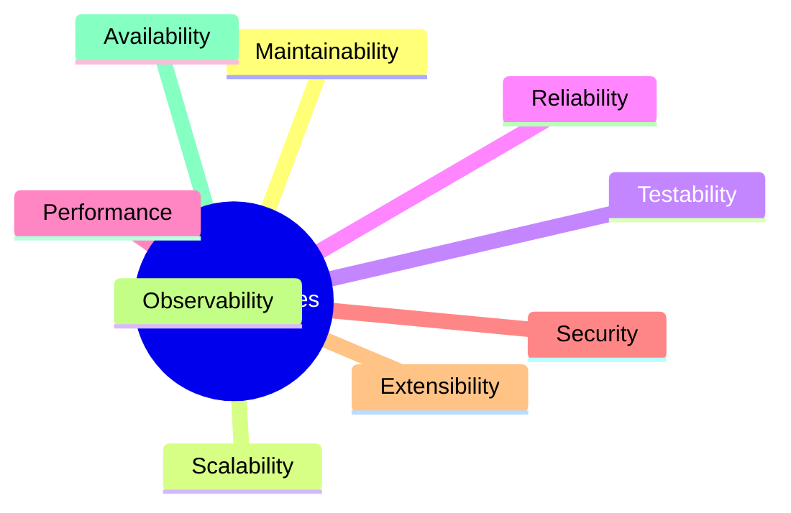
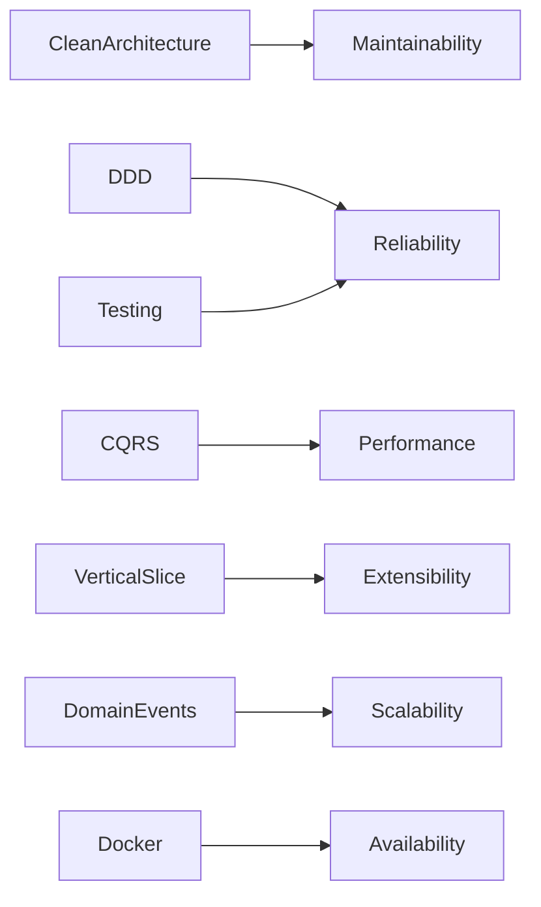

# Quality Attributes

> *"Good software is not measured only by what it does, but by how well it continues to do it as it grows."*

---

# Introduction

Functional requirements describe **what** the system should do.

Quality Attributes describe **how well** the system should perform those functions.

Examples include:

* Performance
* Scalability
* Maintainability
* Reliability
* Security

For FixNow, these attributes influenced almost every architectural decision.

This document explains the non-functional requirements that guided the design of the system.

---

# Quality Attributes Overview

| Attribute       | Priority |  Status |
| --------------- | :------: | :-----: |
| Maintainability |   ⭐⭐⭐⭐⭐  |   High  |
| Scalability     |   ⭐⭐⭐⭐⭐  |   High  |
| Testability     |   ⭐⭐⭐⭐⭐  |   High  |
| Reliability     |   ⭐⭐⭐⭐☆  |   High  |
| Security        |   ⭐⭐⭐⭐⭐  |   High  |
| Performance     |   ⭐⭐⭐⭐☆  |   High  |
| Extensibility   |   ⭐⭐⭐⭐⭐  |   High  |
| Observability   |   ⭐⭐⭐☆☆  | Planned |
| Availability    |   ⭐⭐⭐⭐☆  |   High  |

---

# Quality Attribute Tree



---

# 1. Maintainability

## Goal

The system should be easy to understand, modify, and extend.

---

## Why It Matters

FixNow will evolve over time.

Examples:

* New services
* New payment methods
* New user roles
* New business rules

A maintainable architecture allows these changes with minimal impact.

---

## How FixNow Achieves It

* Clean Architecture
* Domain-Driven Design
* Vertical Slice Architecture
* CQRS
* Rich Domain Model
* Small Aggregates
* Explicit Business Rules
* Consistent Naming

---

## Example

Adding a new feature such as:

```text
Favorite Technicians
```

should not require changes across unrelated modules.

Instead:

```text
Application/

Customers/

FavoriteTechnician/

Domain/

Customer/
```

Only the relevant feature is affected.

---

# 2. Scalability

## Goal

The architecture should support future growth without requiring a complete redesign.

---

## Growth Examples

Today:

* Hundreds of users

Tomorrow:

* Millions of users
* Thousands of technicians
* Millions of service requests

---

## Architectural Decisions

FixNow supports scalability through:

* Stateless APIs
* PostgreSQL
* CQRS
* Feature isolation
* Domain Events
* Docker

Future enhancements may include:

* Redis
* RabbitMQ
* Elasticsearch
* Read Replicas
* Kubernetes

---

# 3. Testability

## Goal

Business rules should be easy to verify through automated tests.

---

## Strategy

Most business logic exists inside:

* Aggregates
* Value Objects

These classes can be tested without:

* HTTP
* Databases
* Entity Framework

Example:

```text
Assignment.Accept()

↓

Unit Test

↓

No Database Required
```

---

# 4. Reliability

## Goal

The system should behave consistently even when unexpected situations occur.

---

## Examples

* Duplicate payment requests
* Technician rejecting assignments
* Invalid status transitions
* Simultaneous requests

---

## Design Choices

Reliability is achieved through:

* Aggregate invariants
* Result Pattern
* Domain Errors
* Transactions
* Optimistic concurrency (planned)

---

# 5. Security

## Goal

Protect user data and prevent unauthorized actions.

---

## Security Principles

Authentication

↓

Authorization

↓

Validation

↓

Business Rules

↓

Persistence

---

## Measures

* JWT Authentication
* Role-based authorization
* Password hashing
* Input validation
* Domain validation
* HTTPS
* Secure file storage
* No sensitive logging

Business rules never trust client input.

---

# 6. Performance

## Goal

Provide fast response times for common operations.

---

## Design Decisions

Performance is improved through:

* CQRS
* Efficient database indexing
* Lightweight DTOs
* Async programming
* Mapster
* PostgreSQL query optimization

Future improvements:

* Redis caching
* Read replicas
* Search indexes

---

# 7. Extensibility

## Goal

New features should be added without modifying existing modules.

---

## Example

Suppose the platform introduces:

```text
Emergency Services
```

The implementation should require:

* New Commands
* New Queries
* New Domain Rules

Existing features remain unchanged.

This follows the Open/Closed Principle.

---

# 8. Observability

## Goal

The system should provide enough information to diagnose problems.

---

## Current

* Structured logging
* Exception logging

---

## Future

* OpenTelemetry
* Distributed tracing
* Metrics
* Health checks
* Dashboards

---

# 9. Availability

## Goal

The platform should remain operational as much as possible.

---

## Current Strategy

* Stateless API
* Docker deployment
* Database backups

---

## Future Strategy

* Multiple API instances
* Load balancing
* Database replication
* Automatic failover

---

# Architectural Decisions vs Quality Attributes

| Decision           | Attributes Improved            |
| ------------------ | ------------------------------ |
| Clean Architecture | Maintainability, Testability   |
| DDD                | Maintainability, Reliability   |
| CQRS               | Performance, Scalability       |
| Vertical Slice     | Maintainability, Extensibility |
| Result Pattern     | Reliability                    |
| Domain Events      | Extensibility, Scalability     |
| PostgreSQL         | Performance, Reliability       |
| Docker             | Availability, Scalability      |

---

# Trade-offs

Every architectural decision introduces trade-offs.

| Decision           | Benefit             | Cost                  |
| ------------------ | ------------------- | --------------------- |
| DDD                | Rich business model | Higher learning curve |
| CQRS               | Clear separation    | More files            |
| Vertical Slice     | Better organization | More folders          |
| Domain Events      | Loose coupling      | Additional complexity |
| Clean Architecture | Maintainability     | More projects         |

The team intentionally accepted these costs because they provide significant long-term benefits.

---

# Quality Attribute Relationships



Each architectural choice contributes to one or more quality attributes.

---

# Measuring Success

The architecture is considered successful if:

* New features can be added with minimal changes.
* Business rules remain isolated.
* Unit tests execute without infrastructure.
* Infrastructure can change without affecting the Domain.
* The system scales without redesign.
* New developers can understand the project quickly.

---

# Summary

Quality Attributes are the foundation behind every architectural decision in FixNow.

Rather than optimizing for a single concern, the project balances:

* Maintainability
* Scalability
* Performance
* Reliability
* Security
* Extensibility

This balance allows the platform to evolve over time while keeping the business model stable and easy to maintain.

---

# Related Documents

* `01-clean-architecture.md`
* `03-vertical-slice-architecture.md`
* `06-technology-stack.md`
* `08-scalability.md`
* `09-architecture-decisions.md`
