# Scalability Strategy

> *"Scalability is not about handling millions of users today. It is about designing a system that can handle them tomorrow without being rewritten."*

---

# Introduction

FixNow is currently being developed as a **Modular Monolith** targeting the **Minimum Viable Product (MVP)**.

Although the initial deployment is relatively simple, the architecture has been intentionally designed to support future growth without requiring a complete redesign.

Scalability was considered from the first architectural decision.

---

# What Does Scalability Mean?

Scalability is the ability of a system to handle increasing amounts of:

* Users
* Requests
* Data
* Business features
* Development teams

while maintaining acceptable performance and reliability.

---

# Scalability Goals

FixNow aims to scale in four different dimensions.

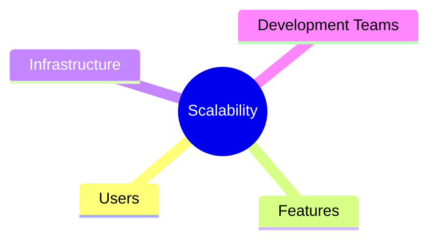

The architecture should support all of them.

---

# Current Architecture

Today, FixNow is a single deployable application.

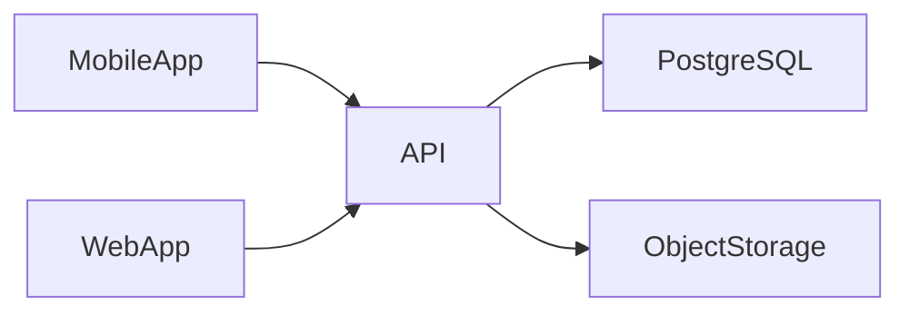

Advantages:

* Simple deployment
* Easy debugging
* Low operational cost
* Fast development
* Easy testing

This is the ideal architecture for an MVP.

---

# Why Modular Monolith First?

Many startups make the mistake of starting with Microservices.

FixNow intentionally does **not**.

Reasons:

* Small development team
* Limited infrastructure cost
* Faster feature delivery
* Simpler debugging
* Easier testing
* Lower operational complexity

A Modular Monolith provides almost all architectural benefits of Microservices without their operational overhead.

---

# Module Isolation

Although deployed as one application, FixNow is divided into business modules.

```text
Identity

Customer

Technician

Service Catalog

Service Request

Assignment

Payment

Review
```

Each module owns:

* Business rules
* Aggregates
* Application use cases
* Infrastructure implementations

This isolation is the foundation for future scaling.

---

# Horizontal Scalability

The API is designed to be **stateless**.

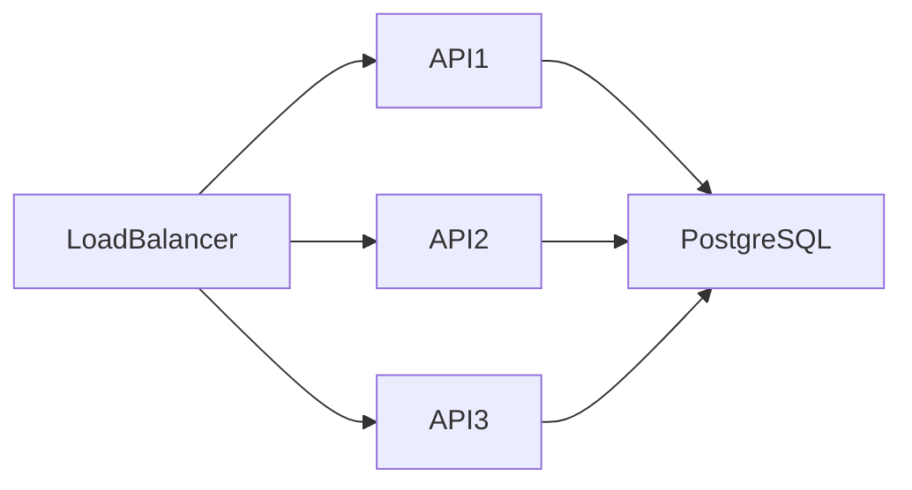

Because no application state is stored in memory, multiple API instances can serve requests simultaneously.

---

# Database Scalability

Initially:

```text
Single PostgreSQL Instance
```

As traffic grows:

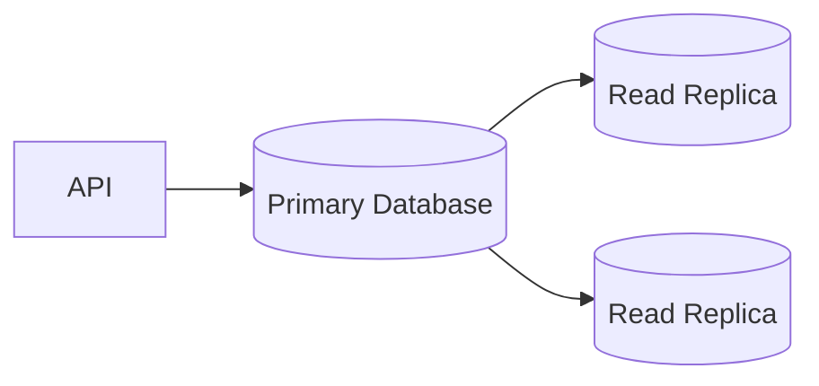

Possible future improvements include:

* Read Replicas
* Connection Pooling
* Table Partitioning
* Optimized Indexes

---

# File Storage Scalability

Large files are stored outside the database.

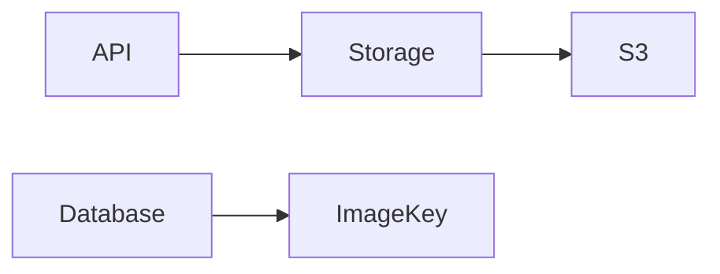

Only the file identifier is stored in PostgreSQL.

This keeps the database:

* Smaller
* Faster
* Easier to back up

---

# Caching Strategy (Future)

Frequently accessed data may eventually be cached.

Examples:

* Service Categories
* Technician Profiles
* City Lists
* Application Settings

Future architecture:

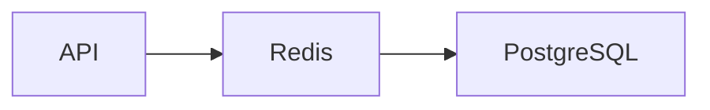

Benefits:

* Reduced database load
* Faster response times
* Improved scalability

---

# Background Processing

Some operations should not block user requests.

Examples:

* Email notifications
* Push notifications
* Image processing
* Analytics

Future architecture:

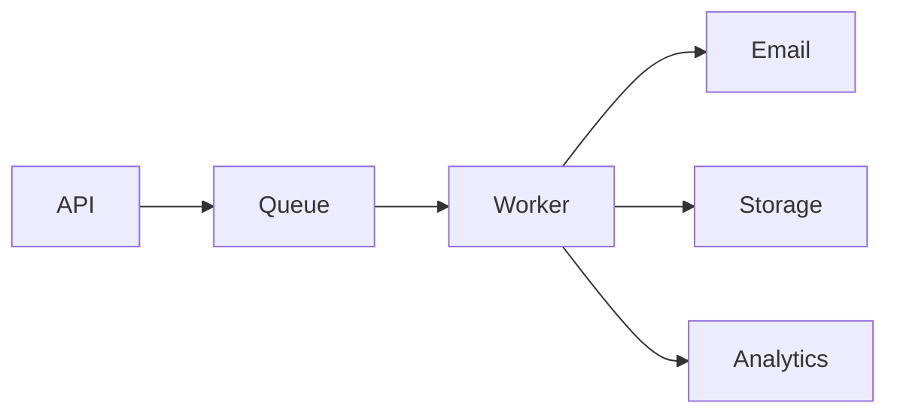

This keeps API response times low.

---

# Search Scalability

Searching technicians using SQL works for the MVP.

As data grows, dedicated search infrastructure may be introduced.

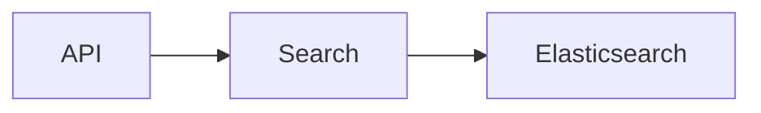

Possible search capabilities:

* Full-text search
* Auto-complete
* Geo-location search
* Ranking
* Filters

---

# Module Extraction

One of the major advantages of the current design is that modules can become Microservices later.

Current:

```text
Modular Monolith

Identity

Customer

Technician

Payment
```

Future:

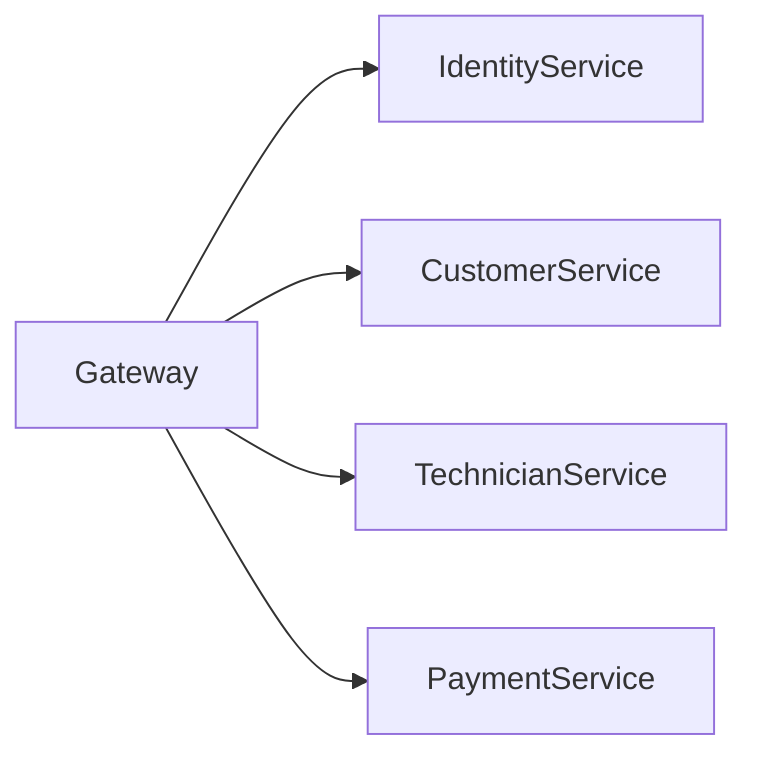

Because modules are already isolated, extraction becomes significantly easier.

---

# Team Scalability

As the engineering team grows:

Small Team

↓

Medium Team

↓

Large Team

Each team can own one or more modules.

Example:

| Team   | Module      |
| ------ | ----------- |
| Team A | Identity    |
| Team B | Customers   |
| Team C | Technicians |
| Team D | Payments    |

This minimizes merge conflicts and increases development velocity.

---

# CQRS and Scalability

CQRS prepares the system for future optimization.

Reads and writes can evolve independently.

Example:

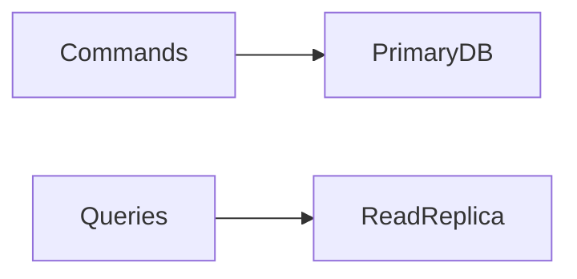

The write model remains optimized for consistency.

The read model becomes optimized for performance.

---

# Domain Events and Scalability

Today:

Domain Events coordinate behavior inside the Modular Monolith.

Future:

The same events can become integration events.

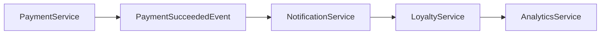

No redesign is required.

---

# Infrastructure Scalability Roadmap

## MVP

* Single API
* Single PostgreSQL
* Single Object Storage

---

## Growth Phase

* Multiple API instances
* Redis
* Background Workers
* Read Replicas

---

## Enterprise Scale

* API Gateway
* Kubernetes
* Elasticsearch
* Message Broker
* Independent Services
* Distributed Monitoring

---

# Scalability Roadmap

| Stage        | Architecture                                 |
| ------------ | -------------------------------------------- |
| MVP          | Modular Monolith                             |
| Early Growth | Multiple API Instances                       |
| Growth       | Redis + Background Workers                   |
| Large Scale  | Read Replicas + Search Engine                |
| Enterprise   | Service Extraction (Selective Microservices) |

Notice that **Microservices are the final step, not the first**.

---

# Architectural Principles

FixNow follows these scalability principles:

* Prefer simplicity over premature optimization.
* Optimize only when real bottlenecks appear.
* Keep modules independent.
* Build stateless APIs.
* Separate business rules from infrastructure.
* Design for gradual evolution.

---

# Summary

Scalability in FixNow is not achieved through unnecessary complexity.

Instead, the architecture evolves gradually:

1. Start with a Modular Monolith.
2. Scale horizontally when traffic increases.
3. Introduce caching and background processing.
4. Optimize database reads.
5. Extract services only when business needs justify the cost.

This approach minimizes operational complexity while ensuring that the platform can grow from an MVP serving hundreds of users to a production system serving millions.

---

# Related Documents

* `01-clean-architecture.md`
* `03-vertical-slice-architecture.md`
* `04-cqrs.md`
* `06-technology-stack.md`
* `07-quality-attributes.md`
* `09-architecture-decisions.md`
