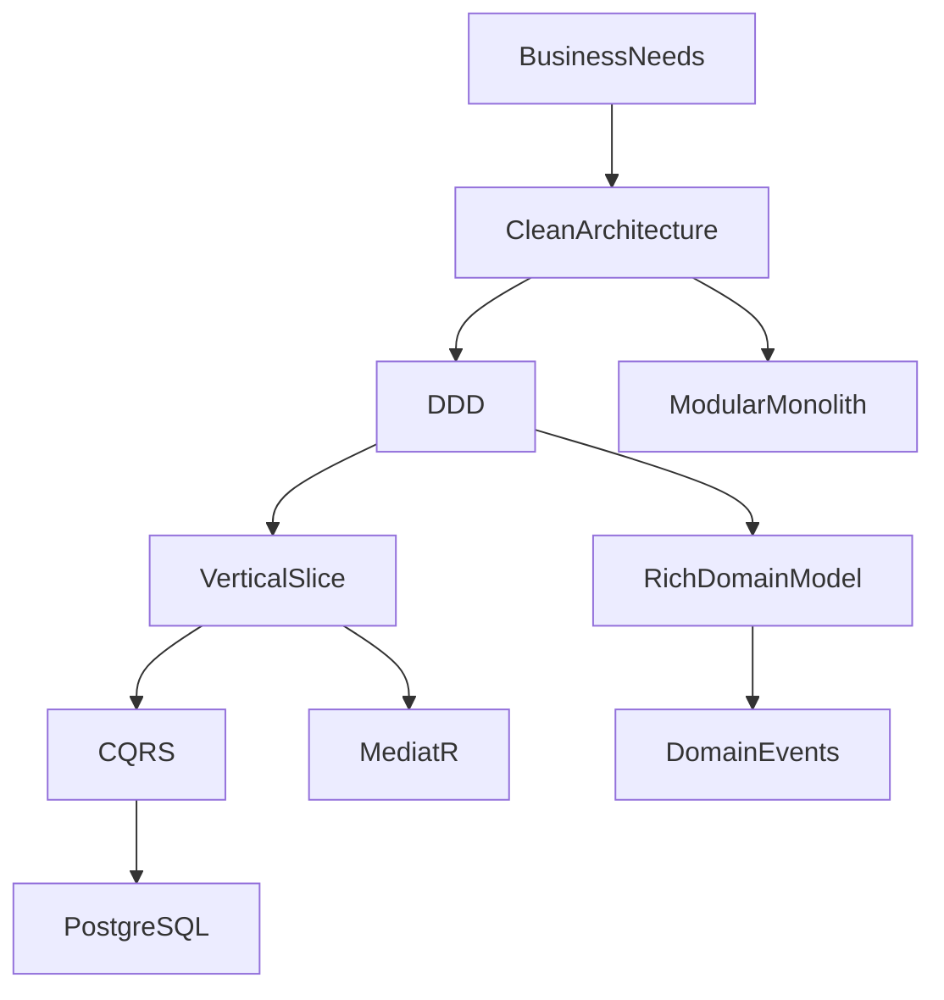

# Architecture Decisions

> *"Every architecture is a collection of decisions. Good documentation explains not only what was chosen, but why it was chosen."*

---

# Introduction

This document summarizes the most important architectural decisions made during the development of **FixNow**.

Each decision was made after evaluating multiple alternatives and selecting the option that best fits the project's current goals and future vision.

Detailed Architectural Decision Records (ADRs) are available in the `docs/decisions/` directory.

---

# Decision Summary

| ID     | Decision                    | Status     |
| ------ | --------------------------- | ---------- |
| AD-001 | Clean Architecture          | ✅ Accepted |
| AD-002 | Domain-Driven Design        | ✅ Accepted |
| AD-003 | Vertical Slice Architecture | ✅ Accepted |
| AD-004 | CQRS                        | ✅ Accepted |
| AD-005 | Rich Domain Model           | ✅ Accepted |
| AD-006 | Result Pattern              | ✅ Accepted |
| AD-007 | Domain Events               | ✅ Accepted |
| AD-008 | Modular Monolith            | ✅ Accepted |
| AD-009 | PostgreSQL                  | ✅ Accepted |
| AD-010 | Entity Framework Core       | ✅ Accepted |

---

# AD-001 — Clean Architecture

## Decision

Use **Clean Architecture** as the foundation of the solution.

## Why?

* Clear separation of concerns
* Business-first design
* Independent Domain Layer
* Easier testing
* Replaceable infrastructure

## Alternatives Considered

* Layered Architecture
* N-Tier Architecture
* Onion Architecture

## Outcome

The project is divided into:

* Domain
* Application
* Infrastructure
* API

---

# AD-002 — Domain-Driven Design (DDD)

## Decision

Model the business using Domain-Driven Design.

## Why?

FixNow is business-driven rather than CRUD-driven.

Examples:

* Assignment
* Payment
* Service Request
* Review

These concepts contain rich business behavior.

## Outcome

The Domain Layer contains:

* Aggregates
* Entities
* Value Objects
* Domain Events

instead of anemic data models.

---

# AD-003 — Vertical Slice Architecture

## Decision

Organize the Application Layer by **features**, not technical responsibilities.

## Why?

Developers work on business features.

Not on:

* DTOs
* Validators
* Handlers

## Example

Instead of:

```text id="6ubox4"
Commands/

Validators/

Handlers/
```

We use:

```text id="y0mjlwm"
Payments/

Refund/

Create/

Assignments/

Accept/
```

---

# AD-004 — CQRS

## Decision

Separate reads from writes.

## Why?

Commands and Queries have different responsibilities.

Commands:

* Change business state.

Queries:

* Retrieve information.

## Benefits

* Better organization
* Better scalability
* Better testing
* Better performance optimization

---

# AD-005 — Rich Domain Model

## Decision

Business rules live inside Aggregates.

## Example

Instead of:

```csharp id="u8vk1b"
PaymentService.Refund()
```

we use:

```csharp id="7vkk4u"
payment.Refund();
```

## Why?

Business rules belong to the business model.

Not to services.

---

# AD-006 — Result Pattern

## Decision

Avoid exceptions for expected business failures.

Use:

```csharp id="owztcn"
Result<T>
```

instead.

## Example

```csharp id="o1jn9p"
return PaymentErrors.AlreadyPaid;
```

instead of

```csharp id="fbrsnn"
throw new Exception();
```

## Benefits

* Explicit failures
* Better API responses
* Easier testing
* Predictable control flow

---

# AD-007 — Domain Events

## Decision

Business events are represented as Domain Events.

Example:

```text id="jkyo76"
PaymentSucceeded

AssignmentCompleted

ReviewCreated

TechnicianVerified
```

## Why?

Reduce coupling between business modules.

Future integration becomes easier.

---

# AD-008 — Modular Monolith

## Decision

Build the MVP as a **Modular Monolith**.

## Why?

Current team size does not justify Microservices.

Advantages:

* Faster development
* Easier deployment
* Lower infrastructure cost
* Simpler debugging

Modules remain isolated for future extraction.

---

# AD-009 — PostgreSQL

## Decision

Use PostgreSQL as the primary database.

## Why?

* Mature
* Open source
* High performance
* Excellent indexing
* Rich SQL support

Future scaling through:

* Read replicas
* Partitioning
* Logical replication

---

# AD-010 — Entity Framework Core

## Decision

Use Entity Framework Core.

## Why?

* Productivity
* LINQ
* Change Tracking
* Migrations
* Strong .NET integration

Business logic remains inside the Domain.

EF Core is responsible only for persistence.

---

# Decisions That Were Rejected

## Generic Repository Pattern

### Rejected

Reason:

EF Core already behaves as a Repository + Unit of Work.

Adding another abstraction provides little value and often leaks database concerns.

---

## CRUD-Based Application Services

### Rejected

Reason:

Business operations are not CRUD.

Example:

```text id="g0jnxh"
Accept Assignment

Reject Assignment

Refund Payment
```

These are business use cases, not CRUD operations.

---

## Anemic Domain Model

### Rejected

Reason:

Moving business logic into services leads to:

* Large services
* Scattered rules
* Difficult maintenance

Instead, business behavior belongs inside Aggregates.

---

## Microservices from Day One

### Rejected

Reason:

Premature complexity.

Current requirements are better served by a Modular Monolith.

---

# Architectural Principles

The following principles guide every new feature added to FixNow:

* Business rules belong to the Domain.
* Dependencies always point inward.
* Every use case has its own Handler.
* Aggregates protect invariants.
* Infrastructure is replaceable.
* Frameworks are implementation details.
* Simplicity is preferred over premature optimization.

---

# Decision Evolution

Some decisions are permanent.

Examples:

* Clean Architecture
* DDD
* Rich Domain Model

Some decisions may evolve.

Examples:

| Current                     | Future                     |
| --------------------------- | -------------------------- |
| Modular Monolith            | Selective Microservices    |
| PostgreSQL                  | PostgreSQL + Read Replicas |
| Local Background Processing | Distributed Workers        |
| Single API                  | Multiple API Instances     |

The architecture is intentionally designed to support this evolution without major redesign.

---

# Decision Map



Every decision reinforces the others, creating a coherent architecture rather than a collection of unrelated patterns.

---

# Summary

The architecture of FixNow is not the result of randomly combining popular patterns.

Each decision was made deliberately to support the project's goals:

* Maintainability
* Scalability
* Testability
* Simplicity
* Long-term evolution

Future contributors should understand these decisions before introducing new patterns or technologies, ensuring that the architecture remains consistent as the project grows.

---

# Related Documents

* `01-clean-architecture.md`
* `02-dependency-rules.md`
* `03-vertical-slice-architecture.md`
* `04-cqrs.md`
* `07-quality-attributes.md`
* `../decisions/README.md`
