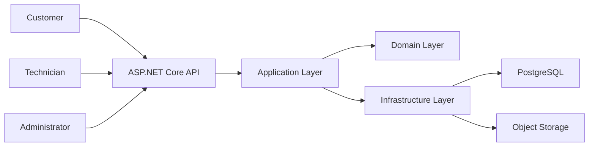
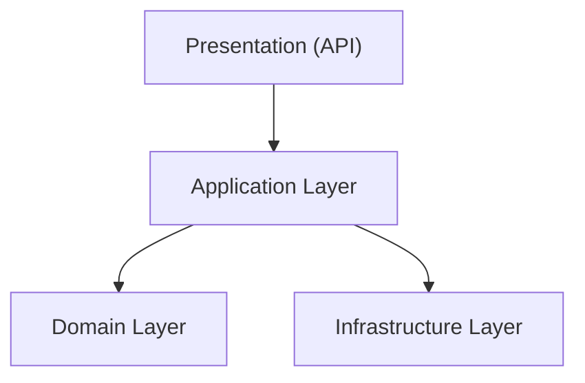
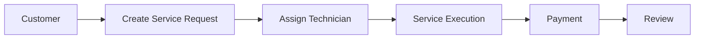
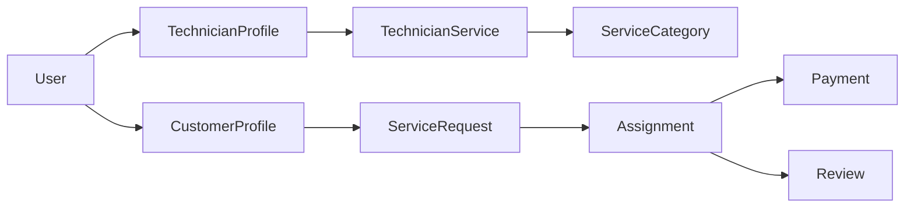
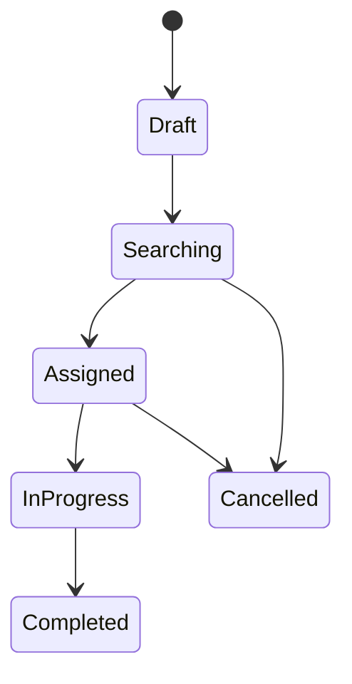
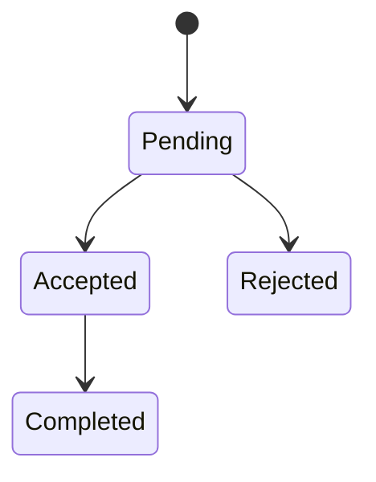
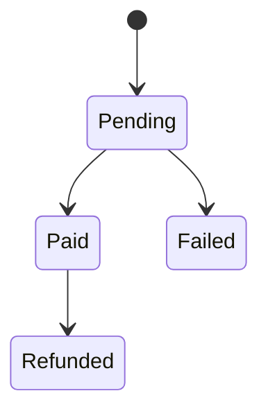
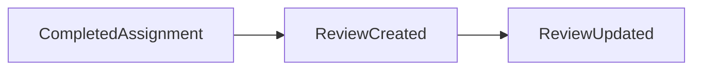

# Chapter 04 — System Overview

> *"Before understanding the implementation, we must understand the system as a whole."*

---

# Introduction

Before diving into the architecture and implementation details, it is important to understand the **big picture**.

FixNow is composed of multiple independent layers and business components that collaborate to provide a complete home services marketplace.

This chapter introduces the overall structure of the system and the responsibilities of each major component.

---

# High-Level System

---

# System Layers

The application follows **Clean Architecture**.

Each layer has a single responsibility.

---

# Core Business Flow

The platform revolves around a simple but powerful workflow.

Everything inside the project ultimately supports this workflow.

---

# Core Domain Model

The following diagram shows the primary business entities.

---

# Request Lifecycle

A service request goes through several states during its lifetime.

---

# Assignment Lifecycle

---

# Payment Lifecycle

---

# Review Lifecycle

---

# Bounded Contexts

Although the MVP is implemented as a modular monolith, the business domain is organized into logical bounded contexts.

| Context         | Responsibility                           |
| --------------- | ---------------------------------------- |
| Identity        | Users and authentication                 |
| Customer        | Customer profiles and addresses          |
| Technician      | Technician profiles and offered services |
| Service Catalog | Available service categories             |
| Service Request | Customer requests and tracking           |
| Assignment      | Technician assignment workflow           |
| Payment         | Payment processing                       |
| Review          | Customer feedback                        |

These contexts reduce coupling and make future extraction into microservices possible.

---

# Design Principles

Several architectural principles guide the implementation.

* Business logic belongs to the Domain Layer.
* Application Layer orchestrates use cases.
* Infrastructure contains technical details.
* API only exposes the application.
* Dependencies always point inward.
* Rich Domain Model over Anemic Domain Model.

---

# Why This Architecture?

This architecture was selected because it provides:

* Clear separation of responsibilities.
* High maintainability.
* Excellent testability.
* Long-term scalability.
* Easy onboarding for new developers.
* Independence from frameworks and databases.

---

# Summary

At this point, we have a high-level understanding of the system.

We know:

* The major actors.
* The overall workflow.
* The primary business entities.
* The lifecycle of important business processes.
* The responsibilities of each architectural layer.

The next chapter explains **why Clean Architecture was selected** and how it serves as the foundation of the entire project.

---

# Next Chapter

➡️ **Chapter 05 — Clean Architecture**
