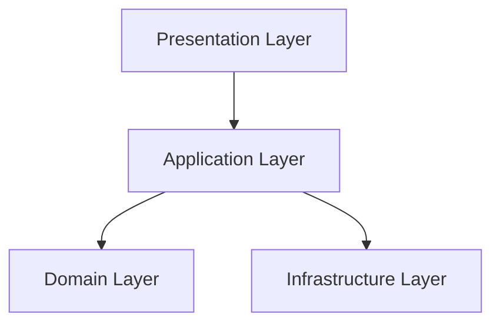
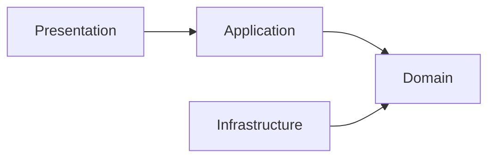

# Chapter 05 — Clean Architecture

> *"Frameworks come and go. Business rules remain."*
> — Robert C. Martin (Uncle Bob)

---

# Introduction

A software system is expected to evolve.

New features are added.

Databases change.

Frameworks are upgraded.

External services are replaced.

However, one thing should remain stable throughout the lifetime of the application:

> **The business rules.**

Clean Architecture was chosen because it protects the business from changes in technology.

Instead of building the system around ASP.NET Core, Entity Framework Core, or PostgreSQL, FixNow is built around its **Domain Model**.

The framework serves the business—not the other way around.

---

# What is Clean Architecture?

Clean Architecture is an architectural style proposed by **Robert C. Martin (Uncle Bob)**.

Its primary goal is to separate software into layers with clear responsibilities while ensuring that business logic remains independent from external technologies.

This results in software that is:

* Easier to maintain
* Easier to test
* Easier to extend
* Less coupled to frameworks
* More resilient to change

---

# The Core Principle

The most important rule of Clean Architecture is:

> **Dependencies always point inward.**

Nothing inside the Domain Layer should know anything about:

* ASP.NET Core
* Entity Framework Core
* PostgreSQL
* JWT
* Redis
* Cloud Storage
* HTTP
* APIs

Instead, those technologies depend on the Domain.

---

# Architecture Overview



Notice that:

* API depends on Application.
* Application depends on Domain.
* Infrastructure depends on Domain.
* Domain depends on nothing.

---

# Layer Responsibilities

## Domain Layer

The Domain Layer is the heart of the system.

It contains:

* Aggregates
* Entities
* Value Objects
* Domain Events
* Business Rules
* Specifications

The Domain answers questions such as:

* Can this request be completed?
* Can this technician accept this assignment?
* Can this payment be refunded?

The Domain never asks:

* Which database are we using?
* How is authentication implemented?
* Which web framework are we running?

---

## Application Layer

The Application Layer coordinates use cases.

It contains:

* Commands
* Queries
* Handlers
* Validators
* Pipeline Behaviors

It does **not** implement business rules.

Instead, it orchestrates business operations by calling the Domain.

Example:

```
Create Service Request

↓

Validate Request

↓

Load Customer

↓

Call Domain

↓

Save Changes

↓

Publish Events
```

---

## Infrastructure Layer

Infrastructure contains technical implementations.

Examples include:

* Entity Framework Core
* PostgreSQL
* Redis
* File Storage
* Email Services
* SMS Providers
* Payment Gateways

Infrastructure exists to support the Domain.

It should never contain business decisions.

---

## Presentation Layer

The Presentation Layer exposes the application to clients.

Examples:

* REST APIs
* Swagger
* Authentication
* Authorization
* HTTP Endpoints

Its responsibility is translating HTTP requests into application use cases.

---

# Dependency Rule



Notice that the Domain has **no outgoing dependencies**.

This is intentional.

---

# Why We Chose Clean Architecture

Many applications become tightly coupled to their frameworks.

For example:

```
Business Logic

↓

Entity Framework

↓

Database
```

Over time, business rules become scattered across:

* Controllers
* Services
* Repositories
* SQL Queries

Eventually, changing business behavior becomes difficult.

FixNow avoids this problem by centralizing business logic inside the Domain Layer.

---

# Benefits for FixNow

Using Clean Architecture provides several advantages.

## Framework Independence

If ASP.NET Core is replaced in the future, the Domain Layer remains unchanged.

---

## Database Independence

If PostgreSQL is replaced by SQL Server or MongoDB, business rules remain untouched.

---

## Testability

Business logic can be tested without:

* HTTP
* Controllers
* Databases
* Entity Framework

---

## Maintainability

Each layer has a single responsibility.

Developers know exactly where to place new functionality.

---

## Scalability

As the system grows, new technologies can be introduced without modifying business rules.

---

# Example

Suppose a customer completes a service.

Where should this rule exist?

❌ Controller

❌ Repository

❌ Entity Framework Configuration

✅ ServiceRequest Aggregate

Because "a completed service cannot return to In Progress" is a **business rule**, not a technical concern.

---

# Common Mistakes

Avoid placing business rules inside:

* Controllers
* Repository classes
* Database triggers
* Entity Framework configurations

Those locations belong to technical infrastructure.

Business decisions belong inside the Domain.

---

# Relationship with DDD

Clean Architecture and Domain-Driven Design complement each other.

Clean Architecture answers:

> **Where should the code live?**

Domain-Driven Design answers:

> **How should the business be modeled?**

Together they provide both structural and business guidance.

---

# FixNow Layer Summary

| Layer          | Responsibility           |
| -------------- | ------------------------ |
| Presentation   | HTTP communication       |
| Application    | Use case orchestration   |
| Domain         | Business rules           |
| Infrastructure | Technical implementation |

---

# Key Takeaways

* Business rules are the center of the system.
* Technologies are replaceable.
* Dependencies always point inward.
* Each layer has one clear responsibility.
* The Domain Layer should remain independent from frameworks and databases.

These principles will guide every implementation throughout the rest of this project.

---

# Next Chapter

➡️ **Chapter 06 — Domain-Driven Design**

Now that we understand the architectural foundation, we can explore the methodology used to model the business itself through Domain-Driven Design (DDD).
