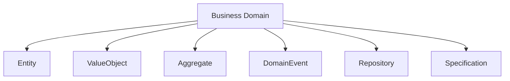
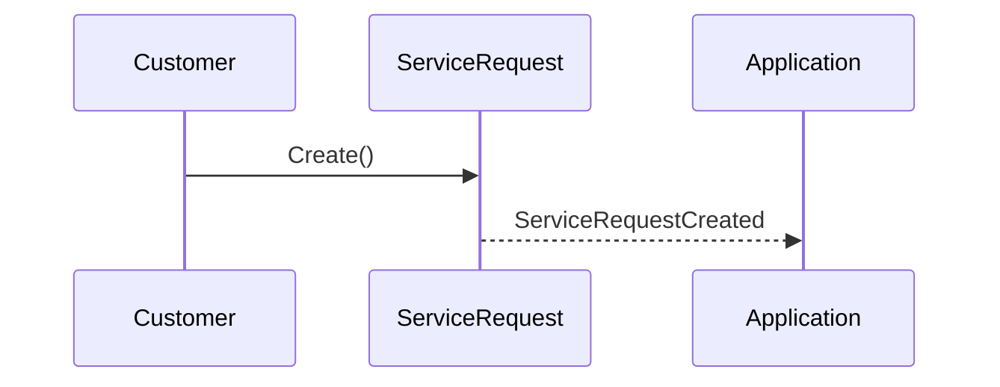

# Chapter 06 — Domain-Driven Design (DDD)

> *"The heart of software is its ability to solve domain-related problems."*
> — Eric Evans

---

# Introduction

Building enterprise software is not primarily about writing code.

It is about understanding the business.

Many projects fail because developers immediately begin designing databases, APIs, and UI screens before fully understanding the business domain.

FixNow follows **Domain-Driven Design (DDD)** because the complexity of the business lies in its rules, workflows, and interactions—not in the technologies used to implement them.

Domain-Driven Design provides a structured approach for modeling complex business domains while keeping the software aligned with real business needs.

---

# What is Domain-Driven Design?

Domain-Driven Design (DDD) is a software design methodology introduced by **Eric Evans** in his book *Domain-Driven Design: Tackling Complexity in the Heart of Software*.

DDD encourages developers to build software around the **business domain**, not around databases or frameworks.

Instead of asking:

> "How should I design my database?"

DDD encourages us to ask:

> "How does the business actually work?"

---

# What is a Domain?

A **Domain** is the area of business that the software is trying to solve.

Examples:

| Business   | Domain                    |
| ---------- | ------------------------- |
| Banking    | Financial Transactions    |
| E-Commerce | Product Sales             |
| Hospital   | Patient Management        |
| Uber       | Ride Sharing              |
| FixNow     | Home Services Marketplace |

For FixNow, the domain is:

> **Connecting customers with trusted technicians to complete home maintenance services.**

Everything inside the project exists to support this business objective.

---

# Why DDD for FixNow?

FixNow contains many business rules.

Examples include:

* A technician cannot accept the same assignment twice.
* A completed service request cannot return to "In Progress".
* A payment cannot be refunded unless it was successfully paid.
* A customer cannot review a service that has not been completed.
* A technician profile cannot be marked as complete without at least one service.

These are **business rules**, not technical rules.

DDD helps us place these rules in the correct location.

---

# Building Blocks of DDD

The FixNow Domain Model is built using several fundamental building blocks.



Each building block solves a different problem.

---

# Entity

An **Entity** has a unique identity.

Even if all of its properties change, it is still considered the same object.

Examples in FixNow:

* User
* CustomerProfile
* TechnicianProfile
* ServiceRequest
* Assignment
* Review
* Payment

Example:

Two technicians may have the same:

* Name
* Years of Experience
* Biography

They are still different technicians because they have different identities.

---

# Value Object

A **Value Object** has **no identity**.

It is defined entirely by its values.

If two Value Objects contain the same values, they are considered equal.

Examples:

* Money
* Rating

```text
Money(250 EGP)

==

Money(250 EGP)
```

Both represent the same concept.

---

# Aggregate

An **Aggregate** is a consistency boundary.

It protects business rules.

Instead of modifying child objects directly, external code communicates only with the Aggregate Root.

Example:

```
ServiceRequest

├── Images

└── Timeline
```

Nobody creates or removes timeline entries directly.

Everything happens through the `ServiceRequest` Aggregate.

This guarantees that every state change follows the business rules.

---

# Aggregate Root

The Aggregate Root is the only object that external code can modify directly.

Example:

```
ServiceRequest

↓

AddImage()

↓

Complete()

↓

Cancel()
```

External code never manipulates `ServiceRequestImage` directly.

This prevents inconsistent states.

---

# Domain Event

A Domain Event represents something important that has already happened in the business.

Examples:

* ServiceRequestCreated
* AssignmentAccepted
* PaymentSucceeded
* ReviewCreated



Notice that the event describes something in the **past tense**.

---

# Repository

Repositories provide access to Aggregates.

They answer questions like:

* Find ServiceRequest by Id
* Find TechnicianProfile
* Save Assignment

Repositories do **not** contain business logic.

They only provide persistence.

---

# Specification

Specifications encapsulate reusable business conditions.

Examples:

* Technician is available
* Customer can submit a review
* Assignment is completed

Instead of scattering these conditions across handlers, they can be represented as reusable specifications.

Although the MVP currently does not require many specifications, the architecture is prepared for them.

---

# Ubiquitous Language

One of the most important ideas in DDD is **Ubiquitous Language**.

Developers and business experts should speak the same language.

For example:

Business says:

* Assignment
* Service Request
* Technician
* Review

The code uses the exact same names.

We avoid generic names such as:

* Data
* Object
* Record
* Item

This keeps the software closely aligned with the business.

---

# Rich Domain Model

FixNow adopts the **Rich Domain Model** approach.

This means that Entities contain both:

* Data
* Behavior

Example:

```
ServiceRequest

✔ Complete()

✔ Cancel()

✔ AddImage()

✔ ChangeStatus()
```

Instead of:

```
ServiceRequestService

Complete()

Cancel()

AddImage()

ChangeStatus()
```

Business behavior belongs inside the Aggregate that owns the business rules.

---

# Anemic Domain Model (What We Avoid)

An Anemic Domain Model stores only data.

```
ServiceRequest

Id

Status

Price

Description
```

All business logic is pushed into services.

```
ServiceRequestService

↓

500+

Lines
```

This leads to:

* Weak encapsulation
* Scattered business rules
* Harder maintenance

FixNow intentionally avoids this approach.

---

# How DDD Appears in FixNow

| Concept             | Example                              |
| ------------------- | ------------------------------------ |
| Entity              | ServiceRequest                       |
| Value Object        | Money                                |
| Aggregate Root      | Assignment                           |
| Domain Event        | PaymentSucceededDomainEvent          |
| Repository          | IServiceRequestRepository            |
| Ubiquitous Language | Customer, Technician, Assignment     |
| Business Rule       | Refund only after successful payment |

---

# Benefits We Gain

Using DDD allows FixNow to achieve:

* Clear business boundaries.
* Highly maintainable business logic.
* Better collaboration between developers.
* Easier testing.
* Easier future expansion.
* Strong protection of business invariants.

---

# Summary

Domain-Driven Design is not a framework.

It is a way of thinking.

Instead of designing software around technology, we design it around the business itself.

Everything built in the remaining chapters—including Aggregates, Commands, Handlers, Repositories, and APIs—exists to support this Domain Model.

---

# Next Chapter

➡️ **Chapter 07 — Domain Layer**

Now that we understand the principles of Domain-Driven Design, we are ready to explore how these concepts are applied inside the FixNow Domain Layer and why each Aggregate was modeled the way it was.
