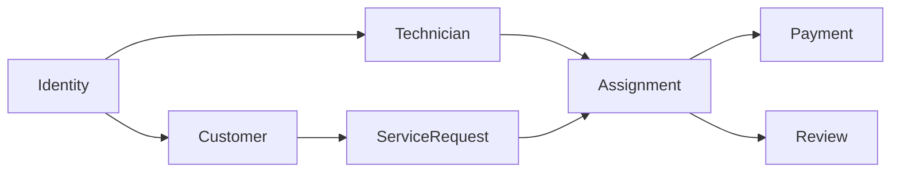

# Chapter 07 — Domain Layer

> *"The Domain Layer is the heart of FixNow. Everything else exists to support it."*

---

# Introduction

The Domain Layer represents the core of the FixNow platform.

It contains the business knowledge, business rules, and business behaviors that define how the system operates.

Unlike other layers, the Domain Layer is completely independent of:

* ASP.NET Core
* Entity Framework Core
* PostgreSQL
* HTTP
* Authentication
* Cloud Storage
* External Services

Its only responsibility is to model the business correctly.

---

# What Lives Inside the Domain?

The Domain Layer contains:

* Aggregates
* Entities
* Value Objects
* Domain Events
* Domain Errors
* Enumerations
* Business Rules

Everything inside this layer exists because it represents a concept from the business domain.

---

# Domain Organization

The FixNow Domain is organized into multiple business modules.

```text
Identity

Customer

Technician

Service Catalog

Service Request

Assignment

Payment

Review
```

Each module owns its own business rules and models.

This keeps the domain cohesive while minimizing coupling between different business areas.

---

# Domain Relationships



Although these modules collaborate, each one has a clearly defined responsibility.

---

# Domain Design Principles

Every part of the Domain Layer follows the same principles.

* Rich Domain Model.
* Encapsulation of business rules.
* Explicit invariants.
* Small aggregates.
* Immutable Value Objects.
* Business-first design.
* Technology independence.

These principles ensure that the business logic remains consistent, maintainable, and easy to evolve.

---

# Chapter Structure

The Domain Layer is divided into several sections.

1. Domain Overview
2. Identity
3. Customer
4. Technician
5. Service Catalog
6. Service Request
7. Assignment
8. Payment
9. Review
10. Domain Events
11. Value Objects
12. Business Rules

Each section explains not only **how** the model was implemented, but also **why** it was designed that way.

---

# Goal

By the end of this chapter, you will understand:

* Why each Aggregate exists.
* Why each Aggregate Root was chosen.
* How Aggregates collaborate.
* Which business rules each Aggregate protects.
* How Domain Events connect different parts of the system.
* Why certain concepts are Entities while others are Value Objects.

This chapter serves as the complete reference for the FixNow business model.

---

# Next Section

➡️ **07.01 — Domain Overview**
