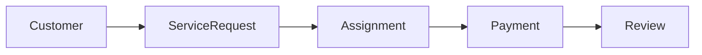

# Domain Layer Documentation

> *"The Domain Layer is the heart of FixNow. Everything else exists to support it."*

---

# Welcome

Welcome to the **FixNow Domain Documentation**.

This section documents the entire business model of the FixNow platform.

Unlike the Architecture documentation—which explains *how the system is built*—this documentation explains *what the business actually is*.

If you want to understand:

* How a Service Request works
* How a Technician gets assigned
* How Payments are processed
* How Reviews are created
* Why certain business rules exist

then this is the place to start.

---

# Purpose of the Domain Layer

The Domain Layer contains the business knowledge of FixNow.

It answers questions like:

* What is a Service Request?
* When can a technician accept an assignment?
* Can a payment be refunded twice?
* Who is allowed to review a technician?
* What makes a profile "completed"?
* What happens after a payment succeeds?

These are **business questions**, not technical questions.

The Domain Layer exists to model and protect those rules.

---

# Core Philosophy

FixNow follows **Domain-Driven Design (DDD)**.

The Domain Layer is built around one simple principle:

> **Business rules belong to the Domain—not to Controllers, Handlers, Repositories, or the Database.**

This means:

* Aggregates enforce invariants.
* Entities own their behavior.
* Value Objects model business concepts.
* Domain Events describe important business occurrences.
* Errors represent expected business failures.
* The Application Layer coordinates; it does not make business decisions.

---

# Domain Structure

The Domain is divided into business modules.

```text id="q8i3dt"
Domain/

├── Identity
├── Customer
├── Technician
├── ServiceCatalog
├── ServiceRequest
├── Assignment
├── Payment
├── Review
└── Shared
```

Each module models one part of the business and has a clear responsibility.

---

# Business Flow

The platform revolves around one primary workflow.



This simple flow represents the entire customer journey.

---

# What's Inside This Documentation?

This documentation is organized as a progressive guide.

| File                              | Purpose                                     |
| --------------------------------- | ------------------------------------------- |
| `01-domain-overview.md`           | Introduction to the Domain Layer            |
| `02-ubiquitous-language.md`       | Business vocabulary used across the system  |
| `03-bounded-contexts.md`          | Domain modules and their boundaries         |
| `04-domain-model.md`              | Overall domain model                        |
| `05-aggregates.md`                | Aggregate Roots and consistency boundaries  |
| `06-entities.md`                  | Domain entities                             |
| `07-value-objects.md`             | Value Objects                               |
| `08-domain-events.md`             | Domain Events                               |
| `09-business-rules.md`            | Business rules implemented in the model     |
| `10-errors-and-result-pattern.md` | Error handling philosophy                   |
| `11-domain-workflows.md`          | End-to-end business workflows               |
| `12-domain-invariants.md`         | Business invariants protected by aggregates |
| `13-future-improvements.md`       | Planned evolution of the domain             |

---

# Aggregate Documentation

Each Aggregate Root has its own detailed documentation.

```text id="lfv9vg"
aggregates/

customer.md

technician.md

service-request.md

assignment.md

payment.md

review.md
```

Every document explains:

* Responsibilities
* Lifecycle
* Behaviors
* Business Rules
* Relationships
* Domain Events
* Invariants

---

# Diagrams

This documentation uses diagrams extensively to explain the business model.

Available diagrams include:

* Aggregate Relationships
* State Machines
* Business Workflows
* Sequence Diagrams
* Domain Event Flow
* Lifecycle Diagrams

The goal is to make the Domain understandable at a glance, not only through code.

---

# Guiding Principles

The FixNow Domain follows these principles:

* Business-first design.
* Rich Domain Model.
* Explicit business behavior.
* Protected invariants.
* Persistence ignorance.
* Framework independence.
* Technology independence.
* High cohesion.
* Low coupling.

---

# Reading Order

For the best understanding, follow this order:

```text id="jdl10u"
README

↓

01 Domain Overview

↓

02 Ubiquitous Language

↓

03 Bounded Contexts

↓

04 Domain Model

↓

05 Aggregates

↓

06 Entities

↓

07 Value Objects

↓

08 Domain Events

↓

09 Business Rules

↓

10 Errors & Result Pattern

↓

11 Workflows

↓

12 Invariants

↓

13 Future Improvements
```

Each chapter builds on the previous one.

---

# Target Audience

This documentation is intended for:

* Backend Developers
* Software Architects
* Technical Leads
* New Team Members
* Code Reviewers
* Interviewers interested in the project architecture

It should provide enough context to understand the business without reading the source code first.

---

# Design Goal

The ultimate goal is that someone who has never seen the project before can:

* Understand the business.
* Understand the language used by the team.
* Understand why the code is written the way it is.
* Navigate the Domain with confidence.

The source code should then become a direct implementation of the concepts explained here.

---

# Final Note

Everything inside FixNow ultimately serves one purpose:

> **Help customers solve home maintenance problems quickly by modeling the business accurately and protecting its rules through a clean, expressive Domain Model.**

The Domain Layer is the foundation of that vision.
