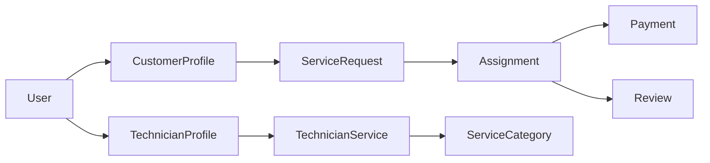

# 02 — Ubiquitous Language

> *"The hardest part of software development is not writing code—it's agreeing on the meaning of words."*
> — Inspired by Eric Evans

---

# Introduction

One of the core concepts of **Domain-Driven Design (DDD)** is the **Ubiquitous Language**.

It is a shared vocabulary used consistently by:

* Product Owners
* Business Analysts
* Developers
* Architects
* QA Engineers
* Designers

Every important business concept has **one clear name** and **one meaning**.

This eliminates ambiguity and makes both conversations and code easier to understand.

---

# Why Is It Important?

Imagine two developers discussing a feature:

Developer A:

> "Assign the technician."

Developer B:

> "Do you mean create an assignment or accept it?"

Those are two completely different business operations.

A shared language prevents these misunderstandings.

---

# Rules of the Ubiquitous Language

FixNow follows these rules:

* Every business concept has **one official name**.
* Do not invent synonyms in code.
* Class names, methods, events, and documentation use the same terminology.
* Business language is more important than technical language.

Example:

❌ Worker

❌ Employee

❌ Repairman

✅ Technician

Only **Technician** is used throughout the project.

---

# Core Business Concepts

## User

A person who owns an account in the system.

A User may become:

* Customer
* Technician

A User is responsible only for authentication and identity.

---

## Customer

A User who requests home services.

Responsibilities:

* Create service requests
* Manage addresses
* Pay for completed work
* Review technicians

---

## Technician

A User who performs home services.

Responsibilities:

* Offer one or more services
* Accept or reject assignments
* Complete jobs
* Receive reviews

---

## Service Category

A type of service offered by the platform.

Examples:

* Plumbing
* Electrical
* Air Conditioning
* Cleaning
* Carpentry

---

## Technician Service

Represents a service that a technician provides.

It links:

```text id="v2d4wn"
Technician

↓

Service Category
```

One technician can provide many services.

---

## Service Request

A customer's request for help.

Examples:

* Water leakage
* Broken air conditioner
* Electrical failure

A Service Request contains:

* Location
* Description
* Images
* Requested service
* Current status

---

## Assignment

Represents offering a Service Request to a technician.

An Assignment is **not** the job itself.

It simply tracks whether the technician:

* Accepted
* Rejected
* Completed

the assigned work.

---

## Payment

Represents the financial transaction for an Assignment.

Possible states include:

* Pending
* Paid
* Failed
* Refunded

---

## Review

Feedback written by the customer after a completed Assignment.

A Review contains:

* Rating
* Comment

Each Assignment can have **at most one Review**.

---

# Supporting Concepts

## Address

A customer location where a service will be performed.

---

## Rating

A value object representing the customer's evaluation.

Valid values:

```text id="yzmnbz"
1

2

3

4

5
```

No other values are allowed.

---

## Money

A Value Object representing a monetary amount.

Contains:

* Amount
* Currency

Example:

```text id="4f4nlr"
250 EGP
```

---

# Business Actions

These verbs are part of the official language.

## Customer Actions

* Create Request
* Cancel Request
* Upload Images
* Pay
* Review Technician

---

## Technician Actions

* Verify Profile
* Add Service
* Remove Service
* Accept Assignment
* Reject Assignment
* Complete Assignment

---

## System Actions

* Create Assignment
* Record Timeline
* Generate Payment
* Publish Domain Event

---

# Status Vocabulary

## Service Request Status

Possible values:

* Pending
* Assigned
* In Progress
* Completed
* Cancelled

---

## Assignment Status

Possible values:

* Pending
* Accepted
* Rejected
* Completed

---

## Payment Status

Possible values:

* Pending
* Paid
* Failed
* Refunded

---

## Verification Status

Possible values:

* Pending
* Verified
* Rejected

---

## Technician Availability

Possible values:

* Offline
* Available
* Busy

---

# Domain Event Vocabulary

Important business events include:

* CustomerProfileCreated
* TechnicianProfileCreated
* TechnicianVerified
* ServiceRequestCreated
* ServiceRequestCancelled
* AssignmentCreated
* AssignmentAccepted
* AssignmentRejected
* AssignmentCompleted
* PaymentCreated
* PaymentSucceeded
* PaymentFailed
* PaymentRefunded
* ReviewCreated
* ReviewUpdated

The event names intentionally use the same language as the business.

---

# Naming Conventions

The language is reflected directly in the codebase.

| Business Term   | Code                |
| --------------- | ------------------- |
| Customer        | `CustomerProfile`   |
| Technician      | `TechnicianProfile` |
| Service Request | `ServiceRequest`    |
| Assignment      | `Assignment`        |
| Payment         | `Payment`           |
| Review          | `Review`            |
| Rating          | `Rating`            |
| Money           | `Money`             |

This one-to-one mapping makes the code read like business documentation.

---

# Relationships



This diagram summarizes the core concepts and how they relate to each other.

---

# Summary

The Ubiquitous Language is the common vocabulary shared by the entire FixNow team.

Using one consistent language across discussions, documentation, and code ensures that everyone—from product owners to developers—understands the business in the same way.

As the project evolves, every new feature should extend this language rather than introduce conflicting terminology.

---

# Next Chapter

Continue with:

**`03-bounded-contexts.md`**

In the next chapter, we will organize these concepts into business modules and define the boundaries between them.
