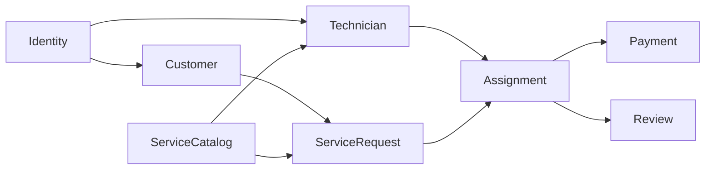
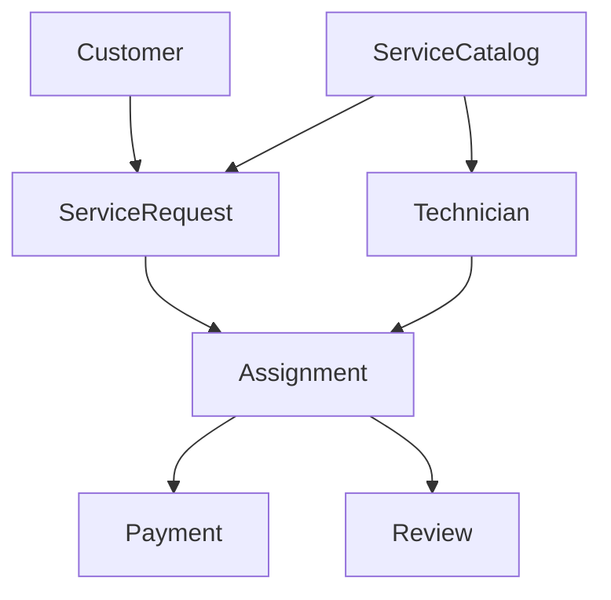

# 03 — Bounded Contexts

> *"Large business domains become manageable only when they are divided into clear boundaries."*
> — Eric Evans

---

# Introduction

As software systems grow, they naturally become more complex.

Trying to model the entire business as one huge model usually leads to:

* Tight coupling
* Confusing terminology
* Large classes
* Difficult maintenance

Domain-Driven Design solves this problem using **Bounded Contexts**.

A Bounded Context defines a clear business boundary where:

* The language is consistent.
* The model has one meaning.
* Business rules are isolated.

---

# What is a Bounded Context?

A Bounded Context is an area of the business that owns:

* Its own terminology
* Its own business rules
* Its own entities
* Its own workflows

Inside a context, concepts are consistent.

Outside the context, they may have different meanings.

---

# FixNow Context Map

The FixNow MVP is divided into the following contexts:

Each context owns its own business responsibilities.

---

# Identity Context

## Purpose

Manages platform users.

## Owns

* User
* Authentication
* Authorization
* Roles

## Responsibilities

* Register users
* Login
* Password management
* JWT identity

## Does NOT Know

* Payments
* Reviews
* Assignments

---

# Customer Context

## Purpose

Represents customers using the platform.

## Owns

* CustomerProfile
* Address

## Responsibilities

* Manage profile
* Manage addresses
* Create service requests
* Submit reviews

---

# Technician Context

## Purpose

Represents professionals offering services.

## Owns

* TechnicianProfile
* TechnicianService

## Responsibilities

* Verification
* Availability
* Services
* Profile completion

---

# Service Catalog Context

## Purpose

Defines the available services.

## Owns

* ServiceCategory

## Responsibilities

* Plumbing
* Electrical
* Cleaning
* Carpentry
* AC Repair

This context changes very rarely.

---

# Service Request Context

## Purpose

Models customer requests.

## Owns

* ServiceRequest
* ServiceRequestImage
* ServiceRequestTimeline

## Responsibilities

* Request lifecycle
* Images
* Timeline
* Status changes

This is the heart of the business.

---

# Assignment Context

## Purpose

Connects technicians with requests.

## Owns

* Assignment

## Responsibilities

* Assign technician
* Accept
* Reject
* Complete

This context coordinates the operational work.

---

# Payment Context

## Purpose

Handles financial transactions.

## Owns

* Payment
* Money (Value Object)

## Responsibilities

* Payment lifecycle
* Refunds
* Payment methods

---

# Review Context

## Purpose

Captures customer feedback.

## Owns

* Review
* Rating (Value Object)

## Responsibilities

* Ratings
* Comments
* Technician reputation

---

# Context Relationships

Notice that each context communicates through business concepts rather than sharing internal implementation details.

---

# Why This Separation?

Separating the domain into contexts provides several benefits:

* Smaller mental model
* Easier maintenance
* Better scalability
* Easier testing
* Clear ownership
* Reduced coupling

A developer working on the Payment context does not need deep knowledge of the Review context.

---

# Context Ownership

| Context         | Aggregate Roots   |
| --------------- | ----------------- |
| Identity        | User              |
| Customer        | CustomerProfile   |
| Technician      | TechnicianProfile |
| Service Catalog | ServiceCategory   |
| Service Request | ServiceRequest    |
| Assignment      | Assignment        |
| Payment         | Payment           |
| Review          | Review            |

Each Aggregate Root acts as the consistency boundary for its context.

---

# Future Contexts

As FixNow evolves, additional contexts may appear.

Examples:

* Notifications
* Chat
* Promotions
* Loyalty Program
* Reporting
* Analytics
* Subscription
* Emergency Services

These can be added without affecting existing contexts because the current architecture already establishes clear boundaries.

---

# Summary

Bounded Contexts divide the business into manageable, independent modules.

Each context owns its own language, rules, and aggregates, allowing the system to grow without becoming tightly coupled.

This separation is one of the key reasons why the FixNow Domain Model remains maintainable and scalable.

---

# Next Chapter

Continue with:

**`04-domain-model.md`**

In the next chapter, we will explore the complete Domain Model and see how all entities and aggregates fit together.
