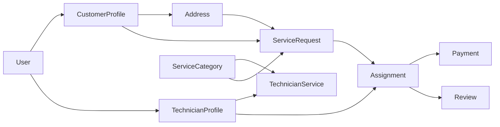

# Aggregate Relationships

## Overview

This document describes the relationships between the aggregates in the FixNow domain model.

The purpose of this diagram is to illustrate aggregate boundaries, references between aggregates, and how different parts of the domain collaborate while preserving aggregate independence.

> Aggregates communicate using identifiers and domain events. Direct object references across aggregate boundaries should be avoided whenever possible.

---

# High-Level Aggregate Map



---

# Aggregate Ownership

| Aggregate | Owns |
|-----------|------|
| User | Authentication and Identity |
| CustomerProfile | Addresses |
| TechnicianProfile | Technician Services |
| ServiceRequest | Images, Timeline |
| Assignment | Assignment Lifecycle |
| Payment | Payment Lifecycle |
| Review | Customer Feedback |

---

# Aggregate References

| Source Aggregate | References |
|------------------|------------|
| CustomerProfile | User |
| TechnicianProfile | User |
| Address | CustomerProfile |
| TechnicianService | TechnicianProfile, ServiceCategory |
| ServiceRequest | CustomerProfile, Address, ServiceCategory |
| Assignment | ServiceRequest, TechnicianProfile |
| Payment | Assignment, CustomerProfile |
| Review | Assignment, ServiceRequest, CustomerProfile, TechnicianProfile |

---

# Aggregate Boundaries

Each aggregate is responsible for maintaining its own business invariants.

Cross-aggregate modifications are performed through:

- Application Layer
- Domain Events
- Domain Services (when applicable)

Aggregates never directly modify the internal state of another aggregate.

---

# Communication Flow

```text
Customer
    │
    ▼
ServiceRequest
    │
    ▼
Assignment
    │
 ┌──┴─────┐
 ▼        ▼
Payment  Review
```

---

# Design Principles

- Aggregates reference each other using identifiers.
- Every aggregate enforces its own invariants.
- Business workflows span multiple aggregates through domain events.
- Aggregate boundaries are intentionally kept small to support scalability and independent evolution.