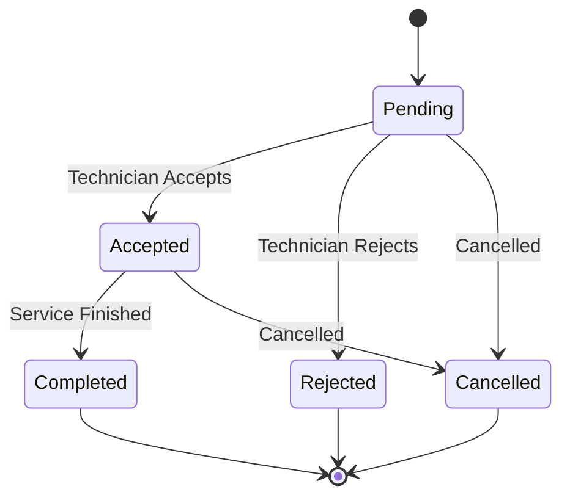
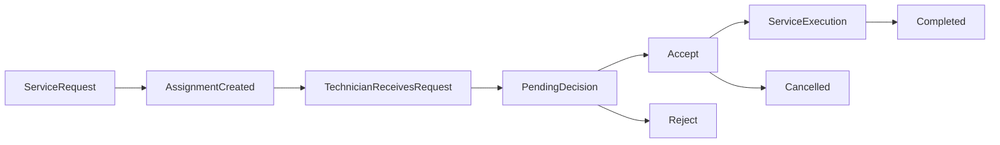
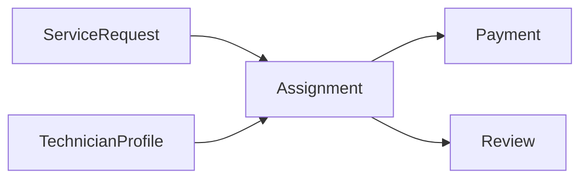
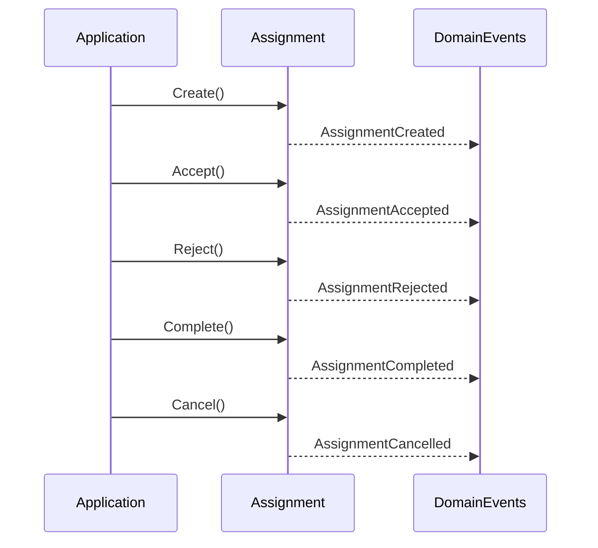

# Assignment Lifecycle

## Overview

The Assignment aggregate represents the lifecycle of assigning a technician to a service request.

It manages technician responses, assignment state transitions, and serves as the bridge between service requests and post-service processes such as payment and reviews.

The aggregate guarantees that every assignment follows a valid business workflow.

---

# Assignment State Machine



---

# Assignment Workflow



This workflow illustrates how an assignment progresses after a technician is selected.

---

# Aggregate Relationships



The assignment acts as the business bridge between the marketplace transaction and the post-service workflow.

---

# Domain Events Timeline



---

# Business Rules

The aggregate enforces the following rules:

- Every assignment belongs to exactly one service request.
- Every assignment belongs to exactly one technician.
- An assignment always starts in the **Pending** state.
- Only pending assignments may be accepted.
- Only pending assignments may be rejected.
- Only accepted assignments may be completed.
- Completed assignments cannot transition to another state.
- Cancellation is not allowed after completion.
- Every rejection stores its rejection reason.
- Completion stores the completion timestamp.

---

# State Transition Matrix

| Current State | Action | Next State |
|---------------|--------|------------|
| Pending | Accept | Accepted |
| Pending | Reject | Rejected |
| Pending | Cancel | Cancelled |
| Accepted | Complete | Completed |
| Accepted | Cancel | Cancelled |
| Completed | — | Final |
| Rejected | — | Final |
| Cancelled | — | Final |

---

# Aggregate Boundary

```text
Assignment
```

The Assignment aggregate has no child entities.

Its responsibility is to enforce the assignment lifecycle and maintain valid state transitions.

---

# Marketplace Interaction

```mermaid
flowchart TD

Customer

--> ServiceRequest

--> Assignment

--> Technician

--> Service Execution

--> Payment

--> Review
```

This diagram shows where the Assignment aggregate fits within the overall marketplace workflow.

---

# Lifecycle Summary

```text
Pending
   │
   ├────────► Rejected
   │
   ├────────► Cancelled
   │
   ▼
Accepted
   │
   ├────────► Cancelled
   │
   ▼
Completed
```

---

# Design Notes

- Assignment is the transactional bridge between customers and technicians.
- State transitions are enforced entirely within the aggregate.
- Domain events are emitted after every successful business transition.
- Payment and Review are independent aggregates that depend on a completed assignment.
- Cross-aggregate coordination should be handled by the Application Layer or Domain Events.