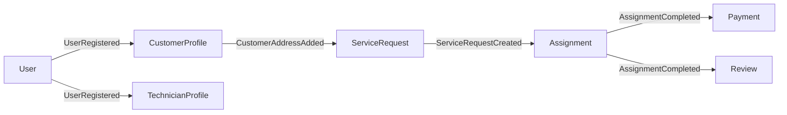
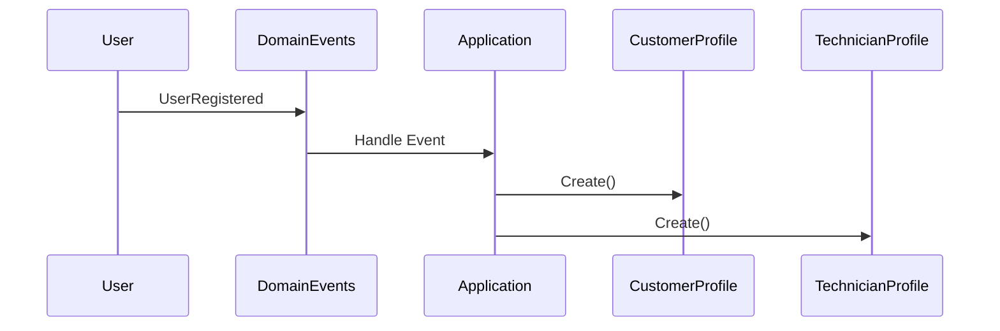
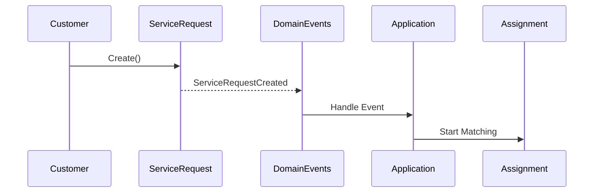
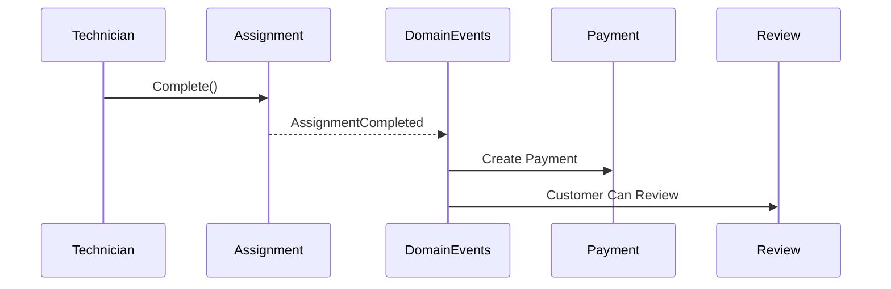
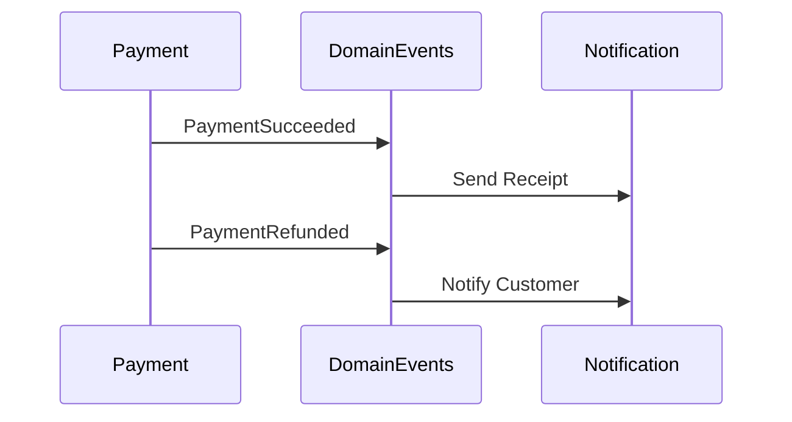
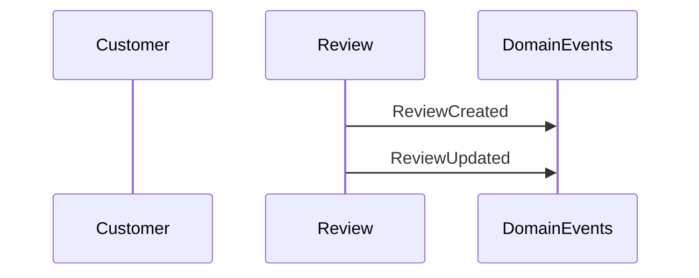

# Domain Events Flow

## Overview

This document illustrates how aggregates communicate through domain events.

Rather than directly modifying other aggregates, each aggregate raises domain events that are handled by the Application Layer or dedicated event handlers.

This approach keeps aggregate boundaries clean, reduces coupling, and supports future scalability.

---

# High-Level Event Flow



---

# Registration Flow



A newly registered user may later become a customer or technician.

The domain event decouples the User aggregate from business profile creation.

---

# Service Request Flow



---

# Assignment Completion Flow



---

# Payment Flow



---

# Review Flow



---

# Event Propagation

```text
Aggregate

      │

      ▼

Business Action

      │

      ▼

Domain Event

      │

      ▼

Application Layer

      │

      ▼

Event Handler

      │

      ▼

Other Aggregate
```

No aggregate directly modifies another aggregate.

Communication always occurs through events and application services.

---

# Event Ownership

| Aggregate | Example Domain Events |
|------------|----------------------|
| User | UserRegistered, UserActivated, UserSuspended |
| CustomerProfile | CustomerProfileCreated, CustomerAddressAdded |
| Address | AddressCreated, AddressUpdated |
| TechnicianProfile | TechnicianVerified, TechnicianProfileCompleted |
| ServiceCategory | ServiceCategoryCreated |
| ServiceRequest | ServiceRequestCreated, Scheduled, Completed, Cancelled |
| Assignment | AssignmentCreated, Accepted, Rejected, Completed |
| Payment | PaymentCreated, PaymentSucceeded, PaymentRefunded |
| Review | ReviewCreated, ReviewUpdated |

---

# Event Lifecycle

```mermaid
flowchart TD

Business Action

↓

Aggregate

↓

Validate Business Rules

↓

Update Aggregate State

↓

Raise Domain Event

↓

Commit Transaction

↓

Publish Event

↓

Execute Event Handlers
```

---

# Design Principles

- Aggregates never call each other directly.
- Business actions produce domain events.
- Domain events represent facts that already happened.
- Event handlers coordinate cross-aggregate workflows.
- Aggregates remain independent and focused on their own invariants.
- The Application Layer is responsible for orchestrating event processing.