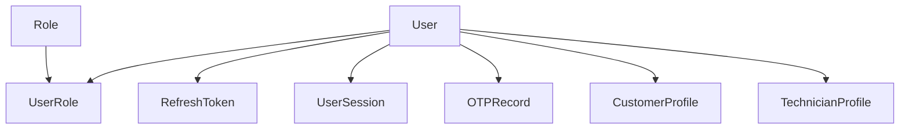
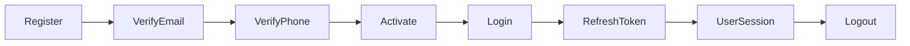

# Identity Relationships

## Overview

The Identity context is responsible for authentication, authorization, user lifecycle, sessions, refresh tokens, and one-time password (OTP) verification.

It serves as the entry point for every actor in the system. Both customers and technicians originate from the `User` aggregate.

The Identity context does **not** contain marketplace business logic. Its responsibility is limited to identity and access management.

---

# Identity Aggregate Map



---

# Aggregate Responsibilities

| Aggregate | Responsibility |
|------------|----------------|
| User | Represents the system identity and account lifecycle. |
| Role | Defines authorization roles within the system. |
| UserRole | Assigns roles to users. |
| RefreshToken | Maintains long-lived authentication sessions. |
| UserSession | Tracks active user login sessions. |
| OTPRecord | Handles one-time password verification. |

---

# Identity Relationships

## User → CustomerProfile

A user may own a single customer profile.

This profile contains customer-specific business information.

Identity remains independent from customer behavior.

---

## User → TechnicianProfile

A user may own a technician profile.

The technician profile contains marketplace-related information such as:

- Verification status
- Services
- Availability
- Experience

---

## User → RefreshToken

Each successful login creates a refresh token.

A user may have multiple active refresh tokens across multiple devices.

Relationship:

```text
User (1)
    │
    └───────< RefreshToken (Many)
```

---

## User → UserSession

Each login also creates a session.

Sessions represent authenticated devices.

Relationship:

```text
User (1)
    │
    └───────< UserSession (Many)
```

---

## RefreshToken → UserSession

Each session references exactly one refresh token.

```text
RefreshToken (1)
        │
        └──────── UserSession (1)
```

This relationship allows session invalidation when a refresh token is revoked.

---

## User → OTPRecord

OTP records are temporary verification artifacts.

Examples:

- Phone verification
- Email verification
- Password reset

Relationship:

```text
User (1)
    │
    └───────< OTPRecord (Many)
```

---

## User ↔ Role

Authorization is implemented using a many-to-many relationship.

```text
User
   │
   ▼
UserRole
   ▲
   │
Role
```

The `UserRole` aggregate stores assignment metadata such as:

- AssignedByUserId
- RevokedByUserId
- RevokedAt
- Active status

---

# Aggregate Independence

Each aggregate manages its own lifecycle.

For example:

- Revoking a refresh token does not modify the User aggregate.
- Ending a session does not modify User.
- Creating an OTP does not change User state.
- Assigning a role does not mutate the Role aggregate.

Communication between aggregates occurs through:

- Application Layer
- Domain Events

---

# Identity Lifecycle



---

# Authentication Flow

```text
User
 │
 │ Login
 ▼
RefreshToken Created
 │
 ▼
UserSession Started
 │
 ▼
Authenticated Requests
 │
 ▼
Refresh Token Rotation
 │
 ▼
Logout
 │
 ▼
Session Ended
```

---

# Design Decisions

- User is the root identity aggregate.
- CustomerProfile and TechnicianProfile are separate business aggregates.
- Authentication concerns are isolated from marketplace logic.
- Authorization is role-based.
- Sessions and refresh tokens are modeled independently.
- OTP records are temporary verification entities.
- Identity aggregates communicate with the rest of the domain using identifiers and domain events.