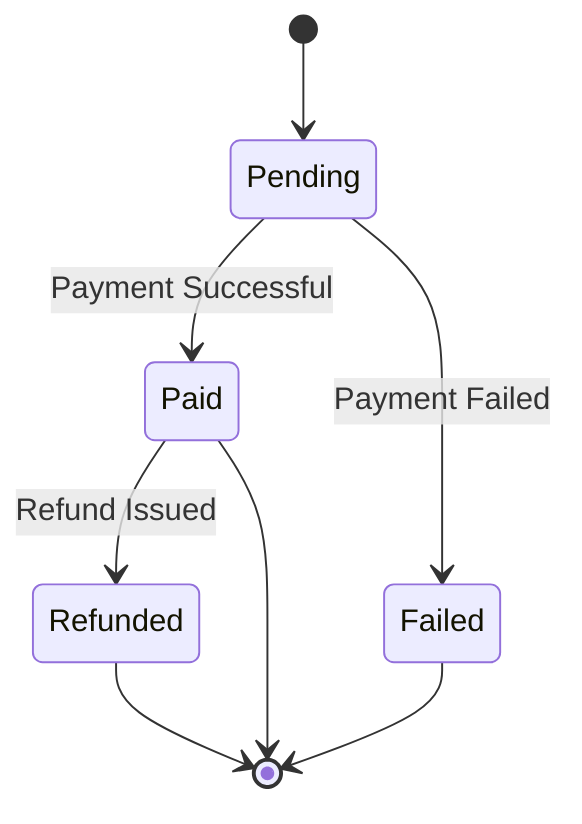
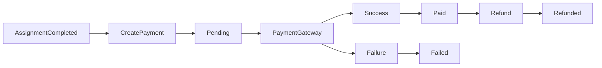
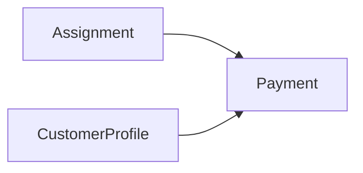
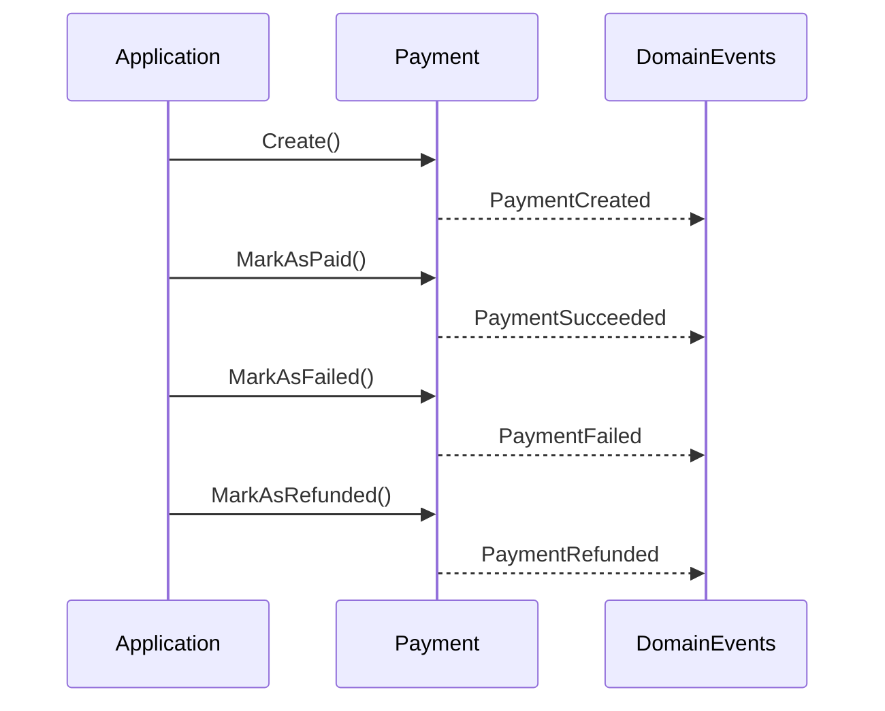

# Payment Lifecycle

## Overview

The Payment aggregate represents the payment lifecycle for a completed service assignment.

Its primary responsibility is to track the payment state, enforce valid payment transitions, and maintain the business integrity of payment operations.

Actual payment processing is handled by external payment providers. The domain only records and validates business state transitions.

---

# Payment State Machine



---

# Payment Workflow



This workflow illustrates how a payment moves from creation until its final state.

---

# Aggregate Relationships



Each payment belongs to:

- One completed assignment
- One customer

---

# Domain Events Timeline



---

# Business Rules

The aggregate enforces the following rules:

- Every payment belongs to exactly one assignment.
- Every payment belongs to exactly one customer.
- Every payment starts in the **Pending** state.
- Only pending payments may become paid.
- Only pending payments may become failed.
- Only successful payments may be refunded.
- Paid payments record the payment timestamp.
- Refunds preserve the original payment information.

---

# State Transition Matrix

| Current State | Action | Next State |
|---------------|--------|------------|
| Pending | Mark As Paid | Paid |
| Pending | Mark As Failed | Failed |
| Paid | Refund | Refunded |
| Failed | — | Final |
| Refunded | — | Final |

---

# Aggregate Boundary

```text
Payment
```

The Payment aggregate has no child entities.

Its responsibility is limited to managing the payment lifecycle and enforcing payment state transitions.

---

# Payment Processing Flow

```mermaid
flowchart TD

Assignment Completed

--> Payment Created

--> Pending

--> External Payment Provider

External Payment Provider --> Success

External Payment Provider --> Failure

Success --> Paid

Failure --> Failed

Paid --> Optional Refund

Optional Refund --> Refunded
```

The domain never performs the payment itself.

Instead, external payment providers execute the transaction and the Application Layer updates the Payment aggregate accordingly.

---

# Lifecycle Summary

```text
Pending
   │
   ├────────► Failed
   │
   ▼
Paid
   │
   ▼
Refunded
```

---

# Design Notes

- Payment represents the business state of a financial transaction.
- External payment providers are outside the domain boundary.
- State transitions are validated inside the aggregate.
- Every successful transition raises a domain event.
- The aggregate is intentionally provider-agnostic and can support multiple payment gateways without modifying the domain model.