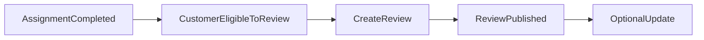
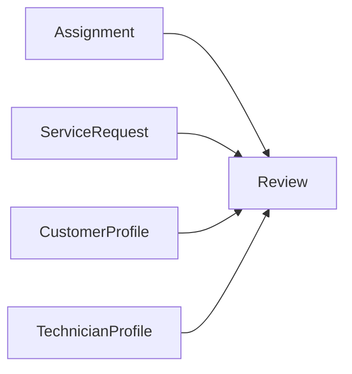
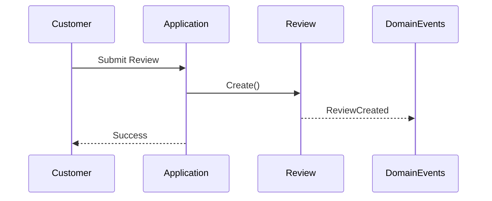
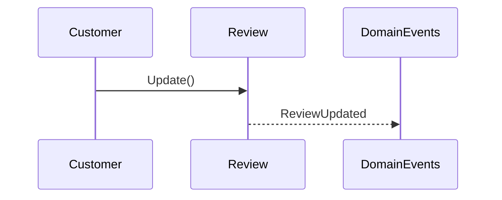
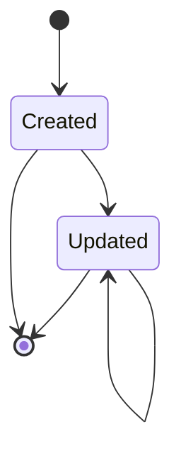

# Review Flow

## Overview

The Review aggregate represents customer feedback after a completed service.

Reviews are an essential part of the marketplace trust system. They provide quality feedback for technicians and help future customers make informed decisions.

A review is always associated with a completed assignment and cannot exist independently.

---

# Review Workflow



A customer becomes eligible to submit a review only after the corresponding assignment has been successfully completed.

---

# Aggregate Relationships



Every review references:

- One assignment
- One service request
- One customer
- One technician

---

# Review Creation Flow



---

# Review Update Flow



---

# Review Lifecycle



The aggregate currently supports review creation and updates.

Deletion is intentionally not part of the MVP.

---

# Business Rules

The aggregate enforces the following rules:

- Every review belongs to exactly one assignment.
- Every review belongs to exactly one customer.
- Every review belongs to exactly one technician.
- Every review belongs to exactly one service request.
- Ratings are represented by a dedicated value object.
- Comments are optional.
- Comments have a maximum allowed length.
- Updates modify the existing review rather than creating a new one.
- Domain events are raised whenever a review is created or updated.

---

# Aggregate Boundary

```text
Review
```

The Review aggregate has no child entities.

Its sole responsibility is maintaining customer feedback and enforcing review consistency.

---

# Marketplace Position

```mermaid
flowchart TD

ServiceRequest

--> Assignment

--> ServiceCompleted

--> Review

Review

--> Technician Reputation
```

The review is the final customer-facing step in the marketplace workflow.

It reflects the customer's experience after service completion.

---

# Review Flow Summary

```text
Completed Assignment
        │
        ▼
Customer Writes Review
        │
        ▼
Review Created
        │
        ▼
(Optional)
Update Review
```

---

# Design Notes

- Review is an independent aggregate.
- Reviews can only exist for completed assignments.
- Ratings are encapsulated within a value object.
- Domain events notify other parts of the system whenever feedback changes.
- Future reputation or recommendation systems should consume review-related domain events rather than coupling directly to the Review aggregate.