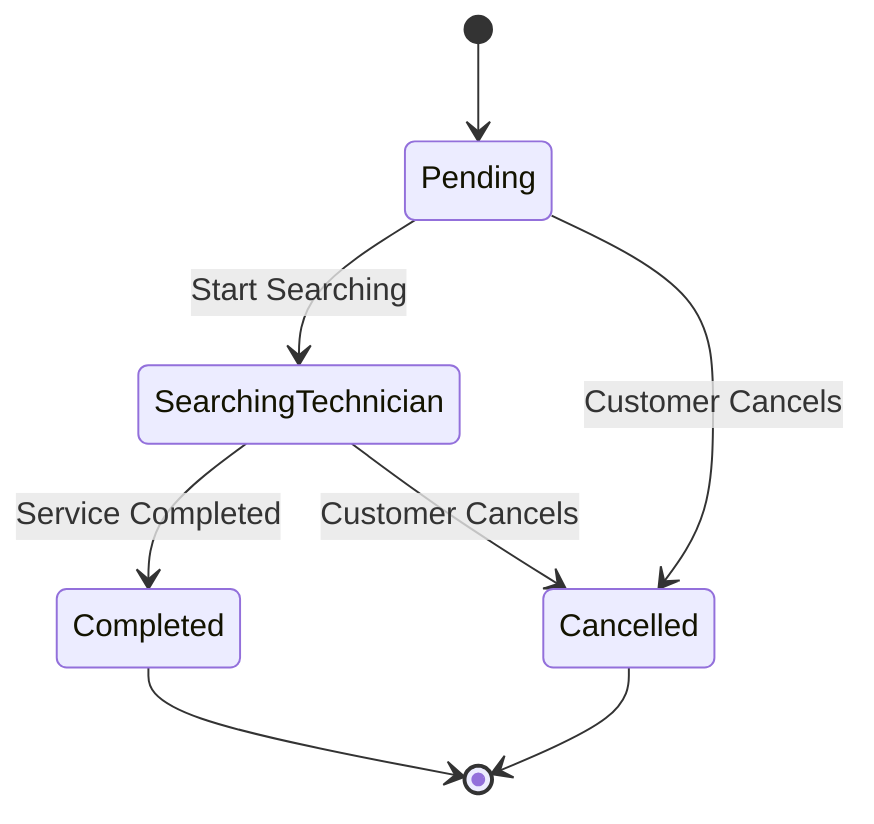
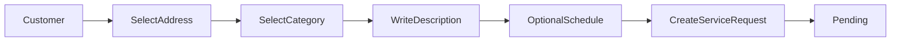
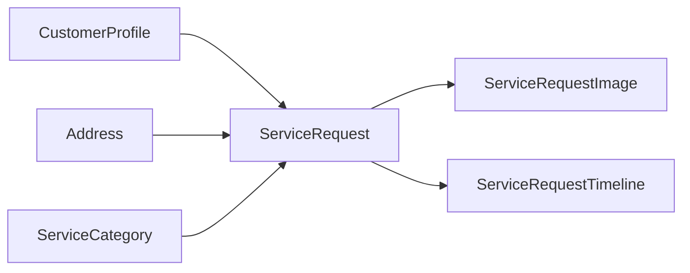
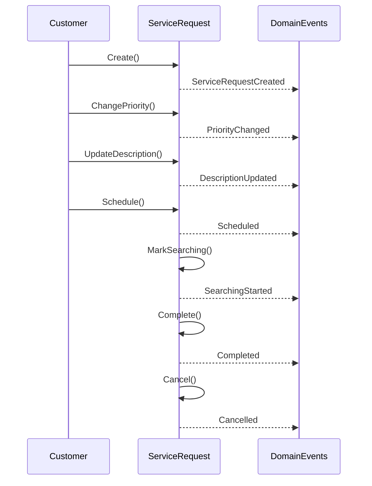

# Service Request Lifecycle

## Overview

This document describes the lifecycle of a service request within the FixNow platform.

A service request evolves through several business states from creation until completion or cancellation.

The lifecycle is controlled entirely by the `ServiceRequest` aggregate to guarantee domain consistency.

---

# State Machine



---

# Request Creation Flow



This represents the request creation workflow before technicians become involved.

---

# Aggregate Interaction



The `ServiceRequest` aggregate owns both:

- Images
- Timeline entries

These child entities cannot exist independently.

---

# Domain Events Timeline



---

# Business Rules

The aggregate enforces the following rules:

- A request always starts in the **Pending** state.
- Scheduled requests must reference a future date.
- Images belong exclusively to one service request.
- Timeline records are append-only.
- Duplicate images are not allowed.
- Description length is limited.
- Cancellation stores both timestamp and reason.
- Completion stores completion timestamp.

---

# State Transition Matrix

| Current State | Allowed Action | Next State |
|---------------|---------------|------------|
| Pending | Start Searching | SearchingTechnician |
| Pending | Cancel | Cancelled |
| SearchingTechnician | Complete | Completed |
| SearchingTechnician | Cancel | Cancelled |
| Completed | — | Final |
| Cancelled | — | Final |

---

# Aggregate Boundary

```text
ServiceRequest
│
├── ServiceRequestImage
│
└── ServiceRequestTimeline
```

Only the `ServiceRequest` aggregate is allowed to create, modify, or remove its child entities.

No external aggregate may directly manipulate images or timeline entries.

---

# Lifecycle Summary

```text
Customer

      │

      ▼

Pending

      │

      ▼

Searching Technician

      │

 ┌────┴────┐

 ▼         ▼

Completed  Cancelled
```

---

# Design Notes

- `ServiceRequest` is the aggregate root.
- Child entities are lifecycle-dependent.
- State transitions are validated inside the aggregate.
- Domain events are raised after every significant business action.
- Cross-aggregate communication should occur through the Application Layer or Domain Events rather than direct mutation.